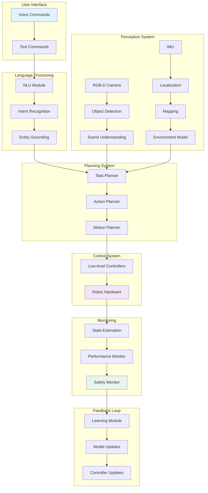
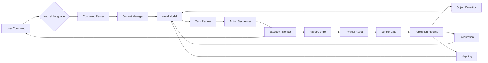

# Capstone Project: Autonomous Humanoid Robot System

## Introduction

The capstone project integrates all concepts learned throughout the Physical AI curriculum into a comprehensive autonomous humanoid robot system. This project demonstrates the complete pipeline from perception to action, incorporating Vision-Language-Action (VLA) capabilities in both simulated and real-world environments.

The project involves developing an autonomous humanoid robot capable of understanding natural language commands, perceiving its environment, planning actions, and executing complex manipulation and navigation tasks. This represents the culmination of all technical concepts covered in the curriculum.

## Project Architecture

### System Overview

The autonomous humanoid system follows a modular architecture with clear separation of concerns while maintaining tight integration between components:

```
┌─────────────────────────────────────────────────────────────────┐
│                    Autonomous Humanoid System                   │
├─────────────────────────────────────────────────────────────────┤
│  ┌─────────────────┐  ┌─────────────────┐  ┌─────────────────┐  │
│  │   Perception    │  │  Cognition      │  │    Action       │  │
│  │   Module        │  │   Module        │  │   Module        │  │
│  │                 │  │                 │  │                 │  │
│  │ • Vision        │  │ • Language      │  │ • Motion        │  │
│  │ • Localization  │  │ • Reasoning     │  │ • Manipulation  │  │
│  │ • Mapping       │  │ • Planning      │  │ • Navigation    │  │
│  └─────────────────┘  └─────────────────┘  └─────────────────┘  │
│                              │                                  │
│                              ▼                                  │
│                    ┌─────────────────┐                        │
│                    │   Integration   │                        │
│                    │   Layer         │                        │
│                    │                 │                        │
│                    │ • State         │                        │
│                    │   Management    │                        │
│                    │ • Coordination  │                        │
│                    │ • Safety        │                        │
│                    └─────────────────┘                        │
└─────────────────────────────────────────────────────────────────┘
```

### Core Components

**Perception Module:**
- Vision system processing RGB-D data
- Object detection and recognition
- Environment mapping and localization
- Human detection and tracking

**Cognition Module:**
- Natural language understanding
- Task planning and reasoning
- Context awareness and memory
- Decision making under uncertainty

**Action Module:**
- Motion planning and control
- Manipulation planning and execution
- Navigation and path planning
- Human-robot interaction

### Communication Architecture

The system uses ROS 2 as the communication backbone with the following key topics and services:

```yaml
Topics:
  - /camera/rgb/image_raw: RGB camera data
  - /camera/depth/image_raw: Depth camera data
  - /imu/data: Inertial measurement data
  - /joint_states: Robot joint positions
  - /tf: Transform data
  - /vl_command: Vision-Language commands
  - /action_plan: Executable action plans
  - /robot_state: Current robot state

Services:
  - /process_command: Process natural language commands
  - /plan_motion: Plan robot motion
  - /execute_action: Execute specific actions
  - /get_map: Retrieve environment map
```

## Vision-Language-Action (VLA) Pipeline

### Language Processing Pipeline

The language processing component converts natural language commands into executable actions:

```python
class LanguageProcessor:
    def __init__(self):
        self.tokenizer = AutoTokenizer.from_pretrained("model")
        self.model = AutoModel.from_pretrained("model")
        self.intent_classifier = IntentClassifier()
        self.entity_extractor = EntityExtractor()

    def process_command(self, command_text, context):
        # Tokenize and encode the command
        tokens = self.tokenizer(command_text, return_tensors="pt")

        # Extract intent and entities
        intent = self.intent_classifier.classify(tokens)
        entities = self.entity_extractor.extract(tokens)

        # Ground entities in the environment
        grounded_entities = self.ground_entities(entities, context)

        # Generate action plan
        action_plan = self.generate_action_plan(intent, grounded_entities)

        return action_plan
```

### Vision Processing Pipeline

The vision processing component provides environmental perception:

```python
class VisionProcessor:
    def __init__(self):
        self.detector = ObjectDetector()
        self.segmenter = SemanticSegmenter()
        self.pose_estimator = PoseEstimator()
        self.mapper = EnvironmentMapper()

    def process_frame(self, rgb_image, depth_image):
        # Detect objects in the scene
        objects = self.detector.detect(rgb_image)

        # Segment and classify objects
        semantic_map = self.segmenter.segment(rgb_image)

        # Estimate 3D poses
        poses = self.pose_estimator.estimate(objects, depth_image)

        # Update environment map
        self.mapper.update(poses, depth_image)

        return {
            'objects': objects,
            'poses': poses,
            'map': self.mapper.get_map()
        }
```

### Action Execution Pipeline

The action execution component converts plans into robot motions:

```python
class ActionExecutor:
    def __init__(self):
        self.motion_planner = MotionPlanner()
        self.manipulator = ManipulationController()
        self.navigator = NavigationController()
        self.safety_monitor = SafetyMonitor()

    def execute_plan(self, action_plan):
        for action in action_plan.steps:
            # Check safety constraints
            if not self.safety_monitor.check_safe(action):
                raise SafetyException("Action violates safety constraints")

            # Execute based on action type
            if action.type == "navigation":
                self.navigator.navigate(action.parameters)
            elif action.type == "manipulation":
                self.manipulator.manipulate(action.parameters)
            elif action.type == "communication":
                self.communicate(action.parameters)

            # Monitor execution
            self.monitor_execution(action)
```

### Integration Pipeline

The integration component coordinates all modules:

```python
class VLAIntegrator:
    def __init__(self):
        self.language_processor = LanguageProcessor()
        self.vision_processor = VisionProcessor()
        self.action_executor = ActionExecutor()
        self.state_manager = StateManager()

    def process_interaction(self, command, sensor_data):
        # Process vision data
        vision_result = self.vision_processor.process_frame(
            sensor_data['rgb'],
            sensor_data['depth']
        )

        # Update world state
        self.state_manager.update_state(vision_result)

        # Process language command with context
        action_plan = self.language_processor.process_command(
            command,
            self.state_manager.get_context()
        )

        # Execute the plan
        execution_result = self.action_executor.execute_plan(action_plan)

        # Update state with execution results
        self.state_manager.update_execution_result(execution_result)

        return execution_result
```

## Simulation Implementation

### Environment Setup

The simulation environment uses NVIDIA Isaac Sim for high-fidelity physics and rendering:

```python
# Environment configuration
class HumanoidEnvironment:
    def __init__(self):
        # Initialize Isaac Sim
        self.gym = gymapi.acquire_gym()
        self.sim = self.gym.create_sim(
            device_id=args.device_id,
            gpu_id=args.graphics_device_id,
            headless=args.headless,
            rendering_params=rendering_params
        )

        # Create viewer
        self.viewer = self.gym.create_viewer(self.sim, gymapi.Vec3(0, 0, 3))

        # Create environment
        self.create_environment()

    def create_environment(self):
        # Load humanoid robot
        asset_root = "path/to/robot/assets"
        asset_file = "humanoid.urdf"
        self.humanoid_asset = self.gym.load_asset(
            self.sim,
            asset_root,
            asset_file
        )

        # Create scene with objects
        self.create_scene_objects()

    def create_scene_objects(self):
        # Create kitchen environment with objects
        self.create_table()
        self.create_cup()
        self.create_fridge()
        # Add more objects as needed
```

### Sensor Simulation

Simulated sensors provide realistic data for the perception system:

```python
# RGB-D camera simulation
class SimulatedCamera:
    def __init__(self, env, robot_handle):
        self.camera_props = gymapi.CameraProperties()
        self.camera_props.width = 640
        self.camera_props.height = 480
        self.camera_props.enable_tensors = True

        self.gym = env.gym
        self.env = env.sim
        self.robot_handle = robot_handle

        # Attach camera to robot head
        self.camera_handle = self.gym.create_camera_sensor(
            self.env,
            self.robot_handle,
            self.camera_props
        )

    def get_observation(self):
        # Get RGB and depth images
        color_tensor = self.gym.get_camera_image_gpu_tensor(
            self.env,
            self.viewer,
            self.camera_handle,
            gymapi.IMAGE_COLOR
        )

        depth_tensor = self.gym.get_camera_image_gpu_tensor(
            self.env,
            self.viewer,
            self.camera_handle,
            gymapi.IMAGE_DEPTH
        )

        return {
            'rgb': color_tensor,
            'depth': depth_tensor
        }
```

### Physics Simulation

Realistic physics simulation ensures proper interaction with the environment:

```python
# Physics properties configuration
class PhysicsConfig:
    def __init__(self):
        self.gravity = gymapi.Vec3(0.0, 0.0, -9.81)
        self.sim_params = gymapi.SimParams()
        self.sim_params.up_axis = gymapi.UP_AXIS_Z
        self.sim_params.gravity = self.gravity

        # Solver parameters
        self.sim_params.solver_type = gymapi.SIM_1_1
        self.sim_params.num_position_iterations = 8
        self.sim_params.num_velocity_iterations = 1
        self.sim_params.max_depenetration_velocity = 10.0

        # GPU simulation parameters
        self.sim_params.use_gpu_pipeline = True
        self.sim_params.physx.use_gpu = True
        self.sim_params.physx.solver_type = 1
        self.sim_params.physx.num_position_iterations = 4
        self.sim_params.physx.num_velocity_iterations = 1
```

## Simulation-to-Real Transfer

### Domain Randomization

To improve sim-to-real transfer, we implement domain randomization:

```python
class DomainRandomizer:
    def __init__(self):
        self.randomization_params = {
            'lighting': {
                'intensity_range': [0.5, 1.5],
                'color_temperature_range': [5000, 8000]
            },
            'textures': {
                'roughness_range': [0.1, 0.9],
                'metallic_range': [0.0, 0.2]
            },
            'dynamics': {
                'mass_range': [0.8, 1.2],
                'friction_range': [0.5, 1.5]
            }
        }

    def randomize_environment(self, env):
        # Randomize lighting conditions
        self.randomize_lighting(env)

        # Randomize object textures
        self.randomize_textures(env)

        # Randomize dynamics parameters
        self.randomize_dynamics(env)

    def randomize_lighting(self, env):
        # Randomize light intensity and color
        intensity = np.random.uniform(
            self.randomization_params['lighting']['intensity_range'][0],
            self.randomization_params['lighting']['intensity_range'][1]
        )
        # Apply to environment
```

### System Identification

Real robot system identification helps bridge the sim-to-real gap:

```python
class SystemIdentifier:
    def __init__(self, robot):
        self.robot = robot
        self.parameters = {
            'mass': [],
            'inertia': [],
            'friction': [],
            'com': []
        }

    def identify_parameters(self):
        # Collect data from real robot
        data = self.collect_excitation_data()

        # Estimate dynamic parameters
        self.estimate_dynamics(data)

        # Update simulation model
        self.update_simulation_model()

    def collect_excitation_data(self):
        # Apply known inputs to robot
        inputs = self.generate_excitation_signals()

        # Record responses
        outputs = []
        for input_signal in inputs:
            output = self.robot.apply_input(input_signal)
            outputs.append(output)

        return {'inputs': inputs, 'outputs': outputs}
```

### Controller Adaptation

Adaptive controllers help handle model discrepancies:

```python
class AdaptiveController:
    def __init__(self):
        self.nominal_controller = PIDController()
        self.adaptive_component = ModelReferenceAdaptiveController()
        self.error_threshold = 0.1

    def compute_control(self, state, reference, simulation_error=None):
        # Nominal control from simulation-optimized controller
        nominal_control = self.nominal_controller.compute(state, reference)

        # Adaptive compensation for real-world discrepancies
        if simulation_error is not None:
            adaptive_control = self.adaptive_component.compute(
                state,
                reference,
                simulation_error
            )
        else:
            adaptive_control = 0.0

        # Combine controls
        total_control = nominal_control + adaptive_control

        return total_control
```

## Implementation Diagrams

### System Architecture Diagram



### Data Flow Diagram



## Code Implementation

### Main System Controller

```python
#!/usr/bin/env python3

import rclpy
from rclpy.node import Node
from sensor_msgs.msg import Image, CameraInfo
from geometry_msgs.msg import PoseStamped
from std_msgs.msg import String
import numpy as np
import cv2
from transformers import AutoTokenizer, AutoModel
import torch

class AutonomousHumanoidController(Node):
    def __init__(self):
        super().__init__('autonomous_humanoid_controller')

        # Initialize components
        self.language_processor = LanguageProcessor()
        self.vision_processor = VisionProcessor()
        self.action_executor = ActionExecutor()
        self.state_manager = StateManager()

        # Create subscribers
        self.rgb_sub = self.create_subscription(
            Image,
            '/camera/rgb/image_raw',
            self.rgb_callback,
            10
        )

        self.depth_sub = self.create_subscription(
            Image,
            '/camera/depth/image_raw',
            self.depth_callback,
            10
        )

        self.command_sub = self.create_subscription(
            String,
            '/vl_command',
            self.command_callback,
            10
        )

        # Create publishers
        self.result_pub = self.create_publisher(
            String,
            '/execution_result',
            10
        )

        # Initialize data storage
        self.rgb_image = None
        self.depth_image = None
        self.latest_command = None

        # Create timer for processing loop
        self.process_timer = self.create_timer(
            0.1,  # 10 Hz
            self.process_callback
        )

        self.get_logger().info('Autonomous Humanoid Controller initialized')

    def rgb_callback(self, msg):
        """Process RGB image data"""
        # Convert ROS Image to OpenCV format
        self.rgb_image = self.ros_to_cv2(msg)

    def depth_callback(self, msg):
        """Process depth image data"""
        # Convert ROS Image to OpenCV format
        self.depth_image = self.ros_to_cv2_depth(msg)

    def command_callback(self, msg):
        """Process incoming command"""
        self.latest_command = msg.data
        self.get_logger().info(f'Received command: {self.latest_command}')

    def process_callback(self):
        """Main processing loop"""
        if self.rgb_image is not None and self.depth_image is not None:
            # Process vision data
            vision_result = self.vision_processor.process_frame(
                self.rgb_image,
                self.depth_image
            )

            # Update world state
            self.state_manager.update_state(vision_result)

            # Process any pending commands
            if self.latest_command is not None:
                try:
                    # Process language command with context
                    action_plan = self.language_processor.process_command(
                        self.latest_command,
                        self.state_manager.get_context()
                    )

                    # Execute the plan
                    execution_result = self.action_executor.execute_plan(
                        action_plan
                    )

                    # Update state with execution results
                    self.state_manager.update_execution_result(
                        execution_result
                    )

                    # Publish result
                    result_msg = String()
                    result_msg.data = f"Executed: {self.latest_command}"
                    self.result_pub.publish(result_msg)

                    # Clear processed command
                    self.latest_command = None

                except Exception as e:
                    self.get_logger().error(f'Command execution failed: {e}')

    def ros_to_cv2(self, ros_image):
        """Convert ROS Image message to OpenCV image"""
        # Implementation depends on encoding
        if ros_image.encoding == 'rgb8':
            # Convert to numpy array
            height = ros_image.height
            width = ros_image.width
            image = np.frombuffer(ros_image.data, dtype=np.uint8)
            image = image.reshape((height, width, 3))
            return image
        else:
            # Handle other encodings
            raise NotImplementedError(f"Encoding {ros_image.encoding} not supported")

    def ros_to_cv2_depth(self, ros_image):
        """Convert ROS Image message to OpenCV depth image"""
        # Handle depth encoding
        if ros_image.encoding == '32FC1':
            height = ros_image.height
            width = ros_image.width
            image = np.frombuffer(ros_image.data, dtype=np.float32)
            image = image.reshape((height, width))
            return image
        else:
            raise NotImplementedError(f"Depth encoding {ros_image.encoding} not supported")


def main(args=None):
    rclpy.init(args=args)

    controller = AutonomousHumanoidController()

    try:
        rclpy.spin(controller)
    except KeyboardInterrupt:
        controller.get_logger().info('Shutting down...')
    finally:
        controller.destroy_node()
        rclpy.shutdown()


if __name__ == '__main__':
    main()
```

### Vision Processing Module

```python
#!/usr/bin/env python3

import cv2
import numpy as np
import open3d as o3d
from scipy.spatial.transform import Rotation as R
import torch
import torchvision.transforms as transforms

class VisionProcessor:
    def __init__(self):
        # Initialize object detection model
        self.detection_model = self.load_detection_model()

        # Initialize pose estimation
        self.pose_estimator = self.load_pose_estimator()

        # Initialize mapping
        self.mapper = EnvironmentMapper()

        # Preprocessing transforms
        self.transform = transforms.Compose([
            transforms.ToTensor(),
            transforms.Normalize(mean=[0.485, 0.456, 0.406],
                               std=[0.229, 0.224, 0.225])
        ])

    def load_detection_model(self):
        """Load pre-trained object detection model"""
        # Using YOLOv8 or similar for object detection
        import ultralytics
        model = ultralytics.YOLO('yolov8x.pt')
        return model

    def load_pose_estimator(self):
        """Load 3D pose estimation model"""
        # Using PVNet or similar for 6D pose estimation
        # Implementation would depend on specific model
        pass

    def process_frame(self, rgb_image, depth_image):
        """Process RGB-D frame to extract scene information"""
        # Detect objects
        detections = self.detect_objects(rgb_image)

        # Estimate 3D poses
        poses = self.estimate_poses(detections, depth_image)

        # Update environment map
        self.mapper.update(poses, depth_image)

        return {
            'objects': detections,
            'poses': poses,
            'map': self.mapper.get_map(),
            'point_cloud': self.create_point_cloud(rgb_image, depth_image)
        }

    def detect_objects(self, rgb_image):
        """Detect objects in RGB image"""
        results = self.detection_model(rgb_image)

        detections = []
        for result in results:
            boxes = result.boxes
            if boxes is not None:
                for box in boxes:
                    # Extract bounding box coordinates
                    x1, y1, x2, y2 = box.xyxy[0].cpu().numpy()

                    # Extract class and confidence
                    cls = int(box.cls[0].cpu().numpy())
                    conf = float(box.conf[0].cpu().numpy())

                    detection = {
                        'bbox': [int(x1), int(y1), int(x2-x1), int(y2-y1)],
                        'class_id': cls,
                        'confidence': conf,
                        'class_name': self.detection_model.names[cls]
                    }
                    detections.append(detection)

        return detections

    def estimate_poses(self, detections, depth_image):
        """Estimate 3D poses of detected objects"""
        poses = []

        for detection in detections:
            bbox = detection['bbox']
            x, y, w, h = bbox

            # Extract region of interest from depth image
            roi_depth = depth_image[y:y+h, x:x+w]

            # Calculate 3D position from depth
            center_x = x + w // 2
            center_y = y + h // 2
            depth_value = roi_depth[h//2, w//2]  # Center depth

            if depth_value > 0:  # Valid depth
                # Convert pixel coordinates to 3D world coordinates
                # This requires camera intrinsics
                position = self.pixel_to_world(
                    center_x, center_y, depth_value
                )

                # Simple orientation (for now, assuming upright objects)
                orientation = [0, 0, 0, 1]  # Quaternion (w, x, y, z)

                pose = {
                    'object_class': detection['class_name'],
                    'position': position,
                    'orientation': orientation,
                    'confidence': detection['confidence']
                }

                poses.append(pose)

        return poses

    def pixel_to_world(self, u, v, depth, camera_intrinsics=None):
        """Convert pixel coordinates + depth to world coordinates"""
        if camera_intrinsics is None:
            # Default camera intrinsics (should be calibrated)
            fx, fy = 554.256, 554.256  # Focal lengths
            cx, cy = 320.5, 240.5     # Principal point
        else:
            fx, fy, cx, cy = camera_intrinsics

        # Convert to world coordinates
        x = (u - cx) * depth / fx
        y = (v - cy) * depth / fy
        z = depth

        return [x, y, z]

    def create_point_cloud(self, rgb_image, depth_image):
        """Create 3D point cloud from RGB-D data"""
        height, width = depth_image.shape

        # Create coordinate grids
        v, u = np.mgrid[0:height, 0:width]

        # Get camera intrinsics
        fx, fy = 554.256, 554.256
        cx, cy = 320.5, 240.5

        # Convert to 3D coordinates
        z = depth_image
        x = (u - cx) * z / fx
        y = (v - cy) * z / fy

        # Create point cloud
        points = np.stack([x, y, z], axis=-1).reshape(-1, 3)
        colors = rgb_image.reshape(-1, 3) / 255.0  # Normalize colors

        # Remove invalid points (where depth is 0 or invalid)
        valid_mask = (z > 0) & (np.isfinite(points).all(axis=1))
        points = points[valid_mask]
        colors = colors[valid_mask]

        return {'points': points, 'colors': colors}


class EnvironmentMapper:
    def __init__(self):
        # Initialize 3D map
        self.map_points = np.empty((0, 3))
        self.map_colors = np.empty((0, 3))
        self.objects = {}

    def update(self, poses, depth_image):
        """Update environment map with new information"""
        # Add new object poses to the map
        for pose in poses:
            obj_id = pose['object_class'] + str(hash(str(pose['position'])))
            self.objects[obj_id] = pose

    def get_map(self):
        """Get current environment map"""
        return {
            'objects': self.objects,
            'points': self.map_points,
            'colors': self.map_colors
        }
```

## Testing and Validation

### Simulation Testing

```python
import unittest
import numpy as np
from capstone_system import AutonomousHumanoidController, VisionProcessor

class TestCapstoneSystem(unittest.TestCase):
    def setUp(self):
        """Set up test environment"""
        self.controller = AutonomousHumanoidController()
        self.vision_processor = VisionProcessor()

    def test_vision_processing(self):
        """Test vision processing pipeline"""
        # Create synthetic RGB-D data
        rgb_image = np.random.randint(0, 255, (480, 640, 3), dtype=np.uint8)
        depth_image = np.random.rand(480, 640).astype(np.float32) * 10.0  # meters

        # Process the frame
        result = self.vision_processor.process_frame(rgb_image, depth_image)

        # Verify results
        self.assertIn('objects', result)
        self.assertIn('poses', result)
        self.assertIn('map', result)
        self.assertIn('point_cloud', result)

    def test_command_processing(self):
        """Test command processing"""
        command = "Pick up the red cup and place it on the table"

        # Simulate vision data
        rgb_image = np.random.randint(0, 255, (480, 640, 3), dtype=np.uint8)
        depth_image = np.random.rand(480, 640).astype(np.float32) * 10.0

        # Process vision
        vision_result = self.vision_processor.process_frame(rgb_image, depth_image)
        self.controller.state_manager.update_state(vision_result)

        # Process command
        action_plan = self.controller.language_processor.process_command(
            command,
            self.controller.state_manager.get_context()
        )

        # Verify action plan
        self.assertIsNotNone(action_plan)
        self.assertGreater(len(action_plan.steps), 0)

    def test_integration_pipeline(self):
        """Test full integration pipeline"""
        # Simulate continuous operation
        for i in range(10):  # Simulate 10 processing cycles
            # Simulate sensor data
            rgb_image = np.random.randint(0, 255, (480, 640, 3), dtype=np.uint8)
            depth_image = np.random.rand(480, 640).astype(np.float32) * 10.0

            # Process in controller
            self.controller.rgb_image = rgb_image
            self.controller.depth_image = depth_image

            # Process if command available
            if i == 5:  # Add command at cycle 5
                self.controller.latest_command = "Move to the kitchen"

            # Execute processing cycle
            self.controller.process_callback()

        # Verify system state after processing
        self.assertIsNotNone(self.controller.state_manager.get_context())


if __name__ == '__main__':
    unittest.main()
```

## Deployment Considerations

### Hardware Requirements

For real-world deployment, the system requires:

- **Computing**: High-performance GPU (RTX 4090 or equivalent) for real-time processing
- **Robot Platform**: Humanoid robot with 20+ DOF and manipulation capabilities
- **Sensors**: RGB-D camera, IMU, joint encoders, force/torque sensors
- **Communication**: Reliable network connection for distributed processing

### Safety Measures

Critical safety measures include:

- **Emergency Stop**: Immediate halt on safety violations
- **Force Limiting**: Physical interaction force constraints
- **Collision Avoidance**: Real-time obstacle detection and avoidance
- **State Monitoring**: Continuous system health monitoring

### Performance Optimization

For real-time operation:

- **Multi-threading**: Parallel processing of different modules
- **Model Quantization**: Reduced precision for faster inference
- **Caching**: Store frequently accessed data in memory
- **Resource Management**: Dynamic allocation based on priority

This capstone project demonstrates the integration of all Physical AI concepts into a functional autonomous humanoid system, bridging the gap between simulation and reality while maintaining safety and performance requirements.
