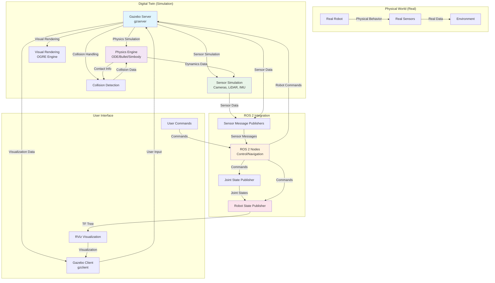

# Chapter 06 — Gazebo Setup and Simulation

## Introduction: Digital Twins in Physical AI

Digital twins have revolutionized the way we approach robotics development, offering a virtual sandbox where we can test, iterate, and validate our robotic systems before deploying them in the real world. In the context of Physical AI, digital twins serve as virtual laboratories that bridge the gap between simulation and reality, enabling us to explore complex interactions between robots, sensors, and environments without the constraints and risks associated with physical hardware.

The concept of a digital twin in robotics extends beyond simple simulation. It encompasses a complete virtual representation of a physical robot or system, including its geometry, physics properties, sensor models, and environmental interactions. This comprehensive virtual model allows us to:

- Test control algorithms in a safe environment
- Validate sensor data processing pipelines
- Explore failure scenarios without hardware risk
- Optimize robot designs before manufacturing
- Train AI models using synthetic data

The simulation-first approach, which we'll explore throughout this module, emphasizes the importance of thoroughly testing and validating robotic systems in simulation before moving to physical deployment. This methodology significantly reduces development time, cost, and risk while improving the overall quality and reliability of robotic systems.

### The Physical AI Context

Physical AI represents the convergence of artificial intelligence with physical systems, creating robots and autonomous agents that can perceive, reason, and act in the real world. Digital twins play a crucial role in this domain by providing a bridge between the digital and physical realms, enabling:

1. **Safe Development**: Complex AI algorithms can be tested in simulation before being deployed on expensive hardware
2. **Rapid Iteration**: Multiple design variations can be tested quickly without physical prototypes
3. **Data Generation**: Large datasets can be generated in simulation for training machine learning models
4. **Risk Mitigation**: Dangerous scenarios can be explored safely in virtual environments
5. **System Integration**: Different components can be tested together before physical integration

### Digital Twin Benefits in Robotics

The implementation of digital twins in robotics provides several key advantages:

**Cost Reduction**: Physical prototypes are expensive and time-consuming to build. Digital twins allow for extensive testing at a fraction of the cost.

**Time Efficiency**: Simulation runs faster than real-time, allowing for accelerated testing and validation cycles.

**Safety**: Dangerous tests and failure scenarios can be explored without risk to hardware or humans.

**Reproducibility**: Simulation environments can be perfectly recreated, ensuring consistent testing conditions.

**Scalability**: Multiple robot configurations and environments can be tested simultaneously in virtual environments.

### Simulation-First Methodology

The simulation-first methodology advocates for developing and testing robotic systems primarily in simulation environments before physical implementation. This approach offers several benefits:

1. **Algorithm Validation**: Control algorithms and AI models can be thoroughly tested and refined
2. **Integration Testing**: Multiple subsystems can be tested together before hardware integration
3. **Edge Case Exploration**: Rare or dangerous scenarios can be systematically tested
4. **Performance Optimization**: System parameters can be fine-tuned without hardware constraints

This methodology has become increasingly important as robotic systems become more complex and costly, making physical testing alone impractical for comprehensive validation.

## Gazebo Architecture and Core Components

Gazebo stands as one of the most powerful and widely-adopted simulation environments in robotics, particularly within the ROS ecosystem. Its architecture is built around a physics engine that accurately models real-world physics, combined with rendering capabilities that provide realistic visual feedback.

### Core Architecture

Gazebo's architecture consists of several key components that work together to create a comprehensive simulation environment:

1. **Physics Engine Layer**: At the core of Gazebo lies the physics engine, which handles collision detection, dynamics simulation, and constraint solving. Gazebo supports multiple physics engines, including ODE (Open Dynamics Engine), Bullet, and Simbody, allowing users to choose the engine that best suits their specific requirements.

2. **Rendering Engine**: The rendering component provides visual feedback for the simulation, using OpenGL to render 3D environments and robot models. This visual representation is crucial for debugging, visualization, and human-in-the-loop interactions.

3. **Sensor Simulation**: Gazebo includes sophisticated sensor simulation capabilities that model various types of sensors, including cameras, LiDAR, IMU, GPS, and force/torque sensors. These simulated sensors produce data that closely matches their real-world counterparts.

4. **Communication Interface**: The simulation environment communicates with external systems through various interfaces, most commonly through ROS/ROS 2 topics and services, enabling seamless integration with robotic control systems.

### Key Components

**World Files**: These SDF (Simulation Description Format) files define the simulation environment, including static objects, lighting conditions, physics parameters, and initial robot positions. World files are crucial for creating consistent and reproducible simulation scenarios.

**Model Definitions**: Robot and object models in Gazebo are typically defined using URDF (Unified Robot Description Format) or SDF. These files contain geometric, kinematic, and dynamic properties of the simulated entities.

**Plugins**: Gazebo's plugin architecture allows for extending functionality, including custom sensor models, control interfaces, and physics behaviors. Plugins are essential for integrating with ROS/ROS 2 and implementing custom simulation logic.

### Architecture Deep Dive

#### Server-Client Architecture
Gazebo employs a server-client architecture that separates the simulation core from the user interface:

- **Gazebo Server (gzserver)**: Runs the simulation engine, physics calculations, and sensor updates. This headless component can run on remote machines or in cloud environments.

- **Gazebo Client (gzclient)**: Provides the graphical user interface for visualization, interaction, and debugging. Multiple clients can connect to a single server.

This separation allows for distributed simulation setups where heavy computation runs on powerful servers while visualization occurs on local machines.

#### Message Passing System
Gazebo uses its own message passing system based on Google's Protocol Buffers for internal communication. This system handles:

- Model state updates
- Sensor data publishing
- Physics parameter adjustments
- GUI commands and updates

#### Plugin Infrastructure
The plugin system is Gazebo's most powerful feature, enabling extensibility through:

- **World Plugins**: Modify global simulation behavior
- **Model Plugins**: Attach custom behavior to specific models
- **Sensor Plugins**: Implement custom sensor models
- **System Plugins**: Add system-level functionality

### Gazebo Classic vs. Newer Versions

It's important to distinguish between different Gazebo versions:

**Gazebo Classic** (versions 11.x and earlier):
- Based on OGRE rendering engine
- Mature ROS 2 integration
- Extensive documentation and community support
- Recommended for educational purposes

**Gazebo Garden/Harmonic** (newer versions):
- Built on modern rendering technologies
- Improved performance and features
- Evolving ROS 2 integration
- Better for cutting-edge applications

For this module, we'll focus on Gazebo Classic due to its stability and educational resources.

### Integration with ROS 2 Ecosystem

Gazebo's tight integration with ROS 2 is facilitated by the `gazebo_ros_pkgs` collection:

- **gazebo_ros**: Core ROS 2 plugins and launch files
- **gazebo_plugins**: Specific sensor and actuator plugins
- **gazebo_msgs**: ROS 2 message definitions for Gazebo interaction
- **gazebo_dev**: Development tools and headers

This integration enables seamless communication between simulation and ROS 2 nodes, maintaining the same interfaces used with real robots.

## World and Environment Modeling

Creating effective simulation environments requires careful consideration of the physical and visual properties that define your world. Gazebo's world modeling capabilities provide the tools needed to create realistic and useful environments for robotic testing and development.

### SDF World Format

The Simulation Description Format (SDF) is Gazebo's native format for describing simulation worlds. An SDF world file typically includes:

- **Physics parameters**: Defines the physics engine configuration, including gravity, step size, and real-time update rates
- **Models**: Static and dynamic objects in the environment, including robots, obstacles, and landmarks
- **Lighting**: Ambient lighting, directional lights, and point lights that affect visual rendering
- **GUI settings**: Camera positions, visualization options, and user interface configurations

### World File Structure

A basic SDF world file follows this structure:

```xml
<?xml version="1.0" ?>
<sdf version="1.6">
  <world name="my_world">
    <!-- Physics configuration -->
    <physics type="ode">
      <max_step_size>0.001</max_step_size>
      <real_time_factor>1.0</real_time_factor>
      <real_time_update_rate>1000.0</real_time_update_rate>
    </physics>

    <!-- Includes for standard models -->
    <include>
      <uri>model://ground_plane</uri>
    </include>
    <include>
      <uri>model://sun</uri>
    </include>

    <!-- Custom models and objects -->
    <model name="my_robot">
      <!-- Model definition -->
    </model>

    <!-- Lighting configuration -->
    <light type="directional" name="sun">
      <pose>0 0 10 0 0 0</pose>
      <diffuse>0.8 0.8 0.8 1</diffuse>
      <specular>0.2 0.2 0.2 1</specular>
      <attenuation>
        <range>1000</range>
        <constant>0.9</constant>
        <linear>0.01</linear>
        <quadratic>0.001</quadratic>
      </attenuation>
      <direction>-0.3 0.3 -1</direction>
    </light>
  </world>
</sdf>
```

### Environment Design Principles

When designing simulation environments, consider these fundamental principles:

1. **Relevance**: Ensure the environment reflects the real-world scenarios where your robot will operate
2. **Complexity Balance**: Create environments that are challenging enough to test your robot's capabilities without being unnecessarily complex
3. **Reproducibility**: Design worlds that can be consistently reproduced across different simulation runs
4. **Scalability**: Structure your environment to allow for easy modification and expansion

### Standard World Components

#### Ground Plane
The ground plane provides a basic surface for your robot to operate on:

```xml
<include>
  <uri>model://ground_plane</uri>
</include>
```

#### Lighting
Proper lighting is essential for both visual rendering and sensor simulation:

```xml
<include>
  <uri>model://sun</uri>
</include>
```

Or custom lighting:
```xml
<light type="directional" name="my_light">
  <pose>0 0 10 0 0 0</pose>
  <diffuse>0.8 0.8 0.8 1</diffuse>
  <specular>0.2 0.2 0.2 1</specular>
  <direction>-0.3 0.3 -1</direction>
</light>
```

### Creating Custom Environments

#### Indoor Environments
For indoor scenarios, consider creating rooms with walls, doors, and furniture:

```xml
<model name="room_walls">
  <link name="wall_1">
    <pose>0 5 1 0 0 0</pose>
    <visual name="visual">
      <geometry>
        <box>
          <size>10 0.2 2</size>
        </box>
      </geometry>
    </visual>
    <collision name="collision">
      <geometry>
        <box>
          <size>10 0.2 2</size>
        </box>
      </geometry>
    </collision>
  </link>
  <!-- Additional walls -->
</model>
```

#### Outdoor Environments
For outdoor scenarios, consider terrain, obstacles, and environmental features:

```xml
<model name="terrain">
  <static>true</static>
  <link name="terrain_link">
    <collision name="collision">
      <geometry>
        <mesh>
          <uri>model://my_terrain/meshes/terrain.dae</uri>
        </mesh>
      </geometry>
    </collision>
    <visual name="visual">
      <geometry>
        <mesh>
          <uri>model://my_terrain/meshes/terrain.dae</uri>
        </mesh>
      </geometry>
    </visual>
  </link>
</model>
```

### Physics Configuration in World Files

The physics section of your world file is crucial for realistic simulation:

```xml
<physics type="ode">
  <!-- Time step for physics updates -->
  <max_step_size>0.001</max_step_size>

  <!-- Real-time factor (1.0 = real-time, >1.0 = faster than real-time) -->
  <real_time_factor>1.0</real_time_factor>

  <!-- Update rate in Hz -->
  <real_time_update_rate>1000.0</real_time_update_rate>

  <!-- Gravity vector -->
  <gravity>0 0 -9.8</gravity>

  <!-- ODE-specific parameters -->
  <ode>
    <solver>
      <type>quick</type>
      <iters>10</iters>
      <sor>1.3</sor>
    </solver>
    <constraints>
      <cfm>0.0</cfm>
      <erp>0.2</erp>
      <contact_max_correcting_vel>100.0</contact_max_correcting_vel>
      <contact_surface_layer>0.001</contact_surface_layer>
    </constraints>
  </ode>
</physics>
```

### Best Practices for World Design

1. **Modularity**: Create reusable components that can be included in multiple worlds
2. **Performance**: Balance visual quality with simulation performance
3. **Consistency**: Use consistent units and coordinate systems
4. **Documentation**: Comment your world files to explain design decisions
5. **Validation**: Test your worlds with different robots to ensure general applicability

### Advanced World Features

#### Plugins in World Files
You can add plugins directly to world files for custom behaviors:

```xml
<plugin name="my_world_plugin" filename="libMyWorldPlugin.so">
  <param1>value1</param1>
  <param2>value2</param2>
</plugin>
```

#### State Management
World files can include initial states for models:

```xml
<model name="my_robot">
  <pose>0 0 0.5 0 0 0</pose>  <!-- Initial position and orientation -->
  <static>false</static>      <!-- Whether the model is static -->
  <link name="chassis">
    <!-- Link definition -->
  </link>
</model>
```

These world modeling techniques provide the foundation for creating realistic and useful simulation environments that accurately represent the conditions your robot will encounter in the real world.

## Physics Engines and Tuning

Gazebo supports multiple physics engines, each with distinct characteristics and performance profiles. Understanding these differences is crucial for selecting the right engine for your specific application.

### ODE (Open Dynamics Engine)

ODE is the default physics engine in Gazebo and offers a good balance of performance and accuracy. It's particularly well-suited for:

- Basic collision detection and response
- Simple dynamic simulations
- Applications where computational efficiency is important
- Educational and prototyping scenarios

Key parameters for ODE tuning include:
- `max_step_size`: The maximum time step for the physics update (typically 0.001-0.01 seconds)
- `real_time_factor`: The target ratio of simulation time to real time (usually 1.0 for real-time)
- `real_time_update_rate`: The frequency of physics updates per second

#### ODE-Specific Configuration

When using ODE, you can fine-tune several parameters in your world file:

```xml
<physics type="ode">
  <max_step_size>0.001</max_step_size>
  <real_time_factor>1.0</real_time_factor>
  <real_time_update_rate>1000.0</real_time_update_rate>
  <gravity>0 0 -9.8</gravity>
  <ode>
    <solver>
      <type>quick</type>
      <iters>10</iters>
      <sor>1.3</sor>
      <use_dynamic_moi_rescaling>0</use_dynamic_moi_rescaling>
    </solver>
    <constraints>
      <cfm>0.0</cfm>
      <erp>0.2</erp>
      <contact_max_correcting_vel>100.0</contact_max_correcting_vel>
      <contact_surface_layer>0.001</contact_surface_layer>
      <max_contacts>20</max_contacts>
    </constraints>
  </ode>
</physics>
```

**Solver Parameters**:
- `iters`: Number of iterations for the constraint solver (higher = more accurate but slower)
- `sor`: Successive Over-Relaxation parameter (affects convergence)
- `use_dynamic_moi_rescaling`: Whether to dynamically rescale the moment of inertia

**Constraint Parameters**:
- `cfm`: Constraint Force Mixing parameter (affects softness of constraints)
- `erp`: Error Reduction Parameter (affects how quickly errors are corrected)
- `contact_max_correcting_vel`: Maximum velocity for contact correction
- `contact_surface_layer`: Depth of the surface layer for contacts

### Bullet Physics Engine

Bullet offers more advanced physics simulation capabilities, including:

- Better handling of complex collision shapes
- More sophisticated constraint solving
- Enhanced support for soft body dynamics
- Improved performance for complex multi-body systems

Bullet is ideal for scenarios requiring high-fidelity physics simulation, such as manipulation tasks with complex contact interactions.

#### Bullet Configuration

Bullet physics configuration in world files:

```xml
<physics type="bullet">
  <max_step_size>0.001</max_step_size>
  <real_time_factor>1.0</real_time_factor>
  <real_time_update_rate>1000.0</real_time_update_rate>
  <gravity>0 0 -9.8</gravity>
  <bullet>
    <solver>
      <type>sequential_impulse</type>
      <iteration>50</iteration>
      <erp>0.2</erp>
      <cfm>0.0</cfm>
    </solver>
    <constraints>
      <contact_surface_layer>0.001</contact_surface_layer>
      <contact_max_correcting_vel>100.0</contact_max_correcting_vel>
    </constraints>
  </bullet>
</physics>
```

### Simbody Physics Engine

Simbody is a high-performance multibody dynamics library that provides:

- Advanced constraint handling
- Exact kinematic constraints
- Efficient handling of closed-loop systems
- Superior accuracy for complex mechanical systems

Simbody is particularly useful for:
- Mechanical systems with complex linkages
- Systems with exact kinematic constraints
- High-precision applications

### Physics Tuning Strategies

Effective physics tuning involves balancing simulation accuracy with computational performance:

1. **Start with conservative parameters**: Begin with smaller time steps and gradually increase for better performance
2. **Validate against real-world data**: Compare simulation results with physical experiments when possible
3. **Monitor simulation stability**: Watch for unexpected behaviors like objects sinking or exploding
4. **Iterate based on application requirements**: Adjust parameters based on the specific needs of your robotic application

#### Common Tuning Approaches

**Stability First**: Start with conservative parameters and gradually relax them:
```xml
<physics type="ode">
  <max_step_size>0.0005</max_step_size>  <!-- Very small initially -->
  <real_time_update_rate>2000.0</real_time_update_rate>
  <ode>
    <solver>
      <iters>50</iters>  <!-- High iterations for stability -->
      <sor>1.0</sor>
    </solver>
  </ode>
</physics>
```

**Performance Optimization**: Once stable, optimize for performance:
```xml
<physics type="ode">
  <max_step_size>0.001</max_step_size>  <!-- Larger, but still stable -->
  <real_time_update_rate>1000.0</real_time_update_rate>
  <ode>
    <solver>
      <iters>20</iters>  <!-- Reduced iterations -->
      <sor>1.3</sor>
    </solver>
  </ode>
</physics>
```

### Physics Engine Selection Guide

**Choose ODE when**:
- Starting with simulation or educational purposes
- Working with simple robots and environments
- Performance is critical
- Compatibility with existing ROS packages is important

**Choose Bullet when**:
- Complex collision geometries are involved
- High-fidelity contact simulation is required
- Working with articulated manipulators
- Advanced constraint solving is needed

**Choose Simbody when**:
- Exact kinematic constraints are essential
- Working with complex mechanical systems
- High-precision simulation is required
- Closed-loop kinematic chains are present

### Troubleshooting Physics Issues

Common physics-related problems and solutions:

**Objects sinking into surfaces**:
- Increase constraint parameters (ERP/CFM)
- Check collision geometry validity
- Verify mass properties in URDF

**Explosive behavior**:
- Decrease time step size
- Increase solver iterations
- Verify joint limits and constraints

**Jittering or unstable motion**:
- Adjust solver parameters
- Check mass distribution in URDF
- Verify joint friction and damping values

The choice of physics engine and its parameters significantly impacts simulation fidelity and performance, making this selection a critical design decision for your digital twin implementation.

## Sensor Simulation Pipeline

Simulated sensors in Gazebo provide the critical link between the virtual environment and the robotic control system. Understanding how these sensors work and how to configure them properly is essential for creating realistic and useful simulations.

### Gazebo Simulation Pipeline Diagram



The above diagram illustrates the complete Gazebo simulation pipeline, showing how the digital twin connects to the physical world and how data flows between the various components of the simulation system.

### Data Flow in the Simulation Pipeline

The simulation pipeline operates in a continuous loop:

1. **Physics Simulation**: The physics engine calculates the motion and interactions of objects based on applied forces, collisions, and constraints.

2. **Sensor Simulation**: Virtual sensors generate data based on the simulated environment, mimicking real sensor behavior with appropriate noise models.

3. **ROS 2 Integration**: Gazebo plugins publish sensor data to ROS 2 topics and subscribe to command topics, maintaining the same interface as real robots.

4. **Control Processing**: ROS 2 nodes process sensor data and generate control commands, just as they would with real robots.

5. **Visualization**: The rendering engine provides visual feedback to users through the Gazebo client interface.

This pipeline ensures that the simulation accurately represents the behavior of real robots, enabling effective testing and validation of robotic algorithms before physical deployment.

### Basic Robot in Gazebo Environment Diagram

```mermaid
graph LR
    subgraph "Robot Structure"
        A[Base Link<br/>Main chassis]
        B[Left Wheel<br/>Continuous Joint]
        C[Right Wheel<br/>Continuous Joint]
        D[Camera Sensor<br/>RGB/Depth]
        E[IMU Sensor<br/>Orientation/Motion]
        F[LiDAR Sensor<br/>Range Scanner]
    end

    subgraph "Environment"
        G[Gazebo World<br/>Physics Simulation]
        H[Ground Plane<br/>Collision Surface]
        I[Lighting<br/>Visual Rendering]
        J[Obstacles<br/>Static/Dynamic Objects]
    end

    subgraph "Control System"
        K[ROS 2 Node<br/>Robot Controller]
        L[Command Topic<br/>geometry_msgs/Twist]
        M[Sensor Topics<br/>sensor_msgs/...]
    end

    A <-- Fixed Joint --> B
    A <-- Fixed Joint --> C
    A <-- Fixed Joint --> D
    A <-- Fixed Joint --> E
    A <-- Fixed Joint --> F

    A --"Physics Simulation"--> G
    B --"Physics Simulation"--> G
    C --"Physics Simulation"--> G
    D --"Sensor Data"--> G
    E --"Sensor Data"--> G
    F --"Sensor Data"--> G

    G --"Ground Contact"--> H
    G --"Lighting Effects"--> I
    G --"Environment"--> J

    K --"Velocity Commands"--> L
    L --"Robot Motion"--> A
    D --"Camera Data"--> M
    E --"IMU Data"--> M
    F --"Laser Scan"--> M
    M --"Sensor Feedback"--> K

    style A fill:#e3f2fd
    style B fill:#e8f5e8
    style C fill:#e8f5e8
    style D fill:#fff9c4
    style E fill:#fff9c4
    style F fill:#fff9c4
    style G fill:#fce4ec
    style K fill:#f3e5f5
</mermaid>

This diagram shows a basic differential drive robot in a Gazebo environment with its main components and how they interact with the simulation system. The robot consists of a base link with two wheels, various sensors, and connects to the ROS 2 control system through standard message interfaces.

### Camera Sensors

Camera sensors simulate RGB cameras, depth cameras, and stereo cameras. Key configuration parameters include:

- **Resolution**: Image width and height in pixels
- **Field of View**: Angular extent of the scene captured by the camera
- **Noise models**: Parameters to simulate real-world sensor noise
- **Update rate**: Frequency at which images are generated

### LiDAR Sensors

LiDAR (Light Detection and Ranging) sensors simulate laser range finders, providing distance measurements to objects in the environment. Configuration includes:

- **Range parameters**: Minimum and maximum detection distances
- **Angular resolution**: Horizontal and vertical resolution of the laser scan
- **Ray count**: Number of rays cast per scan
- **Noise characteristics**: Parameters to simulate real sensor noise

### IMU Sensors

Inertial Measurement Unit (IMU) sensors provide acceleration and angular velocity measurements. Configuration includes:

- **Update rates**: Separate rates for acceleration and angular velocity
- **Noise parameters**: Bias, drift, and random noise characteristics
- **Position and orientation**: Mounting location and orientation on the robot

## ROS 2 ↔ Gazebo Communication Flow

The integration between ROS 2 and Gazebo enables seamless communication between the simulation environment and robotic control systems. This integration is crucial for the simulation-first development approach, as it allows the same control nodes to operate in both simulation and real-world environments.

### Communication Architecture

The ROS 2 ↔ Gazebo communication flow involves several key components:

1. **Gazebo ROS Packages**: These packages provide the bridge between Gazebo's native interfaces and ROS 2 topics and services
2. **TF (Transform) System**: Maintains the relationship between different coordinate frames in the robot and environment
3. **Sensor Topics**: Simulated sensors publish data to ROS 2 topics following standard message types
4. **Actuator Interfaces**: Control commands from ROS 2 nodes are translated to Gazebo actuator commands

### Topic Structure

Common ROS 2 topics used in Gazebo integration include:

- **Sensor data topics**: `/camera/image_raw`, `/scan`, `/imu/data`, etc.
- **Control topics**: `/cmd_vel`, `/joint_states`, `/joint_commands`, etc.
- **TF topics**: `/tf`, `/tf_static` for coordinate transforms
- **Service interfaces**: For dynamic reconfiguration and simulation control

## Common Simulation Failures and Debugging

Even with careful setup and configuration, simulations can fail or behave unexpectedly. Understanding common failure modes and debugging techniques is crucial for efficient development.

### Stability Issues

Simulation instability can manifest as:
- Objects sinking into surfaces
- Explosive behavior during collisions
- Unexpected oscillations in control systems

Common causes include:
- Inappropriate physics parameters (step size, solver iterations)
- Poorly conditioned URDF models (mass properties, joint limits)
- Inadequate collision geometry

### Debugging Strategies

Effective debugging approaches include:
1. **Visual inspection**: Use Gazebo's visualization tools to observe simulation behavior
2. **Parameter validation**: Verify URDF and SDF parameters are physically reasonable
3. **Incremental testing**: Test components individually before integration
4. **Logging and monitoring**: Use ROS 2 tools to monitor topic data and system performance

## Common Simulation Failures and Debugging

Even with careful setup and configuration, simulations can fail or behave unexpectedly. Understanding common failure modes and debugging techniques is crucial for efficient development.

### Stability Issues

Simulation instability can manifest as:
- Objects sinking into surfaces
- Explosive behavior during collisions
- Unexpected oscillations in control systems
- Jittering or unrealistic motion

#### Common Causes of Instability

**Inappropriate Physics Parameters**:
- Time step too large (try values between 0.0001-0.01 seconds)
- Solver iterations too low (start with 50-100 iterations for stability)
- Constraint parameters too aggressive (CFM/ERP values need adjustment)

**Poor URDF Model Quality**:
- Mass values that are too small or negative
- Inertia tensors that don't represent the actual geometry
- Joint limits that are too restrictive or too loose
- Improper center of mass placement

**Numerical Issues**:
- Very large or very small numbers in parameters
- Inconsistent units across the model
- Ill-conditioned mathematical representations

### Debugging Strategies

#### Visual Debugging
Gazebo provides several visualization tools to help debug simulation issues:

**Contact Visualization**:
Enable contact visualization to see where collision detection is occurring:
```bash
gzclient --verbose
```

**Joint Visualization**:
Display joint axes and limits to verify proper kinematic structure.

**Force/Torque Visualization**:
Visualize applied forces to understand dynamic behavior.

#### Parameter Validation
Always verify these critical parameters:

**Mass Properties**:
```xml
<inertial>
  <mass value="1.0"/>  <!-- Should be positive and realistic -->
  <inertia ixx="0.1" ixy="0.0" ixz="0.0"
          iyy="0.1" iyz="0.0" izz="0.1"/>  <!-- Should follow positive-definite rules -->
</inertial>
```

**Joint Limits**:
```xml
<joint name="wheel_joint" type="continuous">
  <parent link="base_link"/>
  <child link="wheel"/>
  <axis xyz="0 1 0"/>
  <!-- For continuous joints, no limits needed -->
</joint>
```

#### Incremental Testing
Follow this approach to isolate problems:

1. **Test Individual Components**: Verify each link and joint separately before integration
2. **Start Simple**: Begin with basic shapes before adding complexity
3. **Verify Physics**: Test with basic physics parameters before tuning
4. **Add Sensors Gradually**: Introduce sensors one at a time

### Common Error Patterns

#### The Sinking Problem
**Symptoms**: Robot slowly sinks into the ground plane
**Solutions**:
- Increase ERP (Error Reduction Parameter) in physics configuration
- Verify that the robot's collision geometry extends to or below its visual geometry
- Check that mass values are positive and realistic

#### The Explosion Problem
**Symptoms**: Objects suddenly fly apart or exhibit explosive behavior
**Solutions**:
- Reduce time step size in world file
- Increase solver iterations
- Verify inertia tensors are properly calculated
- Check for joints with improper limits or zero damping

#### The Jitter Problem
**Symptoms**: Small, rapid oscillations in position or velocity
**Solutions**:
- Adjust solver parameters (try lower SOR value)
- Add appropriate damping to joints
- Verify mass ratios between connected links (avoid extreme differences)

### ROS 2 Integration Issues

#### TF Tree Problems
**Common Issue**: Broken or incomplete TF tree
**Diagnosis**:
```bash
ros2 run tf2_tools view_frames
```
**Solution**: Ensure robot_state_publisher is running and receiving joint states

#### Sensor Data Issues
**Common Issue**: No sensor data or invalid values
**Diagnosis**:
```bash
ros2 topic list | grep scan  # or other sensor topics
ros2 topic echo /scan       # Check for data
```
**Solution**: Verify sensor plugins are properly configured in URDF

#### Control Command Issues
**Common Issue**: Robot doesn't respond to commands
**Diagnosis**:
```bash
ros2 topic echo /cmd_vel    # Check if commands are being published
ros2 topic list             # Verify topic names match
```

### Advanced Debugging Techniques

#### Logging and Monitoring
Use ROS 2 tools to monitor system behavior:
```bash
# Monitor all topics
ros2 topic list

# Check topic bandwidth
ros2 topic bw /scan

# Monitor system performance
ros2 run top top_node
```

#### Simulation Parameter Adjustment
Create launch files with adjustable parameters:
```python
from launch import LaunchDescription
from launch.actions import DeclareLaunchArgument
from launch.substitutions import LaunchConfiguration

def generate_launch_description():
    # Allow physics parameters to be adjusted at launch
    physics_step_arg = DeclareLaunchArgument(
        'physics_step',
        default_value='0.001',
        description='Physics step size'
    )

    # Implementation continues...
```

#### Validation Scripts
Create simple validation scripts to check model integrity:
```python
import xml.etree.ElementTree as ET

def validate_urdf(urdf_file):
    """Basic URDF validation"""
    tree = ET.parse(urdf_file)
    root = tree.getroot()

    # Check for common issues
    for link in root.findall('.//link'):
        mass_elem = link.find('.//mass')
        if mass_elem is not None:
            mass_value = float(mass_elem.get('value'))
            if mass_value <= 0:
                print(f"Warning: Link {link.get('name')} has invalid mass: {mass_value}")
```

### Performance Optimization

#### Simulation Speed
If simulation runs too slowly:
- Reduce visual complexity (simpler meshes)
- Lower physics update rate (balance with accuracy needs)
- Reduce number of active sensors
- Simplify collision geometry

#### Memory Usage
Monitor and optimize memory usage:
- Use efficient mesh formats
- Limit simulation world size
- Remove unnecessary models from the environment

### Best Practices for Robust Simulations

1. **Start Conservative**: Begin with stable parameters and gradually optimize
2. **Validate Realism**: Compare simulation behavior with physical intuition
3. **Document Parameters**: Keep records of working parameter sets
4. **Test Extensively**: Verify behavior under various conditions
5. **Use Version Control**: Track changes to models and configurations

Understanding these failure modes and debugging techniques will significantly improve your ability to create and maintain stable, realistic simulations for your digital twin applications.

## ROS 2 ↔ Gazebo Integration Concepts

The integration between ROS 2 and Gazebo forms the backbone of the simulation-first development approach in robotics. This integration enables seamless communication between the simulation environment and robotic control systems, allowing the same control nodes to operate in both simulation and real-world environments. Understanding this integration is crucial for creating effective digital twins that accurately represent physical robots.

### Architecture of ROS 2 ↔ Gazebo Integration

The integration between ROS 2 and Gazebo is facilitated by the `gazebo_ros_pkgs` collection, which provides a bridge between Gazebo's native interfaces and ROS 2's communication system. This architecture consists of several key components:

**Gazebo ROS Bridge**: This is the core component that translates between Gazebo's internal message system and ROS 2 topics and services. It includes:

- **Publisher Nodes**: Convert Gazebo simulation data to ROS 2 messages (sensor data, odometry, etc.)
- **Subscriber Nodes**: Convert ROS 2 commands to Gazebo actions (motor commands, joint positions, etc.)
- **Service Servers**: Handle dynamic reconfiguration and simulation control commands

**Plugin Infrastructure**: Gazebo's plugin system allows for custom integration points:

- **Sensor Plugins**: Convert simulated sensor data to ROS 2 message formats
- **Actuator Plugins**: Convert ROS 2 commands to simulated actuator behavior
- **Controller Plugins**: Implement complex control logic within the simulation

### Communication Patterns

The ROS 2 ↔ Gazebo integration follows several standard communication patterns:

#### Sensor Data Flow
```mermaid
graph LR
    A[Gazebo Sensor<br/>Simulation] --> B[Plugin Interface]
    B --> C[ROS 2 Message<br/>Creation]
    C --> D[Topic Publisher<br/>sensor_msgs/...]
    D --> E[ROS 2 Nodes<br/>Perception/Control]

    style A fill:#e8f5e8
    style E fill:#f3e5f5
</mermaid>

Sensors in Gazebo generate data based on the simulated environment, which is then converted to standard ROS 2 message types through specialized plugins. For example:

- Camera sensors produce `sensor_msgs/Image` messages
- LiDAR sensors produce `sensor_msgs/LaserScan` messages
- IMU sensors produce `sensor_msgs/Imu` messages
- Joint state sensors produce `sensor_msgs/JointState` messages

#### Control Command Flow
```mermaid
graph RL
    A[ROS 2 Nodes<br/>Navigation/Control] --> B[Topic Subscriber<br/>geometry_msgs/Twist]
    B --> C[ROS 2 Message<br/>Processing]
    C --> D[Plugin Interface]
    D --> E[Gazebo Actuator<br/>Control]

    style A fill:#f3e5f5
    style E fill:#e8f5e8
</mermaid>

Control commands flow from ROS 2 nodes through standard message types to Gazebo actuators:

- Velocity commands (`geometry_msgs/Twist`) control differential drive robots
- Joint position/effort commands control manipulator joints
- Service calls can modify simulation parameters dynamically

### Standard Message Types and Topics

The integration uses standard ROS 2 message types to ensure compatibility between simulation and real robots:

**Sensor Topics**:
- `/camera/image_raw`: Raw camera images (`sensor_msgs/Image`)
- `/scan`: LiDAR scan data (`sensor_msgs/LaserScan`)
- `/imu/data`: IMU measurements (`sensor_msgs/Imu`)
- `/joint_states`: Joint positions, velocities, and efforts (`sensor_msgs/JointState`)

**Control Topics**:
- `/cmd_vel`: Velocity commands for differential drive (`geometry_msgs/Twist`)
- `/joint_commands`: Joint position/velocity/effort commands (`std_msgs/Float64MultiArray`)
- `/set_model_state`: Direct model state control (`gazebo_msgs/SetModelState`)

**TF Topics**:
- `/tf`: Transform tree (`tf2_msgs/TFMessage`)
- `/tf_static`: Static transforms (`tf2_msgs/TFMessage`)

### Gazebo ROS Packages

The `gazebo_ros_pkgs` collection includes several essential packages:

**gazebo_ros**: Core ROS 2 plugins and launch files
- Provides the fundamental bridge between Gazebo and ROS 2
- Includes standard plugins for common sensors and actuators
- Handles basic simulation control services

**gazebo_plugins**: Specific sensor and actuator plugins
- Camera, LiDAR, IMU, and other sensor plugins
- Differential drive and joint control plugins
- Custom sensor simulation capabilities

**gazebo_msgs**: ROS 2 message definitions for Gazebo interaction
- Messages for model state control
- Service definitions for simulation management
- Custom message types for advanced features

### Integration Best Practices

#### Namespace Management
Use proper namespaces to avoid topic conflicts when running multiple robots:

```xml
<plugin name="diff_drive" filename="libgazebo_ros_diff_drive.so">
  <ros>
    <namespace>robot1</namespace>  <!-- Namespace for this robot -->
    <remapping>cmd_vel:=cmd_vel</remapping>
    <remapping>odom:=odom</remapping>
  </ros>
  <!-- Other parameters -->
</plugin>
```

#### TF Frame Conventions
Maintain consistent TF frame conventions between simulation and real robots:

- `base_link`: Robot's base coordinate frame
- `odom`: Odometry frame (integrated from wheel encoders)
- `map`: Global map frame (from localization)
- Sensor frames: Named according to REP-105 standards

#### Parameter Configuration
Use YAML parameter files to maintain consistency between simulation and real robot configurations:

```yaml
# sim_params.yaml
robot1:
  diff_drive_controller:
    left_wheel_names: ["left_wheel"]
    right_wheel_names: ["right_wheel"]
    publish_rate: 50.0
    pose_covariance_diagonal: [0.001, 0.001, 0.001, 0.001, 0.001, 0.01]
    twist_covariance_diagonal: [0.001, 0.001, 0.001, 0.001, 0.001, 0.01]
```

### Advanced Integration Features

#### Dynamic Reconfiguration
Gazebo plugins support dynamic reconfiguration through ROS 2 services, allowing runtime adjustment of simulation parameters:

```bash
# Adjust physics parameters during simulation
ros2 service call /gazebo/set_physics_properties gazebo_msgs/srv/SetPhysicsProperties \
  "{time_step: 0.001, max_update_rate: 1000.0, gravity: {x: 0.0, y: 0.0, z: -9.8}}"
```

#### Simulation Control Services
Standard services for controlling simulation behavior:

- `/gazebo/pause_physics`: Pause physics simulation
- `/gazebo/unpause_physics`: Resume physics simulation
- `/gazebo/reset_simulation`: Reset entire simulation
- `/gazebo/reset_world`: Reset world state only

#### Model State Management
Direct control over model states for advanced simulation scenarios:

```bash
# Set model state directly
ros2 service call /gazebo/set_model_state gazebo_msgs/srv/SetModelState \
  "{state: {model_name: 'my_robot', pose: {position: {x: 1.0, y: 2.0, z: 0.0}}}}"
```

### Performance Considerations

The integration introduces some overhead that should be considered:

**Message Frequency**: Balance sensor update rates with computational requirements:
- High-frequency sensors (IMU: 100-1000 Hz) vs. low-frequency sensors (cameras: 10-30 Hz)
- Consider message throttling for less critical data streams

**Network Overhead**: When running distributed systems:
- Use compression for large data like images
- Consider different QoS settings for various data types
- Monitor bandwidth usage for multi-robot simulations

**Synchronization**: Ensure proper timing between simulation and control:
- Use simulation time (`use_sim_time: true`) for consistent behavior
- Implement proper buffering for real-time performance
- Consider the impact of processing delays on control performance

### Troubleshooting Integration Issues

Common integration problems and solutions:

**Topic Mismatch**: Ensure topic names match between URDF configuration and control nodes
- Use `ros2 topic list` to verify available topics
- Check namespace configuration in plugins
- Verify remapping settings in plugin configuration

**TF Issues**: Maintain proper transform tree structure
- Use `ros2 run tf2_tools view_frames` to visualize TF tree
- Ensure robot_state_publisher is running with correct URDF
- Check joint_state_publisher for proper joint state publication

**Timing Problems**: Address synchronization between simulation and control
- Verify use_sim_time is properly configured
- Check for message queue overflows
- Monitor control loop timing and performance

This comprehensive integration enables the simulation-first methodology by providing identical interfaces between simulation and real robots, allowing developers to test and validate their algorithms in safe, controlled virtual environments before deployment on physical hardware.

## Setup Guide: ROS 2 Gazebo Packages

Setting up the ROS 2 Gazebo integration requires proper installation and configuration of the necessary packages. This guide will walk you through the complete setup process, ensuring your environment is properly configured for digital twin development.

### Prerequisites

Before installing the ROS 2 Gazebo packages, ensure you have:

1. **ROS 2 Humble Hawksbill** installed on Ubuntu 22.04 LTS
2. **Gazebo Classic** (version 11.x) or **Gazebo Garden/Harmonic**
3. **Basic ROS 2 knowledge** including topics, services, and launch files
4. **Development tools** such as colcon for building packages

### Installation Methods

#### Method 1: APT Package Installation (Recommended for beginners)

For a standard installation using APT packages:

```bash
# Update package lists
sudo apt update

# Install ROS 2 Humble Gazebo packages
sudo apt install ros-humble-gazebo-ros-pkgs ros-humble-gazebo-plugins ros-humble-gazebo-dev

# Install additional dependencies
sudo apt install ros-humble-robot-state-publisher ros-humble-joint-state-publisher ros-humble-xacro

# Install visualization tools
sudo apt install ros-humble-rviz2 ros-humble-ros2-control ros-humble-ros2-controllers
```

#### Method 2: Source Installation (Recommended for advanced users)

For the latest features and bug fixes, you can build from source:

```bash
# Create a workspace
mkdir -p ~/ros2_gazebo_ws/src
cd ~/ros2_gazebo_ws/src

# Clone the gazebo_ros_pkgs repository
git clone -b humble https://github.com/ros-simulation/gazebo_ros_pkgs.git

# Clone additional dependencies if needed
git clone -b humble https://github.com/ros-controls/ros2_control.git
git clone -b humble https://github.com/ros-controls/ros2_controllers.git

# Install dependencies using rosdep
cd ~/ros2_gazebo_ws
rosdep install --from-paths src --ignore-src -r -y

# Build the workspace
colcon build --packages-select gazebo_ros_pkgs gazebo_plugins gazebo_dev
```

### Verification of Installation

After installation, verify that the packages are properly installed:

```bash
# Check if gazebo_ros_pkgs are available
ros2 pkg list | grep gazebo

# Verify Gazebo installation
gz --version

# Check for required plugins
find /opt/ros/humble/lib -name "*gazebo*" -type f
```

### Basic Configuration

#### Environment Setup

Add the following to your `~/.bashrc` or `~/.zshrc`:

```bash
# Source ROS 2 Humble
source /opt/ros/humble/setup.bash

# If you built from source, also source your workspace
# source ~/ros2_gazebo_ws/install/setup.bash

# Set Gazebo model path (optional)
export GAZEBO_MODEL_PATH=$GAZEBO_MODEL_PATH:~/.gazebo/models:/usr/share/gazebo-11/models

# Set Gazebo world path (optional)
export GAZEBO_WORLD_PATH=$GAZEBO_WORLD_PATH:~/.gazebo/worlds:/usr/share/gazebo-11/worlds
```

#### Basic Test

Test your installation with a simple launch:

```bash
# Launch empty world
gzserver --verbose

# Or launch with GUI
gzserver --verbose &
gzclient
```

### Creating a Robot Package

To properly use ROS 2 with Gazebo, create a dedicated package for your robot:

```bash
# Create the package
cd ~/ros2_ws/src
ros2 pkg create --build-type ament_cmake my_robot_description --dependencies xacro joint_state_publisher robot_state_publisher gazebo_ros

# Create directory structure
mkdir -p my_robot_description/{urdf,launch,worlds,meshes}
```

#### Package Structure

```
my_robot_description/
├── CMakeLists.txt
├── package.xml
├── urdf/
│   ├── robot.urdf.xacro
│   └── materials.xacro
├── launch/
│   └── robot_gazebo.launch.py
├── worlds/
│   └── empty.world
├── meshes/
└── config/
    └── robot.yaml
```

### URDF Configuration with Gazebo Integration

Create a basic URDF with Gazebo integration:

**File: `urdf/robot.urdf.xacro`**

```xml
<?xml version="1.0"?>
<robot xmlns:xacro="http://www.ros.org/wiki/xacro" name="my_robot">

  <!-- Include materials -->
  <xacro:include filename="materials.xacro"/>

  <!-- Base properties -->
  <xacro:property name="base_width" value="0.6"/>
  <xacro:property name="base_length" value="0.4"/>
  <xacro:property name="base_height" value="0.2"/>
  <xacro:property name="base_mass" value="10.0"/>

  <!-- Wheel properties -->
  <xacro:property name="wheel_radius" value="0.1"/>
  <xacro:property name="wheel_width" value="0.05"/>
  <xacro:property name="wheel_mass" value="0.5"/>
  <xacro:property name="wheel_offset_x" value="0.2"/>
  <xacro:property name="wheel_offset_y" value="0.25"/>

  <!-- Base Link -->
  <link name="base_link">
    <visual>
      <origin xyz="0 0 0" rpy="0 0 0"/>
      <geometry>
        <box size="${base_length} ${base_width} ${base_height}"/>
      </geometry>
      <material name="orange"/>
    </visual>
    <collision>
      <origin xyz="0 0 0" rpy="0 0 0"/>
      <geometry>
        <box size="${base_length} ${base_width} ${base_height}"/>
      </geometry>
    </collision>
    <inertial>
      <mass value="${base_mass}"/>
      <origin xyz="0 0 0" rpy="0 0 0"/>
      <inertia
        ixx="${base_mass/12 * (base_width*base_width + base_height*base_height)}"
        ixy="0.0" ixz="0.0"
        iyy="${base_mass/12 * (base_length*base_length + base_height*base_height)}"
        iyz="0.0"
        izz="${base_mass/12 * (base_length*base_length + base_width*base_width)}"/>
    </inertial>
  </link>

  <!-- Left Wheel -->
  <link name="left_wheel">
    <visual>
      <origin xyz="0 0 0" rpy="1.5708 0 0"/>
      <geometry>
        <cylinder radius="${wheel_radius}" length="${wheel_width}"/>
      </geometry>
      <material name="black"/>
    </visual>
    <collision>
      <origin xyz="0 0 0" rpy="1.5708 0 0"/>
      <geometry>
        <cylinder radius="${wheel_radius}" length="${wheel_width}"/>
      </geometry>
    </collision>
    <inertial>
      <mass value="${wheel_mass}"/>
      <origin xyz="0 0 0" rpy="0 0 0"/>
      <inertia
        ixx="${wheel_mass/12 * (3*wheel_radius*wheel_radius + wheel_width*wheel_width)}"
        ixy="0.0" ixz="0.0"
        iyy="${wheel_mass/12 * (3*wheel_radius*wheel_radius + wheel_width*wheel_width)}"
        iyz="0.0"
        izz="${wheel_mass * wheel_radius * wheel_radius / 2}"/>
    </inertial>
  </link>

  <!-- Right Wheel -->
  <link name="right_wheel">
    <visual>
      <origin xyz="0 0 0" rpy="1.5708 0 0"/>
      <geometry>
        <cylinder radius="${wheel_radius}" length="${wheel_width}"/>
      </geometry>
      <material name="black"/>
    </visual>
    <collision>
      <origin xyz="0 0 0" rpy="1.5708 0 0"/>
      <geometry>
        <cylinder radius="${wheel_radius}" length="${wheel_width}"/>
      </geometry>
    </collision>
    <inertial>
      <mass value="${wheel_mass}"/>
      <origin xyz="0 0 0" rpy="0 0 0"/>
      <inertia
        ixx="${wheel_mass/12 * (3*wheel_radius*wheel_radius + wheel_width*wheel_width)}"
        ixy="0.0" ixz="0.0"
        iyy="${wheel_mass/12 * (3*wheel_radius*wheel_radius + wheel_width*wheel_width)}"
        iyz="0.0"
        izz="${wheel_mass * wheel_radius * wheel_radius / 2}"/>
    </inertial>
  </link>

  <!-- Left Wheel Joint -->
  <joint name="left_wheel_joint" type="continuous">
    <parent link="base_link"/>
    <child link="left_wheel"/>
    <origin xyz="${wheel_offset_x} ${wheel_offset_y} 0" rpy="0 0 0"/>
    <axis xyz="0 0 1"/>
    <dynamics damping="0.5" friction="0.1"/>
  </joint>

  <!-- Right Wheel Joint -->
  <joint name="right_wheel_joint" type="continuous">
    <parent link="base_link"/>
    <child link="right_wheel"/>
    <origin xyz="${wheel_offset_x} ${-wheel_offset_y} 0" rpy="0 0 0"/>
    <axis xyz="0 0 1"/>
    <dynamics damping="0.5" friction="0.1"/>
  </joint>

  <!-- Gazebo Materials -->
  <gazebo reference="base_link">
    <material>Gazebo/Orange</material>
  </gazebo>

  <gazebo reference="left_wheel">
    <material>Gazebo/Black</material>
    <mu1>1.0</mu1>
    <mu2>1.0</mu2>
    <kp>1000000.0</kp>
    <kd>100.0</kd>
  </gazebo>

  <gazebo reference="right_wheel">
    <material>Gazebo/Black</material>
    <mu1>1.0</mu1>
    <mu2>1.0</mu2>
    <kp>1000000.0</kp>
    <kd>100.0</kd>
  </gazebo>

  <!-- Differential Drive Controller -->
  <gazebo>
    <plugin name="diff_drive" filename="libgazebo_ros_diff_drive.so">
      <ros>
        <namespace>my_robot</namespace>
        <remapping>cmd_vel:=cmd_vel</remapping>
        <remapping>odom:=odom</remapping>
      </ros>
      <update_rate>30</update_rate>
      <left_joint>left_wheel_joint</left_joint>
      <right_joint>right_wheel_joint</right_joint>
      <wheel_separation>${2*wheel_offset_y}</wheel_separation>
      <wheel_diameter>${2*wheel_radius}</wheel_diameter>
      <max_wheel_torque>20</max_wheel_torque>
      <max_wheel_acceleration>1.0</max_wheel_acceleration>
      <command_topic>cmd_vel</command_topic>
      <odometry_topic>odom</odometry_topic>
      <odometry_frame>odom</odometry_frame>
      <robot_base_frame>base_link</robot_base_frame>
      <publish_odom>true</publish_odom>
      <publish_wheel_tf>false</publish_wheel_tf>
      <publish_odom_tf>true</publish_odom_tf>
    </plugin>
  </gazebo>

</robot>
```

### Launch File Configuration

Create a launch file to start the robot in Gazebo:

**File: `launch/robot_gazebo.launch.py`**

```python
from launch import LaunchDescription
from launch.actions import IncludeLaunchDescription, DeclareLaunchArgument, ExecuteProcess, RegisterEventHandler
from launch.launch_description_sources import PythonLaunchDescriptionSource
from launch.substitutions import PathJoinSubstitution, LaunchConfiguration
from launch_ros.actions import Node
from launch_ros.substitutions import FindPackageShare
from launch.event_handlers import OnProcessExit
from ament_index_python.packages import get_package_share_directory
import os

def generate_launch_description():
    # Launch configuration variables
    use_sim_time = LaunchConfiguration('use_sim_time', default='true')
    robot_name = LaunchConfiguration('robot_name', default='my_robot')
    world = LaunchConfiguration('world', default='empty.world')
    x_pose = LaunchConfiguration('x_pose', default='0.0')
    y_pose = LaunchConfiguration('y_pose', default='0.0')
    z_pose = LaunchConfiguration('z_pose', default='0.2')

    # Package names
    pkg_gazebo_ros = FindPackageShare('gazebo_ros')
    pkg_robot_description = FindPackageShare('my_robot_description')

    # World file path
    world_path = PathJoinSubstitution([
        FindPackageShare('my_robot_description'),
        'worlds',
        world
    ])

    # Model file path
    model_path = PathJoinSubstitution([
        FindPackageShare('my_robot_description'),
        'urdf',
        'robot.urdf.xacro'
    ])

    # Gazebo launch
    gazebo = IncludeLaunchDescription(
        PythonLaunchDescriptionSource([
            PathJoinSubstitution([
                FindPackageShare('gazebo_ros'),
                'launch',
                'gazebo.launch.py'
            ])
        ]),
        launch_arguments={
            'world': world_path,
            'verbose': 'false',
            'gui': 'true'
        }.items()
    )

    # Robot State Publisher node
    robot_state_publisher = Node(
        package='robot_state_publisher',
        executable='robot_state_publisher',
        name='robot_state_publisher',
        output='screen',
        parameters=[{
            'use_sim_time': use_sim_time,
            'robot_description': open(model_path.perform(SubstitutionContext())).read()
        }]
    )

    # Joint State Publisher node (for non-actuated joints)
    joint_state_publisher = Node(
        package='joint_state_publisher',
        executable='joint_state_publisher',
        name='joint_state_publisher',
        parameters=[{
            'use_sim_time': use_sim_time
        }]
    )

    # Spawn robot in Gazebo
    spawn_entity = Node(
        package='gazebo_ros',
        executable='spawn_entity.py',
        arguments=[
            '-topic', 'robot_description',
            '-entity', robot_name,
            '-x', x_pose,
            '-y', y_pose,
            '-z', z_pose
        ],
        output='screen'
    )

    # RViz2 node (optional)
    rviz = Node(
        package='rviz2',
        executable='rviz2',
        name='rviz2',
        arguments=['-d', PathJoinSubstitution([
            FindPackageShare('my_robot_description'),
            'config',
            'robot.rviz'
        ])],
        parameters=[{
            'use_sim_time': use_sim_time
        }],
        condition=IfCondition(LaunchConfiguration('use_rviz', default='false'))
    )

    # Create the launch description and populate
    ld = LaunchDescription()

    # Add the launch arguments and nodes to the launch description
    ld.add_action(DeclareLaunchArgument(
        'use_sim_time',
        default_value='true',
        description='Use simulation (Gazebo) clock if true'
    ))

    ld.add_action(DeclareLaunchArgument(
        'robot_name',
        default_value='my_robot',
        description='Name of the robot to spawn in Gazebo'
    ))

    ld.add_action(DeclareLaunchArgument(
        'world',
        default_value='empty.world',
        description='Choose one of the world files from `/my_robot_description/worlds`'
    ))

    ld.add_action(DeclareLaunchArgument(
        'x_pose',
        default_value='0.0',
        description='Initial x position of the robot in Gazebo'
    ))

    ld.add_action(DeclareLaunchArgument(
        'y_pose',
        default_value='0.0',
        description='Initial y position of the robot in Gazebo'
    ))

    ld.add_action(DeclareLaunchArgument(
        'z_pose',
        default_value='0.2',
        description='Initial z position of the robot in Gazebo'
    ))

    ld.add_action(gazebo)
    ld.add_action(robot_state_publisher)
    ld.add_action(joint_state_publisher)
    ld.add_action(spawn_entity)
    ld.add_action(rviz)

    return ld
```

### World File Configuration

Create a basic world file for testing:

**File: `worlds/empty.world`**

```xml
<?xml version="1.0" ?>
<sdf version="1.6">
  <world name="small_room">
    <!-- Physics configuration -->
    <physics type="ode">
      <max_step_size>0.001</max_step_size>
      <real_time_factor>1.0</real_time_factor>
      <real_time_update_rate>1000.0</real_time_update_rate>
      <gravity>0 0 -9.8</gravity>
    </physics>

    <!-- Ground plane -->
    <include>
      <uri>model://ground_plane</uri>
    </include>

    <!-- Lighting -->
    <include>
      <uri>model://sun</uri>
    </include>

    <!-- Optional: Add simple obstacles -->
    <model name="wall_1">
      <pose>3 0 1 0 0 0</pose>
      <link name="link">
        <collision name="collision">
          <geometry>
            <box>
              <size>6 0.2 2</size>
            </box>
          </geometry>
        </collision>
        <visual name="visual">
          <geometry>
            <box>
              <size>6 0.2 2</size>
            </box>
          </geometry>
          <material>
            <ambient>0.5 0.5 0.5 1</ambient>
            <diffuse>0.8 0.8 0.8 1</diffuse>
          </material>
        </visual>
        <inertial>
          <mass>100</mass>
          <inertia>
            <ixx>1</ixx>
            <ixy>0</ixy>
            <ixz>0</ixz>
            <iyy>1</iyy>
            <iyz>0</iyz>
            <izz>1</izz>
          </inertia>
        </inertial>
      </link>
    </model>

  </world>
</sdf>
```

### Building and Running

After creating the package structure, build and run:

```bash
# Build the package
cd ~/ros2_ws
colcon build --packages-select my_robot_description

# Source the workspace
source install/setup.bash

# Launch the robot in Gazebo
ros2 launch my_robot_description robot_gazebo.launch.py
```

### Troubleshooting Common Setup Issues

#### Issue 1: Missing Dependencies
```bash
# Error: Could not find ament_cmake
# Solution: Ensure ROS 2 is properly sourced
source /opt/ros/humble/setup.bash
```

#### Issue 2: Plugin Loading Errors
```bash
# Error: Failed to load Gazebo ROS plugin
# Solution: Check plugin filename and path
# For Humble, use: libgazebo_ros_diff_drive.so (not libgazebo_ros_diff_drive.so)
```

#### Issue 3: TF Tree Issues
```bash
# If TF tree is not publishing properly:
# 1. Check that robot_state_publisher is running
# 2. Verify URDF is valid: check_urdf /path/to/robot.urdf
# 3. Ensure joint_state_publisher is publishing joint states
```

#### Issue 4: Sensor Topics Not Publishing
```bash
# Check that sensor plugins are properly configured in URDF
# Verify namespace and topic remappings
# Use ros2 topic list to see available topics
```

### Testing the Setup

Once everything is configured, test with these commands:

```bash
# Check if robot is properly loaded
ros2 topic list | grep -E "(joint_states|tf|odom|scan|image)"

# Test robot movement
ros2 topic pub /my_robot/cmd_vel geometry_msgs/msg/Twist "{linear: {x: 0.5}, angular: {z: 0.0}}"

# Monitor TF tree
ros2 run tf2_tools view_frames

# Check robot state
ros2 run rqt_robot_monitor rqt_robot_monitor
```

This setup guide provides a complete foundation for integrating ROS 2 with Gazebo for digital twin development. Following these steps will ensure your environment is properly configured for creating and testing robotic systems in simulation.

## Sensor Data Integration and Topic Publishing

Sensor data integration is a critical aspect of the ROS 2 ↔ Gazebo integration, enabling simulated robots to provide realistic sensor feedback that matches real-world robot behavior. Understanding how sensor data flows from the simulation to ROS 2 topics is essential for creating effective digital twins that accurately represent physical systems.

### Sensor Data Pipeline Architecture

The sensor data pipeline in Gazebo follows a systematic flow from physical simulation to ROS 2 topics:

```mermaid
graph TD
    A[Physical Simulation<br/>in Gazebo Engine] --> B[Sensor Simulation<br/>Plugin Processing]
    B --> C[Data Conversion<br/>to ROS 2 Format]
    C --> D[ROS 2 Message<br/>Creation]
    D --> E[Topic Publishing<br/>sensor_msgs/...]
    E --> F[ROS 2 Nodes<br/>Perception/Control]
    F --> G[Downstream<br/>Processing]

    style A fill:#e8f5e8
    style E fill:#e1f5fe
    style F fill:#f3e5f5
</mermaid>

This architecture ensures that simulated sensor data follows the same message formats and timing characteristics as real robot sensors, enabling seamless transition between simulation and physical deployment.

### Standard Sensor Types and Message Formats

Gazebo supports various sensor types that publish to standard ROS 2 message formats:

#### Camera Sensors
Camera sensors simulate RGB, depth, or stereo cameras and publish to standard topics:

- **Topic**: `/camera/image_raw` or `/camera/color/image_raw`
- **Message Type**: `sensor_msgs/Image`
- **Frame Rate**: Configurable (typically 10-30 Hz)
- **Data**: Raw image data in various formats (RGB8, BGR8, etc.)

```xml
<!-- Camera sensor configuration in URDF -->
<gazebo reference="camera_link">
  <sensor type="camera" name="camera_sensor">
    <update_rate>30</update_rate>
    <camera name="head">
      <horizontal_fov>1.3962634</horizontal_fov>
      <image>
        <width>640</width>
        <height>480</height>
        <format>R8G8B8</format>
      </image>
      <clip>
        <near>0.1</near>
        <far>100</far>
      </clip>
    </camera>
    <plugin name="camera_controller" filename="libgazebo_ros_camera.so">
      <ros>
        <namespace>my_robot</namespace>
        <remapping>image_raw:=camera/image_raw</remapping>
        <remapping>camera_info:=camera/camera_info</remapping>
      </ros>
      <camera_name>camera</camera_name>
      <image_topic_name>image_raw</image_topic_name>
      <camera_info_topic_name>camera_info</camera_info_topic_name>
      <frame_name>camera_link</frame_name>
    </plugin>
  </sensor>
</gazebo>
```

#### LiDAR Sensors
LiDAR (Light Detection and Ranging) sensors simulate laser range finders and publish to laser scan topics:

- **Topic**: `/scan` or `/laser_scan`
- **Message Type**: `sensor_msgs/LaserScan`
- **Update Rate**: Configurable (typically 5-20 Hz)
- **Data**: Array of range measurements

```xml
<!-- LiDAR sensor configuration in URDF -->
<gazebo reference="lidar_link">
  <sensor type="ray" name="lidar_sensor">
    <always_on>true</always_on>
    <update_rate>10</update_rate>
    <ray>
      <scan>
        <horizontal>
          <samples>720</samples>
          <resolution>1</resolution>
          <min_angle>-3.14159</min_angle>
          <max_angle>3.14159</max_angle>
        </horizontal>
      </scan>
      <range>
        <min>0.1</min>
        <max>30.0</max>
        <resolution>0.01</resolution>
      </range>
    </ray>
    <plugin name="lidar_controller" filename="libgazebo_ros_ray_sensor.so">
      <ros>
        <namespace>my_robot</namespace>
        <remapping>scan:=scan</remapping>
      </ros>
      <output_type>sensor_msgs/LaserScan</output_type>
      <frame_name>lidar_link</frame_name>
    </plugin>
  </sensor>
</gazebo>
```

#### IMU Sensors
Inertial Measurement Unit (IMU) sensors provide acceleration and angular velocity data:

- **Topic**: `/imu/data` or `/imu`
- **Message Type**: `sensor_msgs/Imu`
- **Update Rate**: Configurable (typically 100-1000 Hz)
- **Data**: Orientation, angular velocity, and linear acceleration

```xml
<!-- IMU sensor configuration in URDF -->
<gazebo reference="imu_link">
  <sensor type="imu" name="imu_sensor">
    <always_on>true</always_on>
    <update_rate>100</update_rate>
    <imu>
      <angular_velocity>
        <x>
          <noise type="gaussian">
            <mean>0.0</mean>
            <stddev>2e-4</stddev>
          </noise>
        </x>
        <y>
          <noise type="gaussian">
            <mean>0.0</mean>
            <stddev>2e-4</stddev>
          </noise>
        </y>
        <z>
          <noise type="gaussian">
            <mean>0.0</mean>
            <stddev>2e-4</stddev>
          </noise>
        </z>
      </angular_velocity>
      <linear_acceleration>
        <x>
          <noise type="gaussian">
            <mean>0.0</mean>
            <stddev>1.7e-2</stddev>
          </noise>
        </x>
        <y>
          <noise type="gaussian">
            <mean>0.0</mean>
            <stddev>1.7e-2</stddev>
          </noise>
        </y>
        <z>
          <noise type="gaussian">
            <mean>0.0</mean>
            <stddev>1.7e-2</stddev>
          </noise>
        </z>
      </linear_acceleration>
    </imu>
    <plugin name="imu_controller" filename="libgazebo_ros_imu_sensor.so">
      <ros>
        <namespace>my_robot</namespace>
        <remapping>imu:=imu/data</remapping>
      </ros>
      <frame_name>imu_link</frame_name>
      <body_name>imu_link</body_name>
    </plugin>
  </sensor>
</gazebo>
```

#### GPS Sensors
GPS sensors provide global position data for outdoor robots:

- **Topic**: `/gps/fix` or `/fix`
- **Message Type**: `sensor_msgs/NavSatFix`
- **Update Rate**: Configurable (typically 1-10 Hz)
- **Data**: Latitude, longitude, altitude

### Data Publishing Patterns

#### Continuous Publishing
Most sensors publish data continuously at their configured update rate:

```python
# Example of monitoring sensor data
import rclpy
from sensor_msgs.msg import LaserScan

def scan_callback(msg):
    """Process LiDAR scan data"""
    print(f"Received scan with {len(msg.ranges)} range measurements")
    print(f"Range min: {msg.range_min}, max: {msg.range_max}")
    print(f"Angle min: {msg.angle_min}, max: {msg.angle_max}")

# Subscribe to LiDAR data
lidar_sub = node.create_subscription(LaserScan, '/scan', scan_callback, 10)
```

#### Event-Based Publishing
Some sensors publish data based on specific events or conditions:

```python
# Example of processing camera data
from sensor_msgs.msg import Image
from cv_bridge import CvBridge

def image_callback(msg):
    """Process camera image data"""
    bridge = CvBridge()
    cv_image = bridge.imgmsg_to_cv2(msg, "bgr8")
    # Process image data here
    print(f"Received image: {cv_image.shape[1]}x{cv_image.shape[0]}")

# Subscribe to camera data
camera_sub = node.create_subscription(Image, '/camera/image_raw', image_callback, 10)
```

### Sensor Data Quality and Noise Modeling

Realistic sensor simulation requires proper noise modeling to match real-world sensor characteristics:

#### Noise Parameters
Different sensors require different noise models:

**Camera Sensors**:
- Gaussian noise for image quality simulation
- Distortion parameters to simulate lens effects
- Frame rate limitations to match real cameras

**LiDAR Sensors**:
- Range measurement noise
- Angular resolution limitations
- Multiple reflection simulation

**IMU Sensors**:
- Bias and drift characteristics
- Temperature-dependent noise
- Cross-axis sensitivity

#### Example: Configuring IMU Noise
```xml
<sensor type="imu" name="imu_sensor">
  <imu>
    <angular_velocity>
      <x>
        <noise type="gaussian">
          <mean>0.0</mean>
          <stddev>0.0002</stddev>  <!-- 2e-4 rad/s noise -->
          <bias_mean>0.0000075</bias_mean>
          <bias_stddev>0.0000008</bias_stddev>
        </noise>
      </x>
      <y>
        <noise type="gaussian">
          <mean>0.0</mean>
          <stddev>0.0002</stddev>
        </noise>
      </y>
      <z>
        <noise type="gaussian">
          <mean>0.0</mean>
          <stddev>0.0002</stddev>
        </noise>
      </z>
    </angular_velocity>
    <linear_acceleration>
      <x>
        <noise type="gaussian">
          <mean>0.0</mean>
          <stddev>0.017</stddev>  <!-- 1.7e-2 m/s² noise -->
        </noise>
      </x>
      <y>
        <noise type="gaussian">
          <mean>0.0</mean>
          <stddev>0.017</stddev>
        </noise>
      </y>
      <z>
        <noise type="gaussian">
          <mean>0.0</mean>
          <stddev>0.017</stddev>
        </noise>
      </z>
    </linear_acceleration>
  </imu>
</sensor>
```

### Topic Management and Namespacing

Proper topic management is crucial for multi-robot simulations:

#### Namespace Configuration
```xml
<plugin name="camera_controller" filename="libgazebo_ros_camera.so">
  <ros>
    <namespace>robot1</namespace>  <!-- All topics prefixed with robot1/ -->
    <remapping>image_raw:=camera/image_raw</remapping>
    <remapping>camera_info:=camera/camera_info</remapping>
  </ros>
</plugin>
```

#### Topic Remapping
Custom topic names for specific applications:
```xml
<plugin name="lidar_controller" filename="libgazebo_ros_ray_sensor.so">
  <ros>
    <namespace>my_robot</namespace>
    <remapping>scan:=front_laser_scan</remapping>  <!-- Remap to custom topic name -->
  </ros>
</plugin>
```

### Performance Considerations

#### Data Rate Optimization
Balance sensor update rates with computational requirements:

- **High-frequency sensors** (IMU: 100-1000 Hz): Essential for control systems
- **Medium-frequency sensors** (LiDAR: 5-20 Hz): Important for navigation
- **Low-frequency sensors** (GPS: 1-10 Hz): Sufficient for localization

#### Bandwidth Management
For distributed systems, consider data compression and throttling:

```bash
# Throttle high-bandwidth topics
ros2 run topic_tools throttle messages /camera/image_raw 5.0 /camera/image_throttled
```

### Integration with Perception Systems

Sensor data from Gazebo seamlessly integrates with ROS 2 perception systems:

#### SLAM Integration
```bash
# Use simulated LiDAR data for SLAM
ros2 run slam_toolbox slam_toolbox_async --ros-args -p use_sim_time:=true
```

#### Object Detection
```bash
# Process simulated camera data for object detection
ros2 run vision_opencv cv_bridge_example --ros-args -p use_sim_time:=true
```

### Quality Assurance for Sensor Integration

#### Data Validation
Verify sensor data quality through automated tests:

```python
def validate_lidar_data(scan_msg):
    """Validate LiDAR scan data quality"""
    # Check for valid range values
    valid_ranges = [r for r in scan_msg.ranges if scan_msg.range_min <= r <= scan_msg.range_max]

    # Check for expected number of measurements
    expected_samples = 720  # Based on configuration
    if len(scan_msg.ranges) != expected_samples:
        return False, f"Expected {expected_samples} samples, got {len(scan_msg.ranges)}"

    # Check for NaN values
    if any(r != r for r in scan_msg.ranges):  # NaN check
        return False, "Found NaN values in scan data"

    return True, "Valid scan data"
```

#### Timing Analysis
Monitor sensor data timing for consistency:

```python
def analyze_timing(self, msg):
    """Analyze sensor data timing"""
    current_time = self.get_clock().now().nanoseconds
    msg_time = msg.header.stamp.sec * 1e9 + msg.header.stamp.nanosec
    delay = (current_time - msg_time) / 1e6  # in milliseconds

    if delay > 100:  # Alert if delay exceeds 100ms
        self.get_logger().warn(f"Sensor data delay: {delay:.2f} ms")
```

This comprehensive sensor data integration approach ensures that digital twins provide realistic sensor feedback, enabling effective testing and validation of perception and control algorithms before deployment on physical robots.

## Code Example: Advanced ROS 2 Launch File for Gazebo Integration

This advanced launch file demonstrates a comprehensive setup for integrating a robot with Gazebo simulation, including multiple sensors, controllers, and visualization tools. This example showcases best practices for creating complex simulation environments that accurately represent real-world robotic systems.

### Complete Advanced Launch File

**File: `launch/advanced_robot_gazebo.launch.py`**

```python
from launch import LaunchDescription
from launch.actions import IncludeLaunchDescription, DeclareLaunchArgument, RegisterEventHandler
from launch.launch_description_sources import PythonLaunchDescriptionSource
from launch.substitutions import PathJoinSubstitution, LaunchConfiguration
from launch_ros.actions import Node, ComposableNodeContainer
from launch_ros.descriptions import ComposableNode
from launch_ros.substitutions import FindPackageShare
from launch.event_handlers import OnProcessExit
from launch.conditions import IfCondition
from ament_index_python.packages import get_package_share_directory
import os

def generate_launch_description():
    # Launch configuration variables
    use_sim_time = LaunchConfiguration('use_sim_time', default='true')
    robot_name = LaunchConfiguration('robot_name', default='advanced_robot')
    world = LaunchConfiguration('world', default='small_room.world')
    x_pose = LaunchConfiguration('x_pose', default='0.0')
    y_pose = LaunchConfiguration('y_pose', default='0.0')
    z_pose = LaunchConfiguration('z_pose', default='0.2')
    roll = LaunchConfiguration('roll', default='0.0')
    pitch = LaunchConfiguration('pitch', default='0.0')
    yaw = LaunchConfiguration('yaw', default='0.0')
    use_rviz = LaunchConfiguration('use_rviz', default='true')
    use_jsp_gui = LaunchConfiguration('use_jsp_gui', default='false')
    use_composition = LaunchConfiguration('use_composition', default='false')

    # Package names
    pkg_gazebo_ros = FindPackageShare('gazebo_ros')
    pkg_robot_description = FindPackageShare('my_robot_description')
    pkg_nav2_bringup = FindPackageShare('nav2_bringup')

    # World file path
    world_path = PathJoinSubstitution([
        FindPackageShare('my_robot_description'),
        'worlds',
        world
    ])

    # Model file path
    model_path = PathJoinSubstitution([
        FindPackageShare('my_robot_description'),
        'urdf',
        'advanced_robot.urdf.xacro'
    ])

    # Gazebo launch with additional parameters
    gazebo = IncludeLaunchDescription(
        PythonLaunchDescriptionSource([
            PathJoinSubstitution([
                FindPackageShare('gazebo_ros'),
                'launch',
                'gazebo.launch.py'
            ])
        ]),
        launch_arguments={
            'world': world_path,
            'verbose': 'false',
            'gui': 'true',
            'pause': 'false'
        }.items()
    )

    # Robot State Publisher node
    robot_state_publisher = Node(
        package='robot_state_publisher',
        executable='robot_state_publisher',
        name='robot_state_publisher',
        output='screen',
        parameters=[{
            'use_sim_time': use_sim_time,
            'robot_description': open(model_path.perform(SubstitutionContext())).read()
        }],
        remappings=[
            ('/joint_states', 'joint_states'),
        ]
    )

    # Joint State Publisher node (for non-actuated joints, with GUI option)
    joint_state_publisher = Node(
        package='joint_state_publisher',
        executable='joint_state_publisher',
        name='joint_state_publisher',
        parameters=[{
            'use_sim_time': use_sim_time,
            'rate': 50  # Publish joint states at 50Hz
        }],
        condition=IfCondition(LaunchConfiguration('use_jsp_gui', default='false'))
    )

    # Joint State Publisher GUI (for manual joint control during debugging)
    joint_state_publisher_gui = Node(
        package='joint_state_publisher_gui',
        executable='joint_state_publisher_gui',
        name='joint_state_publisher_gui',
        condition=IfCondition(LaunchConfiguration('use_jsp_gui', default='false'))
    )

    # Spawn robot in Gazebo with full pose
    spawn_entity = Node(
        package='gazebo_ros',
        executable='spawn_entity.py',
        arguments=[
            '-topic', 'robot_description',
            '-entity', robot_name,
            '-x', x_pose,
            '-y', y_pose,
            '-z', z_pose,
            '-R', roll,
            '-P', pitch,
            '-Y', yaw
        ],
        output='screen'
    )

    # RViz2 node with custom configuration
    rviz_config_file = PathJoinSubstitution([
        FindPackageShare('my_robot_description'),
        'config',
        'advanced_robot.rviz'
    ])

    rviz = Node(
        package='rviz2',
        executable='rviz2',
        name='rviz2',
        arguments=['-d', rviz_config_file],
        parameters=[{
            'use_sim_time': use_sim_time
        }],
        condition=IfCondition(use_rviz)
    )

    # TF2 static transform publisher for odom to base_link (if needed for testing)
    static_transform_publisher = Node(
        package='tf2_ros',
        executable='static_transform_publisher',
        name='static_transform_publisher',
        arguments=['0', '0', '0', '0', '0', '0', 'odom', 'base_footprint'],
        parameters=[{
            'use_sim_time': use_sim_time
        }]
    )

    # Robot localization node for sensor fusion (odometry + IMU)
    robot_localization = Node(
        package='robot_localization',
        executable='ekf_node',
        name='ekf_filter_node',
        output='screen',
        parameters=[
            PathJoinSubstitution([
                FindPackageShare('my_robot_description'),
                'config',
                'ekf.yaml'
            ]),
            {'use_sim_time': use_sim_time}
        ],
        remappings=[
            ('odometry/filtered', 'odom'),
        ]
    )

    # Twist mux for combining multiple velocity commands
    twist_mux = Node(
        package='twist_mux',
        executable='twist_mux',
        parameters=[
            PathJoinSubstitution([
                FindPackageShare('my_robot_description'),
                'config',
                'twist_mux.yaml'
            ]),
            {'use_sim_time': use_sim_time}
        ],
        remappings=[
            ('/cmd_vel_out', 'cmd_vel'),
        ]
    )

    # Laser scan merger (if multiple LiDARs are present)
    scan_merger = Node(
        package='scan_tools',
        executable='scan_merger',
        name='scan_merger',
        parameters=[
            PathJoinSubstitution([
                FindPackageShare('my_robot_description'),
                'config',
                'scan_merger.yaml'
            ]),
            {'use_sim_time': use_sim_time}
        ],
        remappings=[
            ('scan', 'merged_scan'),
        ]
    )

    # Add a delay between spawning the robot and starting controllers
    delay_rviz_after_spawn = RegisterEventHandler(
        event_handler=OnProcessExit(
            target_action=spawn_entity,
            on_exit=[rviz],
        )
    )

    # Create the launch description and populate
    ld = LaunchDescription()

    # Add the launch arguments and nodes to the launch description
    ld.add_action(DeclareLaunchArgument(
        'use_sim_time',
        default_value='true',
        description='Use simulation (Gazebo) clock if true'
    ))

    ld.add_action(DeclareLaunchArgument(
        'robot_name',
        default_value='advanced_robot',
        description='Name of the robot to spawn in Gazebo'
    ))

    ld.add_action(DeclareLaunchArgument(
        'world',
        default_value='small_room.world',
        description='Choose one of the world files from `/my_robot_description/worlds`'
    ))

    ld.add_action(DeclareLaunchArgument(
        'x_pose',
        default_value='0.0',
        description='Initial x position of the robot in Gazebo'
    ))

    ld.add_action(DeclareLaunchArgument(
        'y_pose',
        default_value='0.0',
        description='Initial y position of the robot in Gazebo'
    ))

    ld.add_action(DeclareLaunchArgument(
        'z_pose',
        default_value='0.2',
        description='Initial z position of the robot in Gazebo'
    ))

    ld.add_action(DeclareLaunchArgument(
        'roll',
        default_value='0.0',
        description='Initial roll orientation of the robot in Gazebo'
    ))

    ld.add_action(DeclareLaunchArgument(
        'pitch',
        default_value='0.0',
        description='Initial pitch orientation of the robot in Gazebo'
    ))

    ld.add_action(DeclareLaunchArgument(
        'yaw',
        default_value='0.0',
        description='Initial yaw orientation of the robot in Gazebo'
    ))

    ld.add_action(DeclareLaunchArgument(
        'use_rviz',
        default_value='true',
        description='Whether to launch RViz'
    ))

    ld.add_action(DeclareLaunchArgument(
        'use_jsp_gui',
        default_value='false',
        description='Whether to launch Joint State Publisher GUI'
    ))

    ld.add_action(DeclareLaunchArgument(
        'use_composition',
        default_value='false',
        description='Whether to use composed nodes'
    ))

    # Add nodes to the launch description
    ld.add_action(gazebo)
    ld.add_action(robot_state_publisher)
    ld.add_action(joint_state_publisher)
    ld.add_action(joint_state_publisher_gui)
    ld.add_action(spawn_entity)
    ld.add_action(static_transform_publisher)
    ld.add_action(robot_localization)
    ld.add_action(twist_mux)
    ld.add_action(scan_merger)
    ld.add_action(delay_rviz_after_spawn)

    return ld
```

### Advanced URDF Configuration

**File: `urdf/advanced_robot.urdf.xacro`**

```xml
<?xml version="1.0"?>
<robot xmlns:xacro="http://www.ros.org/wiki/xacro" name="advanced_robot">

  <!-- Include materials and common macros -->
  <xacro:include filename="materials.xacro"/>
  <xacro:include filename="gazebo_control.xacro"/>

  <!-- Robot properties -->
  <xacro:property name="base_width" value="0.6"/>
  <xacro:property name="base_length" value="0.4"/>
  <xacro:property name="base_height" value="0.3"/>
  <xacro:property name="base_mass" value="15.0"/>

  <!-- Wheel properties -->
  <xacro:property name="wheel_radius" value="0.1"/>
  <xacro:property name="wheel_width" value="0.05"/>
  <xacro:property name="wheel_mass" value="0.8"/>
  <xacro:property name="wheel_offset_x" value="0.2"/>
  <xacro:property name="wheel_offset_y" value="0.25"/>

  <!-- Camera properties -->
  <xacro:property name="camera_offset_x" value="0.25"/>
  <xacro:property name="camera_offset_z" value="0.2"/>

  <!-- LiDAR properties -->
  <xacro:property name="lidar_offset_x" value="0.2"/>
  <xacro:property name="lidar_offset_z" value="0.25"/>

  <!-- IMU properties -->
  <xacro:property name="imu_offset_x" value="0.0"/>
  <xacro:property name="imu_offset_y" value="0.0"/>
  <xacro:property name="imu_offset_z" value="0.1"/>

  <!-- Base Link -->
  <link name="base_link">
    <visual>
      <origin xyz="0 0 0" rpy="0 0 0"/>
      <geometry>
        <box size="${base_length} ${base_width} ${base_height}"/>
      </geometry>
      <material name="orange"/>
    </visual>
    <collision>
      <origin xyz="0 0 0" rpy="0 0 0"/>
      <geometry>
        <box size="${base_length} ${base_width} ${base_height}"/>
      </geometry>
    </collision>
    <inertial>
      <mass value="${base_mass}"/>
      <origin xyz="0 0 0" rpy="0 0 0"/>
      <inertia
        ixx="${base_mass/12 * (base_width*base_width + base_height*base_height)}"
        ixy="0.0" ixz="0.0"
        iyy="${base_mass/12 * (base_length*base_length + base_height*base_height)}"
        iyz="0.0"
        izz="${base_mass/12 * (base_length*base_length + base_width*base_width)}"/>
    </inertial>
  </link>

  <!-- Base Footprint (for navigation) -->
  <link name="base_footprint">
    <visual>
      <origin xyz="0 0 0" rpy="0 0 0"/>
      <geometry>
        <cylinder radius="0.01" length="0.01"/>
      </geometry>
      <material name="transparent"/>
    </visual>
  </link>

  <joint name="base_footprint_joint" type="fixed">
    <parent link="base_link"/>
    <child link="base_footprint"/>
    <origin xyz="0 0 0.05" rpy="0 0 0"/>
  </joint>

  <!-- Left Wheel -->
  <link name="left_wheel">
    <visual>
      <origin xyz="0 0 0" rpy="1.5708 0 0"/>
      <geometry>
        <cylinder radius="${wheel_radius}" length="${wheel_width}"/>
      </geometry>
      <material name="black"/>
    </visual>
    <collision>
      <origin xyz="0 0 0" rpy="1.5708 0 0"/>
      <geometry>
        <cylinder radius="${wheel_radius}" length="${wheel_width}"/>
      </geometry>
    </collision>
    <inertial>
      <mass value="${wheel_mass}"/>
      <origin xyz="0 0 0" rpy="0 0 0"/>
      <inertia
        ixx="${wheel_mass/12 * (3*wheel_radius*wheel_radius + wheel_width*wheel_width)}"
        ixy="0.0" ixz="0.0"
        iyy="${wheel_mass/12 * (3*wheel_radius*wheel_radius + wheel_width*wheel_width)}"
        iyz="0.0"
        izz="${wheel_mass * wheel_radius * wheel_radius / 2}"/>
    </inertial>
  </link>

  <!-- Right Wheel -->
  <link name="right_wheel">
    <visual>
      <origin xyz="0 0 0" rpy="1.5708 0 0"/>
      <geometry>
        <cylinder radius="${wheel_radius}" length="${wheel_width}"/>
      </geometry>
      <material name="black"/>
    </visual>
    <collision>
      <origin xyz="0 0 0" rpy="1.5708 0 0"/>
      <geometry>
        <cylinder radius="${wheel_radius}" length="${wheel_width}"/>
      </geometry>
    </collision>
    <inertial>
      <mass value="${wheel_mass}"/>
      <origin xyz="0 0 0" rpy="0 0 0"/>
      <inertia
        ixx="${wheel_mass/12 * (3*wheel_radius*wheel_radius + wheel_width*wheel_width)}"
        ixy="0.0" ixz="0.0"
        iyy="${wheel_mass/12 * (3*wheel_radius*wheel_radius + wheel_width*wheel_width)}"
        iyz="0.0"
        izz="${wheel_mass * wheel_radius * wheel_radius / 2}"/>
    </inertial>
  </link>

  <!-- Left Wheel Joint -->
  <joint name="left_wheel_joint" type="continuous">
    <parent link="base_link"/>
    <child link="left_wheel"/>
    <origin xyz="${wheel_offset_x} ${wheel_offset_y} 0" rpy="0 0 0"/>
    <axis xyz="0 0 1"/>
    <dynamics damping="0.5" friction="0.1"/>
  </joint>

  <!-- Right Wheel Joint -->
  <joint name="right_wheel_joint" type="continuous">
    <parent link="base_link"/>
    <child link="right_wheel"/>
    <origin xyz="${wheel_offset_x} ${-wheel_offset_y} 0" rpy="0 0 0"/>
    <axis xyz="0 0 1"/>
    <dynamics damping="0.5" friction="0.1"/>
  </joint>

  <!-- Camera Link -->
  <link name="camera_link">
    <visual>
      <origin xyz="0 0 0" rpy="0 0 0"/>
      <geometry>
        <box size="0.05 0.05 0.03"/>
      </geometry>
      <material name="red"/>
    </visual>
    <collision>
      <origin xyz="0 0 0" rpy="0 0 0"/>
      <geometry>
        <box size="0.05 0.05 0.03"/>
      </geometry>
    </collision>
    <inertial>
      <mass value="0.1"/>
      <origin xyz="0 0 0" rpy="0 0 0"/>
      <inertia ixx="0.0001" ixy="0.0" ixz="0.0"
               iyy="0.0001" iyz="0.0" izz="0.0001"/>
    </inertial>
  </link>

  <!-- Camera Joint -->
  <joint name="camera_joint" type="fixed">
    <parent link="base_link"/>
    <child link="camera_link"/>
    <origin xyz="${camera_offset_x} 0 ${camera_offset_z}" rpy="0 0 0"/>
  </joint>

  <!-- LiDAR Link -->
  <link name="lidar_link">
    <visual>
      <origin xyz="0 0 0" rpy="0 0 0"/>
      <geometry>
        <cylinder radius="0.05" length="0.05"/>
      </geometry>
      <material name="blue"/>
    </visual>
    <collision>
      <origin xyz="0 0 0" rpy="0 0 0"/>
      <geometry>
        <cylinder radius="0.05" length="0.05"/>
      </geometry>
    </collision>
    <inertial>
      <mass value="0.2"/>
      <origin xyz="0 0 0" rpy="0 0 0"/>
      <inertia ixx="0.001" ixy="0.0" ixz="0.0"
               iyy="0.001" iyz="0.0" izz="0.001"/>
    </inertial>
  </link>

  <!-- LiDAR Joint -->
  <joint name="lidar_joint" type="fixed">
    <parent link="base_link"/>
    <child link="lidar_link"/>
    <origin xyz="${lidar_offset_x} 0 ${lidar_offset_z}" rpy="0 0 0"/>
  </joint>

  <!-- IMU Link -->
  <link name="imu_link">
    <inertial>
      <mass value="0.01"/>
      <origin xyz="0 0 0" rpy="0 0 0"/>
      <inertia ixx="0.000001" ixy="0.0" ixz="0.0"
               iyy="0.000001" iyz="0.0" izz="0.000001"/>
    </inertial>
  </link>

  <!-- IMU Joint -->
  <joint name="imu_joint" type="fixed">
    <parent link="base_link"/>
    <child link="imu_link"/>
    <origin xyz="${imu_offset_x} ${imu_offset_y} ${imu_offset_z}" rpy="0 0 0"/>
  </joint>

  <!-- Gazebo Materials -->
  <gazebo reference="base_link">
    <material>Gazebo/Orange</material>
  </gazebo>

  <gazebo reference="left_wheel">
    <material>Gazebo/Black</material>
    <mu1>1.0</mu1>
    <mu2>1.0</mu2>
    <kp>1000000.0</kp>
    <kd>100.0</kd>
  </gazebo>

  <gazebo reference="right_wheel">
    <material>Gazebo/Black</material>
    <mu1>1.0</mu1>
    <mu2>1.0</mu2>
    <kp>1000000.0</kp>
    <kd>100.0</kd>
  </gazebo>

  <!-- Differential Drive Controller -->
  <gazebo>
    <plugin name="diff_drive" filename="libgazebo_ros_diff_drive.so">
      <ros>
        <namespace>advanced_robot</namespace>
        <remapping>cmd_vel:=cmd_vel</remapping>
        <remapping>odom:=odom</remapping>
      </ros>
      <update_rate>30</update_rate>
      <left_joint>left_wheel_joint</left_joint>
      <right_joint>right_wheel_joint</right_joint>
      <wheel_separation>${2*wheel_offset_y}</wheel_separation>
      <wheel_diameter>${2*wheel_radius}</wheel_diameter>
      <max_wheel_torque>20</max_wheel_torque>
      <max_wheel_acceleration>1.0</max_wheel_acceleration>
      <command_topic>cmd_vel</command_topic>
      <odometry_topic>odom</odometry_topic>
      <odometry_frame>odom</odometry_frame>
      <robot_base_frame>base_footprint</robot_base_frame>
      <publish_odom>true</publish_odom>
      <publish_wheel_tf>false</publish_wheel_tf>
      <publish_odom_tf>true</publish_odom_tf>
    </plugin>
  </gazebo>

  <!-- Camera Sensor -->
  <gazebo reference="camera_link">
    <sensor type="camera" name="camera_sensor">
      <update_rate>30</update_rate>
      <camera name="head">
        <horizontal_fov>1.3962634</horizontal_fov>
        <image>
          <width>640</width>
          <height>480</height>
          <format>R8G8B8</format>
        </image>
        <clip>
          <near>0.1</near>
          <far>100</far>
        </clip>
      </camera>
      <plugin name="camera_controller" filename="libgazebo_ros_camera.so">
        <ros>
          <namespace>advanced_robot</namespace>
          <remapping>image_raw:=camera/image_raw</remapping>
          <remapping>camera_info:=camera/camera_info</remapping>
        </ros>
        <camera_name>camera</camera_name>
        <image_topic_name>image_raw</image_topic_name>
        <camera_info_topic_name>camera_info</camera_info_topic_name>
        <frame_name>camera_link</frame_name>
      </plugin>
    </sensor>
  </gazebo>

  <!-- LiDAR Sensor -->
  <gazebo reference="lidar_link">
    <sensor type="ray" name="lidar_sensor">
      <always_on>true</always_on>
      <update_rate>10</update_rate>
      <ray>
        <scan>
          <horizontal>
            <samples>720</samples>
            <resolution>1</resolution>
            <min_angle>-3.14159</min_angle>
            <max_angle>3.14159</max_angle>
          </horizontal>
        </scan>
        <range>
          <min>0.1</min>
          <max>30.0</max>
          <resolution>0.01</resolution>
        </range>
      </ray>
      <plugin name="lidar_controller" filename="libgazebo_ros_ray_sensor.so">
        <ros>
          <namespace>advanced_robot</namespace>
          <remapping>scan:=scan</remapping>
        </ros>
        <output_type>sensor_msgs/LaserScan</output_type>
        <frame_name>lidar_link</frame_name>
      </plugin>
    </sensor>
  </gazebo>

  <!-- IMU Sensor -->
  <gazebo reference="imu_link">
    <sensor type="imu" name="imu_sensor">
      <always_on>true</always_on>
      <update_rate>100</update_rate>
      <imu>
        <angular_velocity>
          <x>
            <noise type="gaussian">
              <mean>0.0</mean>
              <stddev>2e-4</stddev>
            </noise>
          </x>
          <y>
            <noise type="gaussian">
              <mean>0.0</mean>
              <stddev>2e-4</stddev>
            </noise>
          </y>
          <z>
            <noise type="gaussian">
              <mean>0.0</mean>
              <stddev>2e-4</stddev>
            </noise>
          </z>
        </angular_velocity>
        <linear_acceleration>
          <x>
            <noise type="gaussian">
              <mean>0.0</mean>
              <stddev>1.7e-2</stddev>
            </noise>
          </x>
          <y>
            <noise type="gaussian">
              <mean>0.0</mean>
              <stddev>1.7e-2</stddev>
            </noise>
          </y>
          <z>
            <noise type="gaussian">
              <mean>0.0</mean>
              <stddev>1.7e-2</stddev>
            </noise>
          </z>
        </linear_acceleration>
      </imu>
      <plugin name="imu_controller" filename="libgazebo_ros_imu_sensor.so">
        <ros>
          <namespace>advanced_robot</namespace>
          <remapping>imu:=imu/data</remapping>
        </ros>
        <frame_name>imu_link</frame_name>
        <body_name>imu_link</body_name>
      </plugin>
    </sensor>
  </gazebo>

</robot>
```

### Configuration Files

**File: `config/ekf.yaml`**

```yaml
# Configuration for the robot_localization EKF node
advanced_robot:
  ros__parameters:
    use_sim_time: true
    frequency: 50.0
    sensor_timeout: 0.1
    two_d_mode: true
    transform_time_offset: 0.0
    transform_timeout: 0.0
    print_diagnostics: true
    debug: false
    debug_out_file: /path/to/debug/file.txt

    # Frames
    world_frame: odom
    base_link_frame: base_footprint
    odom0: odom
    imu0: imu/data

    # Enable sensor inputs
    odom0_config: [true,  true,  true,
                   false, false, false,
                   false, false, false,
                   false, false, true,
                   false, false, false]
    imu0_config: [false, false, false,
                  true,  true,  true,
                  true,  true,  true,
                  false, false, false,
                  true,  true,  true]

    # Uncertainty of initial state
    initial_state: [0.0, 0.0, 0.0,
                    0.0, 0.0, 0.0,
                    0.0, 0.0, 0.0,
                    0.0, 0.0, 0.0,
                    0.0, 0.0, 0.0]

    # Process noise
    process_noise_covariance: [0.05, 0.0,    0.0,    0.0,    0.0,    0.0,    0.0,     0.0,     0.0,    0.0,    0.0,    0.0,    0.0,    0.0,    0.0,
                              0.0,    0.05, 0.0,    0.0,    0.0,    0.0,    0.0,     0.0,     0.0,    0.0,    0.0,    0.0,    0.0,    0.0,    0.0,
                              0.0,    0.0,    0.06, 0.0,    0.0,    0.0,    0.0,     0.0,     0.0,    0.0,    0.0,    0.0,    0.0,    0.0,    0.0,
                              0.0,    0.0,    0.0,    0.03, 0.0,    0.0,    0.0,     0.0,     0.0,    0.0,    0.0,    0.0,    0.0,    0.0,    0.0,
                              0.0,    0.0,    0.0,    0.0,    0.03, 0.0,    0.0,     0.0,     0.0,    0.0,    0.0,    0.0,    0.0,    0.0,    0.0,
                              0.0,    0.0,    0.0,    0.0,    0.0,    0.06, 0.0,     0.0,     0.0,    0.0,    0.0,    0.0,    0.0,    0.0,    0.0,
                              0.0,    0.0,    0.0,    0.0,    0.0,    0.0,    0.025, 0.0,     0.0,    0.0,    0.0,    0.0,    0.0,    0.0,    0.0,
                              0.0,    0.0,    0.0,    0.0,    0.0,    0.0,    0.0,     0.025, 0.0,    0.0,    0.0,    0.0,    0.0,    0.0,    0.0,
                              0.0,    0.0,    0.0,    0.0,    0.0,    0.0,    0.0,     0.0,     0.04, 0.0,    0.0,    0.0,    0.0,    0.0,    0.0,
                              0.0,    0.0,    0.0,    0.0,    0.0,    0.0,    0.0,     0.0,     0.0,    0.01, 0.0,    0.0,    0.0,    0.0,    0.0,
                              0.0,    0.0,    0.0,    0.0,    0.0,    0.0,    0.0,     0.0,     0.0,    0.0,    0.01, 0.0,    0.0,    0.0,    0.0,
                              0.0,    0.0,    0.0,    0.0,    0.0,    0.0,    0.0,     0.0,     0.0,    0.0,    0.0,    0.02, 0.0,    0.0,    0.0,
                              0.0,    0.0,    0.0,    0.0,    0.0,    0.0,    0.0,     0.0,     0.0,    0.0,    0.0,    0.0,    0.01, 0.0,    0.0,
                              0.0,    0.0,    0.0,    0.0,    0.0,    0.0,    0.0,     0.0,     0.0,    0.0,    0.0,    0.0,    0.0,    0.01, 0.0,
                              0.0,    0.0,    0.0,    0.0,    0.0,    0.0,    0.0,     0.0,     0.0,    0.0,    0.0,    0.0,    0.0,    0.0,    0.015]

    # Initial estimate error covariance
    initial_estimate_covariance: [1e-9, 0.0,    0.0,    0.0,    0.0,    0.0,    0.0,    0.0,    0.0,    0.0,     0.0,     0.0,     0.0,    0.0,    0.0,
                                 0.0,    1e-9, 0.0,    0.0,    0.0,    0.0,    0.0,    0.0,    0.0,    0.0,     0.0,     0.0,     0.0,    0.0,    0.0,
                                 0.0,    0.0,    1e-9, 0.0,    0.0,    0.0,    0.0,    0.0,    0.0,    0.0,     0.0,     0.0,     0.0,    0.0,    0.0,
                                 0.0,    0.0,    0.0,    1e-9, 0.0,    0.0,    0.0,    0.0,    0.0,    0.0,     0.0,     0.0,     0.0,    0.0,    0.0,
                                 0.0,    0.0,    0.0,    0.0,    1e-9, 0.0,    0.0,    0.0,    0.0,    0.0,     0.0,     0.0,     0.0,    0.0,    0.0,
                                 0.0,    0.0,    0.0,    0.0,    0.0,    1e-9, 0.0,    0.0,    0.0,    0.0,     0.0,     0.0,     0.0,    0.0,    0.0,
                                 0.0,    0.0,    0.0,    0.0,    0.0,    0.0,    1e-9, 0.0,    0.0,    0.0,     0.0,     0.0,     0.0,    0.0,    0.0,
                                 0.0,    0.0,    0.0,    0.0,    0.0,    0.0,    0.0,    1e-9, 0.0,    0.0,     0.0,     0.0,     0.0,    0.0,    0.0,
                                 0.0,    0.0,    0.0,    0.0,    0.0,    0.0,    0.0,    0.0,    1e-9, 0.0,     0.0,     0.0,     0.0,    0.0,    0.0,
                                 0.0,    0.0,    0.0,    0.0,    0.0,    0.0,    0.0,    0.0,    0.0,    1e-9,  0.0,     0.0,     0.0,    0.0,    0.0,
                                 0.0,    0.0,    0.0,    0.0,    0.0,    0.0,    0.0,    0.0,    0.0,    0.0,     1e-9,  0.0,     0.0,    0.0,    0.0,
                                 0.0,    0.0,    0.0,    0.0,    0.0,    0.0,    0.0,    0.0,    0.0,    0.0,     0.0,     1e-9,  0.0,    0.0,    0.0,
                                 0.0,    0.0,    0.0,    0.0,    0.0,    0.0,    0.0,    0.0,    0.0,    0.0,     0.0,     0.0,     1e-9, 0.0,    0.0,
                                 0.0,    0.0,    0.0,    0.0,    0.0,    0.0,    0.0,    0.0,    0.0,    0.0,     0.0,     0.0,     0.0,    1e-9, 0.0,
                                 0.0,    0.0,    0.0,    0.0,    0.0,    0.0,    0.0,    0.0,    0.0,    0.0,     0.0,     0.0,     0.0,    0.0,    1e-9]
```

### Launch Instructions

To use this advanced launch file:

```bash
# Build the package
cd ~/ros2_ws
colcon build --packages-select my_robot_description

# Source the workspace
source install/setup.bash

# Launch with default parameters
ros2 launch my_robot_description advanced_robot_gazebo.launch.py

# Launch with custom parameters
ros2 launch my_robot_description advanced_robot_gazebo.launch.py \
  robot_name:=my_robot \
  x_pose:=1.0 \
  y_pose:=2.0 \
  use_rviz:=true
```

This advanced launch file provides a comprehensive setup for Gazebo simulation with multiple sensors, proper TF management, localization, and control systems. It demonstrates best practices for creating complex simulation environments that accurately represent real-world robotic systems, making it ideal for digital twin applications.

## Code Example: ROS 2 Control Node for Simulated Robot

This example demonstrates a comprehensive ROS 2 control node that interfaces with a simulated robot in Gazebo. The node integrates various sensors, implements navigation behaviors, and provides a foundation for more complex robotic applications in digital twin environments.

### Complete ROS 2 Control Node

**File: `src/robot_controller.cpp`**

```cpp
#include <memory>
#include <string>
#include <vector>
#include <chrono>
#include <functional>

#include "rclcpp/rclcpp.hpp"
#include "geometry_msgs/msg/twist.hpp"
#include "sensor_msgs/msg/laser_scan.hpp"
#include "sensor_msgs/msg/imu.hpp"
#include "sensor_msgs/msg/image.hpp"
#include "nav_msgs/msg/odometry.hpp"
#include "tf2/LinearMath/Quaternion.h"
#include "tf2_ros/transform_broadcaster.h"
#include "cv_bridge/cv_bridge.h"
#include "opencv2/opencv.hpp"

using namespace std::chrono_literals;

class RobotController : public rclcpp::Node
{
public:
    RobotController() : Node("robot_controller")
    {
        // Declare parameters
        this->declare_parameter<std::string>("robot_namespace", "advanced_robot");
        this->declare_parameter<double>("linear_velocity", 0.5);
        this->declare_parameter<double>("angular_velocity", 0.5);
        this->declare_parameter<double>("safety_distance", 0.5);
        this->declare_parameter<std::string>("cmd_vel_topic", "cmd_vel");
        this->declare_parameter<std::string>("scan_topic", "scan");
        this->declare_parameter<std::string>("imu_topic", "imu/data");
        this->declare_parameter<std::string>("camera_topic", "camera/image_raw");

        // Get parameters
        std::string robot_namespace = this->get_parameter("robot_namespace").as_string();
        double linear_vel = this->get_parameter("linear_velocity").as_double();
        double angular_vel = this->get_parameter("angular_velocity").as_double();
        safety_distance_ = this->get_parameter("safety_distance").as_double();

        std::string cmd_vel_topic = this->get_parameter("cmd_vel_topic").as_string();
        std::string scan_topic = this->get_parameter("scan_topic").as_string();
        std::string imu_topic = this->get_parameter("imu_topic").as_string();
        std::string camera_topic = this->get_parameter("camera_topic").as_string();

        // Create publishers
        cmd_vel_publisher_ = this->create_publisher<geometry_msgs::msg::Twist>(
            "/" + robot_namespace + "/" + cmd_vel_topic, 10);

        // Create subscribers
        scan_subscription_ = this->create_subscription<sensor_msgs::msg::LaserScan>(
            "/" + robot_namespace + "/" + scan_topic,
            10,
            std::bind(&RobotController::scan_callback, this, std::placeholders::_1));

        imu_subscription_ = this->create_subscription<sensor_msgs::msg::Imu>(
            "/" + robot_namespace + "/" + imu_topic,
            10,
            std::bind(&RobotController::imu_callback, this, std::placeholders::_1));

        camera_subscription_ = this->create_subscription<sensor_msgs::msg::Image>(
            "/" + robot_namespace + "/" + camera_topic,
            10,
            std::bind(&RobotController::camera_callback, this, std::placeholders::_1));

        odom_subscription_ = this->create_subscription<nav_msgs::msg::Odometry>(
            "/" + robot_namespace + "/odom",
            10,
            std::bind(&RobotController::odom_callback, this, std::placeholders::_1));

        // Create timer for control loop
        control_timer_ = this->create_wall_timer(
            50ms, std::bind(&RobotController::control_loop, this));

        // Initialize robot state
        linear_velocity_ = 0.0;
        angular_velocity_ = 0.0;
        emergency_stop_ = false;
        last_scan_received_ = false;
        last_imu_received_ = false;
        last_camera_received_ = false;

        RCLCPP_INFO(this->get_logger(), "Robot controller initialized for namespace: %s", robot_namespace.c_str());
    }

private:
    // Publishers
    rclcpp::Publisher<geometry_msgs::msg::Twist>::SharedPtr cmd_vel_publisher_;

    // Subscribers
    rclcpp::Subscription<sensor_msgs::msg::LaserScan>::SharedPtr scan_subscription_;
    rclcpp::Subscription<sensor_msgs::msg::Imu>::SharedPtr imu_subscription_;
    rclcpp::Subscription<sensor_msgs::msg::Image>::SharedPtr camera_subscription_;
    rclcpp::Subscription<nav_msgs::msg::Odometry>::SharedPtr odom_subscription_;

    // Timer
    rclcpp::TimerBase::SharedPtr control_timer_;

    // Robot state variables
    double linear_velocity_;
    double angular_velocity_;
    double safety_distance_;
    bool emergency_stop_;
    bool last_scan_received_;
    bool last_imu_received_;
    bool last_camera_received_;

    // Sensor data
    sensor_msgs::msg::LaserScan::SharedPtr last_scan_;
    sensor_msgs::msg::Imu::SharedPtr last_imu_;
    sensor_msgs::msg::Image::SharedPtr last_camera_;
    nav_msgs::msg::Odometry::SharedPtr last_odom_;

    // Callback functions
    void scan_callback(const sensor_msgs::msg::LaserScan::SharedPtr msg)
    {
        last_scan_ = msg;
        last_scan_received_ = true;

        // Check for obstacles and implement safety behavior
        check_obstacles();
    }

    void imu_callback(const sensor_msgs::msg::Imu::SharedPtr msg)
    {
        last_imu_ = msg;
        last_imu_received_ = true;

        // Process IMU data for orientation and motion
        process_imu_data();
    }

    void camera_callback(const sensor_msgs::msg::Image::SharedPtr msg)
    {
        last_camera_ = msg;
        last_camera_received_ = true;

        // Process camera data (example: simple obstacle detection)
        process_camera_data();
    }

    void odom_callback(const nav_msgs::msg::Odometry::SharedPtr msg)
    {
        last_odom_ = msg;
        // Store position and velocity for navigation
    }

    void check_obstacles()
    {
        if (!last_scan_received_) return;

        // Find minimum distance in front of robot (between -30 and +30 degrees)
        double min_distance = std::numeric_limits<double>::max();
        int start_idx = static_cast<int>((-30.0 * M_PI / 180.0 - last_scan_->angle_min) / last_scan_->angle_increment);
        int end_idx = static_cast<int>((30.0 * M_PI / 180.0 - last_scan_->angle_min) / last_scan_->angle_increment);

        // Ensure indices are within bounds
        start_idx = std::max(0, start_idx);
        end_idx = std::min(static_cast<int>(last_scan_->ranges.size()), end_idx);

        for (int i = start_idx; i < end_idx; ++i)
        {
            if (last_scan_->ranges[i] < min_distance &&
                last_scan_->range_min < last_scan_->ranges[i] &&
                last_scan_->ranges[i] < last_scan_->range_max)
            {
                min_distance = last_scan_->ranges[i];
            }
        }

        // Implement safety behavior
        if (min_distance < safety_distance_ && min_distance > 0)
        {
            emergency_stop_ = true;
            RCLCPP_WARN(this->get_logger(), "Obstacle detected! Distance: %.2f m", min_distance);
        }
        else
        {
            emergency_stop_ = false;
        }
    }

    void process_imu_data()
    {
        if (!last_imu_received_) return;

        // Extract orientation from IMU (example: for navigation correction)
        double roll, pitch, yaw;
        tf2::Quaternion q(
            last_imu_->orientation.x,
            last_imu_->orientation.y,
            last_imu_->orientation.z,
            last_imu_->orientation.w);
        tf2::Matrix3x3 m(q);
        m.getRPY(roll, pitch, yaw);

        // Use IMU data for navigation correction if needed
        // This is a simplified example
    }

    void process_camera_data()
    {
        if (!last_camera_received_) return;

        try
        {
            // Convert ROS Image to OpenCV
            cv_bridge::CvImagePtr cv_ptr = cv_bridge::toCvCopy(last_camera_, sensor_msgs::image_encodings::BGR8);

            // Example: Simple color-based obstacle detection
            cv::Mat hsv;
            cv::cvtColor(cv_ptr->image, hsv, cv::COLOR_BGR2HSV);

            // Define range for obstacle color detection (example: red obstacles)
            cv::Mat mask;
            cv::inRange(hsv, cv::Scalar(0, 50, 50), cv::Scalar(10, 255, 255), mask);
            cv::inRange(hsv, cv::Scalar(170, 50, 50), cv::Scalar(180, 255, 255), mask);

            // Count non-zero pixels to detect obstacles
            int obstacle_pixels = cv::countNonZero(mask);
            double obstacle_ratio = static_cast<double>(obstacle_pixels) / (mask.rows * mask.cols);

            if (obstacle_ratio > 0.1) // If more than 10% of image shows obstacles
            {
                RCLCPP_WARN(this->get_logger(), "Camera obstacle detected! Ratio: %.2f", obstacle_ratio);
            }
        }
        catch (cv_bridge::Exception& e)
        {
            RCLCPP_ERROR(this->get_logger(), "cv_bridge exception: %s", e.what());
        }
    }

    void control_loop()
    {
        auto cmd_vel_msg = geometry_msgs::msg::Twist();

        if (emergency_stop_)
        {
            // Emergency stop: stop all motion
            cmd_vel_msg.linear.x = 0.0;
            cmd_vel_msg.angular.z = 0.0;
        }
        else
        {
            // Normal navigation behavior: move forward with slight random exploration
            cmd_vel_msg.linear.x = 0.3;  // Forward velocity
            cmd_vel_msg.angular.z = 0.1 * sin(this->get_clock()->now().seconds());  // Slight oscillation
        }

        cmd_vel_publisher_->publish(cmd_vel_msg);

        // Log robot status
        RCLCPP_DEBUG(this->get_logger(),
            "Published cmd_vel: linear=%.2f, angular=%.2f, emergency=%s",
            cmd_vel_msg.linear.x, cmd_vel_msg.angular.z,
            emergency_stop_ ? "true" : "false");
    }
};

int main(int argc, char * argv[])
{
    rclcpp::init(argc, argv);
    rclcpp::spin(std::make_shared<RobotController>());
    rclcpp::shutdown();
    return 0;
}
```

### Python Control Node Alternative

**File: `robot_controller_py/robot_controller.py`**

```python
#!/usr/bin/env python3

import rclpy
from rclpy.node import Node
from rclpy.qos import QoSProfile, ReliabilityPolicy, HistoryPolicy
from geometry_msgs.msg import Twist
from sensor_msgs.msg import LaserScan, Imu, Image
from nav_msgs.msg import Odometry
from cv_bridge import CvBridge
import numpy as np
import cv2
from math import sin, cos, pi


class RobotController(Node):
    def __init__(self):
        super().__init__('robot_controller')

        # Declare parameters
        self.declare_parameter('robot_namespace', 'advanced_robot')
        self.declare_parameter('linear_velocity', 0.5)
        self.declare_parameter('angular_velocity', 0.5)
        self.declare_parameter('safety_distance', 0.5)
        self.declare_parameter('cmd_vel_topic', 'cmd_vel')
        self.declare_parameter('scan_topic', 'scan')
        self.declare_parameter('imu_topic', 'imu/data')
        self.declare_parameter('camera_topic', 'camera/image_raw')

        # Get parameters
        robot_namespace = self.get_parameter('robot_namespace').value
        self.linear_velocity = self.get_parameter('linear_velocity').value
        self.angular_velocity = self.get_parameter('angular_velocity').value
        self.safety_distance = self.get_parameter('safety_distance').value

        cmd_vel_topic = self.get_parameter('cmd_vel_topic').value
        scan_topic = self.get_parameter('scan_topic').value
        imu_topic = self.get_parameter('imu_topic').value
        camera_topic = self.get_parameter('camera_topic').value

        # Create QoS profile for sensor data
        sensor_qos = QoSProfile(
            reliability=ReliabilityPolicy.BEST_EFFORT,
            history=HistoryPolicy.KEEP_LAST,
            depth=10
        )

        # Create publishers
        self.cmd_vel_publisher = self.create_publisher(
            Twist, f'/{robot_namespace}/{cmd_vel_topic}', 10)

        # Create subscribers
        self.scan_subscription = self.create_subscription(
            LaserScan, f'/{robot_namespace}/{scan_topic}',
            self.scan_callback, sensor_qos)

        self.imu_subscription = self.create_subscription(
            Imu, f'/{robot_namespace}/{imu_topic}',
            self.imu_callback, sensor_qos)

        self.camera_subscription = self.create_subscription(
            Image, f'/{robot_namespace}/{camera_topic}',
            self.camera_callback, sensor_qos)

        self.odom_subscription = self.create_subscription(
            Odometry, f'/{robot_namespace}/odom',
            self.odom_callback, 10)

        # Create timer for control loop
        self.control_timer = self.create_timer(0.05, self.control_loop)  # 20 Hz

        # Initialize robot state
        self.linear_velocity_cmd = 0.0
        self.angular_velocity_cmd = 0.0
        self.emergency_stop = False
        self.last_scan = None
        self.last_imu = None
        self.last_camera = None
        self.last_odom = None
        self.last_scan_received = False
        self.last_imu_received = False
        self.last_camera_received = False

        # CV Bridge for image processing
        self.cv_bridge = CvBridge()

        self.get_logger().info(f'Robot controller initialized for namespace: {robot_namespace}')

    def scan_callback(self, msg):
        """Callback for LiDAR scan data"""
        self.last_scan = msg
        self.last_scan_received = True

        # Check for obstacles and implement safety behavior
        self.check_obstacles()

    def imu_callback(self, msg):
        """Callback for IMU data"""
        self.last_imu = msg
        self.last_imu_received = True

        # Process IMU data for orientation and motion
        self.process_imu_data()

    def camera_callback(self, msg):
        """Callback for camera image data"""
        self.last_camera = msg
        self.last_camera_received = True

        # Process camera data (example: simple obstacle detection)
        self.process_camera_data()

    def odom_callback(self, msg):
        """Callback for odometry data"""
        self.last_odom = msg
        # Store position and velocity for navigation

    def check_obstacles(self):
        """Check LiDAR scan for obstacles and implement safety behavior"""
        if not self.last_scan_received:
            return

        # Find minimum distance in front of robot (between -30 and +30 degrees)
        angle_min = self.last_scan.angle_min
        angle_increment = self.last_scan.angle_increment

        # Calculate indices for front-facing sector
        start_angle = -30.0 * pi / 180.0  # -30 degrees in radians
        end_angle = 30.0 * pi / 180.0     # +30 degrees in radians

        start_idx = int((start_angle - angle_min) / angle_increment)
        end_idx = int((end_angle - angle_min) / angle_increment)

        # Ensure indices are within bounds
        start_idx = max(0, start_idx)
        end_idx = min(len(self.last_scan.ranges), end_idx)

        # Find minimum distance in front sector
        min_distance = float('inf')
        for i in range(start_idx, end_idx):
            if (self.last_scan.range_min < self.last_scan.ranges[i] <
                self.last_scan.range_max and
                self.last_scan.ranges[i] < min_distance):
                min_distance = self.last_scan.ranges[i]

        # Implement safety behavior
        if min_distance < self.safety_distance and min_distance > 0:
            self.emergency_stop = True
            self.get_logger().warn(f'Obstacle detected! Distance: {min_distance:.2f} m')
        else:
            self.emergency_stop = False

    def process_imu_data(self):
        """Process IMU data for orientation and motion"""
        if not self.last_imu_received:
            return

        # Extract orientation from IMU (quaternion to euler)
        import tf_transformations
        orientation_q = self.last_imu.orientation
        (roll, pitch, yaw) = tf_transformations.euler_from_quaternion(
            [orientation_q.x, orientation_q.y, orientation_q.z, orientation_q.w])

        # Use IMU data for navigation correction if needed
        # This is a simplified example
        self.get_logger().debug(f'IMU Yaw: {yaw:.2f} rad')

    def process_camera_data(self):
        """Process camera image data"""
        if not self.last_camera_received:
            return

        try:
            # Convert ROS Image to OpenCV
            cv_image = self.cv_bridge.imgmsg_to_cv2(self.last_camera, "bgr8")

            # Example: Simple color-based obstacle detection
            hsv = cv2.cvtColor(cv_image, cv2.COLOR_BGR2HSV)

            # Define range for obstacle color detection (example: red obstacles)
            lower_red1 = np.array([0, 50, 50])
            upper_red1 = np.array([10, 255, 255])
            lower_red2 = np.array([170, 50, 50])
            upper_red2 = np.array([180, 255, 255])

            mask1 = cv2.inRange(hsv, lower_red1, upper_red1)
            mask2 = cv2.inRange(hsv, lower_red2, upper_red2)
            mask = cv2.bitwise_or(mask1, mask2)

            # Count non-zero pixels to detect obstacles
            obstacle_pixels = cv2.countNonZero(mask)
            obstacle_ratio = obstacle_pixels / (mask.shape[0] * mask.shape[1])

            if obstacle_ratio > 0.1:  # If more than 10% of image shows obstacles
                self.get_logger().warn(f'Camera obstacle detected! Ratio: {obstacle_ratio:.2f}')

        except Exception as e:
            self.get_logger().error(f'Error processing camera data: {str(e)}')

    def control_loop(self):
        """Main control loop"""
        cmd_vel_msg = Twist()

        if self.emergency_stop:
            # Emergency stop: stop all motion
            cmd_vel_msg.linear.x = 0.0
            cmd_vel_msg.angular.z = 0.0
        else:
            # Normal navigation behavior: move forward with slight random exploration
            cmd_vel_msg.linear.x = 0.3  # Forward velocity
            cmd_vel_msg.angular.z = 0.1 * sin(self.get_clock().now().nanoseconds / 1e9)  # Slight oscillation

        self.cmd_vel_publisher.publish(cmd_vel_msg)

        # Log robot status
        self.get_logger().debug(
            f'Published cmd_vel: linear={cmd_vel_msg.linear.x:.2f}, '
            f'angular={cmd_vel_msg.angular.z:.2f}, emergency={self.emergency_stop}')


def main(args=None):
    rclpy.init(args=args)
    robot_controller = RobotController()

    try:
        rclpy.spin(robot_controller)
    except KeyboardInterrupt:
        robot_controller.get_logger().info('Robot controller stopped by user')
    finally:
        robot_controller.destroy_node()
        rclpy.shutdown()


if __name__ == '__main__':
    main()
```

### Package Configuration Files

**File: `CMakeLists.txt` (for C++ version)**

```cmake
cmake_minimum_required(VERSION 3.8)
project(robot_controller)

if(CMAKE_COMPILER_IS_GNUCXX OR CMAKE_CXX_COMPILER_ID MATCHES "Clang")
  add_compile_options(-Wall -Wextra -Wpedantic)
endif()

# Find dependencies
find_package(ament_cmake REQUIRED)
find_package(rclcpp REQUIRED)
find_package(geometry_msgs REQUIRED)
find_package(sensor_msgs REQUIRED)
find_package(nav_msgs REQUIRED)
find_package(tf2 REQUIRED)
find_package(tf2_ros REQUIRED)
find_package(cv_bridge REQUIRED)
find_package(OpenCV REQUIRED)

# C++ controller
add_executable(robot_controller src/robot_controller.cpp)
ament_target_dependencies(robot_controller
  rclcpp
  geometry_msgs
  sensor_msgs
  nav_msgs
  tf2
  tf2_ros
  cv_bridge
  ${OpenCV_LIBS}
)

install(TARGETS
  robot_controller
  DESTINATION lib/${PROJECT_NAME}
)

if(BUILD_TESTING)
  find_package(ament_lint_auto REQUIRED)
  set(ament_cmake_copyright_FOUND TRUE)
  set(ament_cmake_cpplint_FOUND TRUE)
  ament_lint_auto_find_test_dependencies()
endif()

ament_package()
```

**File: `setup.py` (for Python version)**

```python
from setuptools import setup
from glob import glob
import os

package_name = 'robot_controller_py'

setup(
    name=package_name,
    version='0.0.1',
    packages=[package_name],
    data_files=[
        ('share/ament_index/resource_index/packages',
            ['resource/' + package_name]),
        ('share/' + package_name, ['package.xml']),
        (os.path.join('share', package_name, 'launch'), glob('launch/*.py')),
        (os.path.join('share', package_name, 'config'), glob('config/*.yaml')),
    ],
    install_requires=['setuptools'],
    zip_safe=True,
    maintainer='Your Name',
    maintainer_email='your.email@example.com',
    description='ROS 2 robot controller package for Gazebo simulation',
    license='Apache License 2.0',
    tests_require=['pytest'],
    entry_points={
        'console_scripts': [
            'robot_controller = robot_controller_py.robot_controller:main',
        ],
    },
)
```

### Launch File for Controller

**File: `launch/controller.launch.py`**

```python
from launch import LaunchDescription
from launch.actions import DeclareLaunchArgument, IncludeLaunchDescription
from launch.launch_description_sources import PythonLaunchDescriptionSource
from launch.substitutions import PathJoinSubstitution, LaunchConfiguration
from launch_ros.actions import Node
from launch_ros.substitutions import FindPackageShare


def generate_launch_description():
    # Launch configuration variables
    use_sim_time = LaunchConfiguration('use_sim_time', default='true')
    robot_namespace = LaunchConfiguration('robot_namespace', default='advanced_robot')
    linear_velocity = LaunchConfiguration('linear_velocity', default='0.5')
    angular_velocity = LaunchConfiguration('angular_velocity', default='0.5')
    safety_distance = LaunchConfiguration('safety_distance', default='0.5')

    # Controller node
    robot_controller = Node(
        package='robot_controller_py',
        executable='robot_controller',
        name='robot_controller',
        parameters=[
            {'use_sim_time': use_sim_time},
            {'robot_namespace': robot_namespace},
            {'linear_velocity': linear_velocity},
            {'angular_velocity': angular_velocity},
            {'safety_distance': safety_distance}
        ],
        output='screen'
    )

    # Create the launch description and populate
    ld = LaunchDescription()

    # Declare launch arguments
    ld.add_action(DeclareLaunchArgument(
        'use_sim_time',
        default_value='true',
        description='Use simulation (Gazebo) clock if true'
    ))

    ld.add_action(DeclareLaunchArgument(
        'robot_namespace',
        default_value='advanced_robot',
        description='Namespace for the robot'
    ))

    ld.add_action(DeclareLaunchArgument(
        'linear_velocity',
        default_value='0.5',
        description='Default linear velocity for the robot'
    ))

    ld.add_action(DeclareLaunchArgument(
        'angular_velocity',
        default_value='0.5',
        description='Default angular velocity for the robot'
    ))

    ld.add_action(DeclareLaunchArgument(
        'safety_distance',
        default_value='0.5',
        description='Safety distance threshold for obstacle avoidance'
    ))

    # Add nodes to the launch description
    ld.add_action(robot_controller)

    return ld
```

### Usage Instructions

To use this control node:

```bash
# Build the package
cd ~/ros2_ws
colcon build --packages-select robot_controller_py

# Source the workspace
source install/setup.bash

# Run the controller node
ros2 run robot_controller_py robot_controller

# Or launch with parameters
ros2 launch robot_controller_py controller.launch.py \
  robot_namespace:=my_robot \
  safety_distance:=0.8
```

This comprehensive control node demonstrates how to integrate multiple sensors (LiDAR, IMU, camera, odometry) in a ROS 2 system for controlling a simulated robot in Gazebo. It includes safety features like obstacle detection and emergency stopping, making it suitable for digital twin applications where safety and reliability are paramount.

## Diagram: ROS 2 ↔ Gazebo Communication Flow

The following diagram illustrates the complete communication flow between ROS 2 and Gazebo in a digital twin simulation environment. This visualization shows how data flows between the simulation engine, ROS 2 nodes, and various components of the system.

```mermaid
graph TB
    subgraph "Physical World (Real Robot)"
        PR[Real Robot]
        PS[Real Sensors]
        PE[Real Environment]
    end

    subgraph "Digital Twin (Simulation Environment)"
        A[Gazebo Server<br/>gzserver]
        B[Gazebo Client<br/>gzclient]
        C[Physics Engine<br/>ODE/Bullet/Simbody]
        D[Sensor Simulation<br/>Cameras, LiDAR, IMU]
        E[Collision Detection]
        F[Visual Rendering<br/>OGRE Engine]
        G[World Models<br/>Static/Dynamic Objects]
    end

    subgraph "ROS 2 Integration Layer"
        H[gazebo_ros_pkgs<br/>Core Bridge]
        I[Plugin Interface<br/>libgazebo_ros.so]
        J[ROS 2 Message<br/>Conversion Layer]
        K[Topic Management<br/>Publishers/Subscribers]
    end

    subgraph "ROS 2 Ecosystem"
        L[Robot State Publisher]
        M[Joint State Publisher]
        N[Sensor Nodes<br/>Perception Processing]
        O[Control Nodes<br/>Navigation/Movement]
        P[TF Transform<br/>System]
        Q[RViz2<br/>Visualization]
    end

    subgraph "User Interface & Tools"
        R[RQT<br/>GUI Tools]
        S[Terminal<br/>Command Interface]
        T[Custom Applications<br/>Python/C++ Nodes]
    end

    subgraph "Communication Channels"
        U[ROS 2 Topics<br/>sensor_msgs, geometry_msgs]
        V[ROS 2 Services<br/>Dynamic Reconfiguration]
        W[ROS 2 Actions<br/>Long-running Operations]
    end

    %% Physical world connections
    PR -- "Physical Data" --> PS
    PS -- "Real Sensor Data" --> PE

    %% Gazebo internal connections
    A -- "Physics Simulation" --> C
    A -- "Sensor Simulation" --> D
    A -- "Collision Handling" --> E
    A -- "Visual Data" --> F
    A -- "Model Spawning" --> G
    B -- "Visualization Commands" --> A
    C -- "Dynamics Data" --> D
    C -- "Contact Info" --> E
    D -- "Sensor Data" --> F
    E -- "Collision Events" --> C

    %% ROS 2 integration connections
    A -- "Plugin Interface" --> I
    I -- "Message Conversion" --> J
    J -- "Topic Creation" --> K
    H -- "Core Bridge" --> I
    K -- "ROS 2 Messages" --> U

    %% ROS 2 ecosystem connections
    L -- "Robot Description" --> P
    M -- "Joint States" --> L
    N -- "Sensor Processing" --> U
    O -- "Control Commands" --> U
    P -- "Transform Tree" --> Q
    P -- "TF Data" --> N
    P -- "Coordinate Frames" --> O

    %% Topic connections
    U -- "sensor_msgs/Image" --> N
    U -- "sensor_msgs/LaserScan" --> N
    U -- "sensor_msgs/Imu" --> N
    U -- "geometry_msgs/Twist" --> A
    U -- "sensor_msgs/JointState" --> M

    %% Service connections
    V -- "Simulation Control" --> A
    V -- "Model State" --> A
    V -- "World Control" --> A

    %% User interface connections
    S -- "Launch Commands" --> A
    S -- "Topic Commands" --> U
    R -- "GUI Monitoring" --> U
    T -- "Custom Nodes" --> U
    Q -- "Visualization" --> U

    %% ROS 2 ecosystem internal connections
    O -- "Navigation Commands" --> A
    N -- "Perception Data" --> O
    L -- "URDF Model" --> A

    %% Style for key components
    style A fill:#e1f5fe
    style H fill:#f3e5f5
    style U fill:#e8f5e8
    style L fill:#fff3e0
    style O fill:#fce4ec
    style N fill:#f1f8e9
</mermaid>

### Diagram Explanation

This communication flow diagram shows the complete architecture of ROS 2 ↔ Gazebo integration:

1. **Physical World**: Represents the real robot and environment that the digital twin simulates
2. **Gazebo Simulation**: Core simulation environment with physics, rendering, and sensor simulation
3. **ROS 2 Integration Layer**: Bridge components that connect Gazebo with ROS 2
4. **ROS 2 Ecosystem**: Standard ROS 2 nodes and tools that interact with the simulation
5. **User Interface**: Tools and interfaces for controlling and monitoring the simulation
6. **Communication Channels**: ROS 2 topics, services, and actions that enable data exchange

### Key Communication Paths

#### Sensor Data Path
- **Gazebo Sensors** → **Plugin Interface** → **ROS 2 Topics** → **Perception Nodes**
- Example: LiDAR simulation → `libgazebo_ros_ray_sensor.so` → `/scan` topic → SLAM algorithms

#### Control Command Path
- **Control Nodes** → **ROS 2 Topics** → **Plugin Interface** → **Gazebo Actuators**
- Example: Navigation stack → `/cmd_vel` topic → `libgazebo_ros_diff_drive.so` → Differential drive

#### TF Transform Path
- **Robot State Publisher** → **TF System** → **All ROS 2 Nodes**
- Ensures consistent coordinate frame management across simulation and control nodes

This comprehensive communication flow enables the digital twin to provide realistic simulation data while maintaining the same interfaces as real robots, facilitating the simulation-first development approach.

## Diagram: ROS 2 Control Architecture for Simulation

The following diagram illustrates the complete ROS 2 control architecture specifically designed for simulation environments. This architecture shows how various ROS 2 nodes, controllers, and tools work together to create a comprehensive simulation system for digital twin applications.

```mermaid
graph TB
    subgraph "Simulation Environment"
        A[Gazebo Server<br/>Simulation Core]
        B[Robot Model<br/>URDF/SDF]
        C[Physics Engine<br/>ODE/Bullet/Simbody]
        D[Sensors<br/>LiDAR, Camera, IMU]
        E[Actuators<br/>Motors, Joints]
    end

    subgraph "ROS 2 Core Infrastructure"
        F[ROS 2 Master<br/>DDS Implementation]
        G[Parameter Server<br/>Configuration Management]
        H[Logging System<br/>rcl_logging]
        I[Clock System<br/>Time Management]
    end

    subgraph "Robot State Management"
        J[Robot State Publisher<br/>Static TF Publisher]
        K[Joint State Publisher<br/>Dynamic Joint States]
        L[TF2 Transform<br/>Coordinate Management]
        M[URDF Parser<br/>Model Description]
    end

    subgraph "Sensor Processing Pipeline"
        N[Sensor Drivers<br/>Gazebo Plugins]
        O[Image Processing<br/>cv_bridge, OpenCV]
        P[Laser Processing<br/>PCL, laser_filters]
        Q[IMU Processing<br/>robot_localization]
        R[Sensor Fusion<br/>Extended Kalman Filter]
    end

    subgraph "Navigation Stack"
        S[AMCL<br/>Localization]
        T[Costmap 2D<br/>Obstacle Map]
        U[Global Planner<br/>A*, Dijkstra]
        V[Local Planner<br/>DWA, TEB]
        W[Recovery Behaviors<br/>Safety Fallbacks]
    end

    subgraph "Control Systems"
        X[Diff Drive Controller<br/>Wheel Control]
        Y[Joint State Controller<br/>Actuator Commands]
        Z[Forward Command Controller<br/>Trajectory Execution]
        AA[Velocity Smoothers<br/>Motion Refinement]
    end

    subgraph "Perception Stack"
        BB[SLAM Toolbox<br/>Mapping]
        CC[Object Detection<br/>OpenVINO, YOLO]
        DD[Semantic Segmentation<br/>Deep Learning]
        EE[Scene Understanding<br/>3D Perception]
    end

    subgraph "User Interface & Tools"
        FF[RViz2<br/>Visualization]
        GG[RQT<br/>GUI Tools]
        HH[ros2 CLI<br/>Command Line]
        II[Custom GUI<br/>Web/Qt Applications]
    end

    subgraph "Development & Debugging"
        JJ[rqt_plot<br/>Data Visualization]
        KK[ros2 bag<br/>Data Recording]
        LL[ros2 topic<br/>Message Monitoring]
        MM[ros2 service<br/>Service Testing]
    end

    %% Core connections
    F -- "DDS Communication" --> J
    F -- "DDS Communication" --> K
    F -- "DDS Communication" --> N
    F -- "DDS Communication" --> X
    F -- "DDS Communication" --> S
    F -- "DDS Communication" --> BB

    %% Robot state connections
    M -- "URDF Model" --> J
    M -- "URDF Model" --> B
    J -- "TF Data" --> L
    K -- "Joint States" --> L
    K -- "Joint States" --> X
    L -- "Transforms" --> FF
    L -- "Transforms" --> N

    %% Simulation connections
    A -- "Physics Simulation" --> C
    A -- "Model Spawning" --> B
    B -- "Robot Model" --> D
    B -- "Robot Model" --> E
    C -- "Physics Data" --> D
    C -- "Physics Data" --> E
    D -- "Sensor Data" --> N
    E -- "Actuator Commands" --> X

    %% Sensor processing connections
    N -- "Raw Sensor Data" --> O
    N -- "Raw Sensor Data" --> P
    N -- "Raw Sensor Data" --> Q
    O -- "Processed Images" --> CC
    P -- "Processed Scans" --> BB
    Q -- "IMU Data" --> R
    R -- "Fused Data" --> S
    R -- "Fused Data" --> T

    %% Navigation connections
    S -- "Pose Estimate" --> T
    T -- "Costmap" --> U
    T -- "Costmap" --> V
    U -- "Global Plan" --> V
    V -- "Local Plan" --> X
    W -- "Recovery Commands" --> V
    BB -- "Map Data" --> T
    BB -- "Map Data" --> U

    %% Control connections
    V -- "Velocity Commands" --> AA
    AA -- "Smoothed Velocities" --> X
    X -- "Wheel Commands" --> E
    Z -- "Joint Commands" --> Y
    Y -- "Actuator Commands" --> E

    %% Perception connections
    BB -- "Map Updates" --> FF
    CC -- "Object Data" --> EE
    DD -- "Segmentation Data" --> EE
    EE -- "Scene Data" --> FF
    EE -- "Scene Data" --> U

    %% Interface connections
    FF -- "Visualization" --> II
    GG -- "GUI Control" --> HH
    HH -- "Commands" --> F
    II -- "User Commands" --> F

    %% Development tools connections
    JJ -- "Data Access" --> F
    KK -- "Recording" --> F
    LL -- "Monitoring" --> F
    MM -- "Service Calls" --> F

    %% Style for key components
    style A fill:#e1f5fe
    style F fill:#f3e5f5
    style J fill:#e8f5e8
    style N fill:#fff3e0
    style S fill:#fce4ec
    style X fill:#f1f8e9
    style BB fill:#e8eaf6
    style FF fill:#f3e5f5
</mermaid>

### Diagram Explanation

This control architecture diagram shows the complete ROS 2 system for simulation environments:

1. **Simulation Environment**: Core Gazebo simulation components that provide physics, sensors, and actuators
2. **ROS 2 Core Infrastructure**: Fundamental ROS 2 communication and management systems
3. **Robot State Management**: Components that handle robot model, joints, and transforms
4. **Sensor Processing Pipeline**: Complete pipeline from raw sensor data to processed information
5. **Navigation Stack**: Complete navigation system including localization, mapping, and path planning
6. **Control Systems**: Various controllers that manage robot motion and actuators
7. **Perception Stack**: Advanced perception capabilities for understanding the environment
8. **User Interface & Tools**: Tools for visualization, monitoring, and control
9. **Development & Debugging**: Tools for development, testing, and debugging

### Key Architecture Components

#### Robot State Management
- **Robot State Publisher**: Publishes static and dynamic transforms for the robot model
- **Joint State Publisher**: Publishes current joint states for visualization and control
- **TF2 System**: Manages coordinate frame transformations across the entire system

#### Sensor Processing Pipeline
- **Sensor Drivers**: Gazebo plugins that convert simulation data to ROS 2 messages
- **Processing Nodes**: Specialized nodes for processing different sensor types
- **Sensor Fusion**: Combines data from multiple sensors for better accuracy

#### Navigation Stack
- **Localization**: Estimates robot position in the map (AMCL)
- **Mapping**: Creates maps from sensor data (SLAM)
- **Path Planning**: Plans global and local paths for navigation
- **Control**: Executes navigation commands safely

This comprehensive control architecture provides a complete framework for developing and testing robotic systems in simulation before deployment on physical robots, making it ideal for digital twin applications.

## Debugging ROS 2 ↔ Gazebo Integration Issues

Debugging ROS 2 ↔ Gazebo integration issues is a critical skill for effective digital twin development. This section covers systematic approaches to identify, diagnose, and resolve common problems that arise when integrating ROS 2 with Gazebo simulation environments.

### Common Integration Issues and Solutions

#### Topic Connection Problems

**Issue**: Sensor topics not publishing or control topics not being received

**Diagnosis**:
```bash
# Check available topics
ros2 topic list

# Check topic types
ros2 topic list -t

# Monitor a specific topic
ros2 topic echo /robot_name/scan

# Check topic bandwidth
ros2 topic bw /robot_name/camera/image_raw
```

**Solutions**:
1. Verify plugin configuration in URDF/SDF files
2. Check namespace consistency between launch files and plugins
3. Ensure remapping is correctly configured
4. Verify Gazebo plugins are properly loaded

```xml
<!-- Correct plugin configuration with namespace -->
<plugin name="camera_controller" filename="libgazebo_ros_camera.so">
  <ros>
    <namespace>my_robot</namespace>
    <remapping>image_raw:=camera/image_raw</remapping>
  </ros>
</plugin>
```

#### TF Tree Issues

**Issue**: Broken or incomplete TF tree preventing navigation and perception

**Diagnosis**:
```bash
# View the TF tree
ros2 run tf2_tools view_frames

# Check specific transforms
ros2 run tf2_ros tf2_echo base_link laser_link

# Monitor TF topics
ros2 topic echo /tf
ros2 topic echo /tf_static
```

**Solutions**:
1. Verify robot_state_publisher is running
2. Check URDF joint definitions
3. Ensure joint_state_publisher is publishing joint states
4. Validate coordinate frame conventions

```bash
# Launch with proper TF configuration
ros2 run robot_state_publisher robot_state_publisher --ros-args -p robot_description:="$(cat robot.urdf)"
```

#### Sensor Data Quality Problems

**Issue**: Missing, delayed, or incorrect sensor data

**Diagnosis**:
```bash
# Check sensor data timing
ros2 topic hz /robot_name/scan

# Monitor sensor data values
ros2 topic echo /robot_name/imu/data --field angular_velocity

# Check for NaN values
ros2 run rqt_plot rqt_plot
```

**Solutions**:
1. Verify sensor plugin update rates
2. Check noise model configurations
3. Ensure proper sensor placement in URDF
4. Validate physics simulation parameters

#### Performance Issues

**Issue**: Slow simulation, high CPU usage, or delayed responses

**Diagnosis**:
```bash
# Monitor system resources
htop

# Check ROS 2 node performance
ros2 run top top_node

# Monitor topic frequencies
ros2 topic hz /robot_name/camera/image_raw
```

**Solutions**:
1. Reduce sensor update rates
2. Simplify collision geometry
3. Limit visualization complexity
4. Optimize plugin configurations

### Advanced Debugging Techniques

#### Using Gazebo Debugging Tools

```bash
# Launch Gazebo with verbose output
gzserver --verbose world_file.world

# Enable physics debugging
gzclient --verbose

# Use Gazebo's built-in visualization tools
# - View contacts
# - View joints
# - View center of mass
```

#### ROS 2 Debugging Tools

```bash
# Use rqt for comprehensive monitoring
ros2 run rqt rqt

# Launch specific debugging tools
ros2 run rqt_topic rqt_topic
ros2 run rqt_service_caller rqt_service_caller
ros2 run rqt_graph rqt_graph

# Use ros2 command line tools
ros2 node list
ros2 node info <node_name>
ros2 lifecycle list <node_name>
```

#### Logging and Monitoring

```cpp
// In C++ nodes, use appropriate logging levels
RCLCPP_INFO(node->get_logger(), "Normal operation message");
RCLCPP_DEBUG(node->get_logger(), "Detailed debugging information");
RCLCPP_WARN(node->get_logger(), "Warning about potential issues");
RCLCPP_ERROR(node->get_logger(), "Error that affects functionality");
```

```python
# In Python nodes
self.get_logger().info('Normal operation message')
self.get_logger().debug('Detailed debugging information')
self.get_logger().warn('Warning about potential issues')
self.get_logger().error('Error that affects functionality')
```

### Systematic Debugging Approach

#### Step 1: Verify Basic Connectivity

1. **Check Gazebo launch**:
   ```bash
   # Verify Gazebo server is running
   ps aux | grep gzserver

   # Check if Gazebo GUI is connected
   ps aux | grep gzclient
   ```

2. **Verify ROS 2 launch**:
   ```bash
   # Check ROS 2 nodes
   ros2 node list

   # Check ROS 2 topics
   ros2 topic list
   ```

#### Step 2: Test Individual Components

1. **Robot State Publisher**:
   ```bash
   # Check if robot model is properly loaded
   ros2 param get /robot_state_publisher robot_description

   # Monitor TF tree
   ros2 topic echo /tf
   ```

2. **Sensor Plugins**:
   ```bash
   # Test each sensor individually
   ros2 topic echo /robot_name/scan
   ros2 topic echo /robot_name/camera/image_raw
   ros2 topic echo /robot_name/imu/data
   ```

3. **Control Plugins**:
   ```bash
   # Test control commands
   ros2 topic pub /robot_name/cmd_vel geometry_msgs/msg/Twist "{linear: {x: 0.5}, angular: {z: 0.0}}"
   ```

#### Step 3: Integration Testing

1. **End-to-end testing**:
   ```bash
   # Test complete pipeline
   ros2 run rviz2 rviz2

   # Use navigation stack if available
   ros2 run nav2_tester nav2_tester
   ```

2. **Performance testing**:
   ```bash
   # Monitor system performance
   ros2 topic hz /robot_name/camera/image_raw
   ros2 topic bw /robot_name/scan
   ```

### Common Error Patterns and Solutions

#### The "No Transform" Error

**Symptoms**: TF lookup failures in perception or navigation nodes

**Causes and Solutions**:
- Robot state publisher not running → Start robot_state_publisher
- Joint states not published → Verify joint_state_publisher
- Wrong frame names → Check URDF frame definitions
- Timing issues → Ensure use_sim_time is consistent

#### The "No Sensor Data" Error

**Symptoms**: Perception nodes failing due to missing sensor input

**Causes and Solutions**:
- Sensor plugins not loaded → Check URDF plugin configuration
- Wrong topic names → Verify remapping in plugins
- Sensor disabled → Check plugin parameters
- Physics not running → Verify Gazebo simulation

#### The "Control Not Working" Error

**Symptoms**: Robot not responding to velocity commands

**Causes and Solutions**:
- Control plugin not loaded → Check URDF plugin configuration
- Wrong command topic → Verify topic names and namespaces
- Physics parameters → Check friction, mass, and damping values
- Joint limits → Verify joint configurations

### Debugging Best Practices

#### Use Simulation Time Consistently

```xml
<!-- In launch files -->
<param name="use_sim_time" value="true"/>
```

```python
# In nodes
self.declare_parameter('use_sim_time', rclpy.Parameter.Type.BOOL)
use_sim_time = self.get_parameter('use_sim_time').value
```

#### Implement Comprehensive Logging

```python
def debug_sensor_data(self, msg):
    """Comprehensive sensor data validation"""
    self.get_logger().debug(f'Received sensor data at {msg.header.stamp}')

    # Validate message contents
    if hasattr(msg, 'ranges'):
        valid_ranges = [r for r in msg.ranges if msg.range_min <= r <= msg.range_max]
        self.get_logger().debug(f'Valid ranges: {len(valid_ranges)}/{len(msg.ranges)}')

    # Check for anomalies
    if any(r != r for r in msg.ranges):  # Check for NaN
        self.get_logger().warn('NaN values detected in sensor data')
```

#### Create Diagnostic Nodes

```python
class DiagnosticNode(Node):
    def __init__(self):
        super().__init__('diagnostic_node')

        # Subscribe to all important topics
        self.scan_sub = self.create_subscription(LaserScan, 'scan', self.scan_callback, 10)
        self.imu_sub = self.create_subscription(Imu, 'imu/data', self.imu_callback, 10)
        self.odom_sub = self.create_subscription(Odometry, 'odom', self.odom_callback, 10)

        # Timer for system health checks
        self.health_timer = self.create_timer(1.0, self.health_check)

    def health_check(self):
        """Check system health and report diagnostics"""
        # Implement comprehensive health checking
        pass
```

#### Use Parameter Validation

```python
def validate_parameters(self):
    """Validate all parameters at startup"""
    required_params = [
        'robot_namespace',
        'safety_distance',
        'linear_velocity',
        'angular_velocity'
    ]

    for param in required_params:
        if not self.has_parameter(param):
            self.get_logger().error(f'Missing required parameter: {param}')
            return False

    return True
```

This systematic approach to debugging ROS 2 ↔ Gazebo integration issues will help you quickly identify and resolve problems, ensuring your digital twin simulation operates reliably and efficiently.

## Applied Lab: Control Simulated Robot with ROS 2 Commands and Verify Sensor Feedback

In this applied lab, you'll control a simulated robot using ROS 2 commands and verify sensor feedback to understand the complete ROS 2 ↔ Gazebo integration cycle. This hands-on exercise will demonstrate how the same interfaces used for real robots work identically with simulated robots, enabling the simulation-first development approach.

### Lab Objectives

By completing this lab, you will:
- Launch a robot model in Gazebo simulation
- Control the robot using ROS 2 velocity commands
- Monitor sensor feedback from simulated sensors
- Validate that the simulation behaves like a real robot
- Debug common integration issues in practice
- Understand the complete data flow between ROS 2 and Gazebo

### Prerequisites

Before starting this lab, ensure you have:
- ROS 2 Humble Hawksbill installed
- Gazebo Classic or Garden installed
- Basic knowledge of ROS 2 commands (topics, nodes, services)
- The robot model files from previous chapters
- A working ROS 2 workspace with the necessary packages

### Lab Environment Setup

First, create a dedicated workspace for this lab:

```bash
# Create workspace
mkdir -p ~/ros2_labs/ws_sim_control
cd ~/ros2_labs/ws_sim_control

# Create source directory
mkdir -p src
cd src

# Create a package for the lab
ros2 pkg create --build-type ament_python lab_robot_controller --dependencies rclpy geometry_msgs sensor_msgs nav_msgs tf2_ros
```

### Step 1: Launch the Simulation Environment

Start by launching the simulation environment with your robot model:

```bash
# Terminal 1: Launch Gazebo with robot
cd ~/ros2_ws
source install/setup.bash

# Launch your robot in Gazebo (use the launch file from previous sections)
ros2 launch my_robot_description advanced_robot_gazebo.launch.py
```

Wait for Gazebo to start and your robot to be spawned. You should see:
- The Gazebo window with your robot
- The robot model properly positioned
- All sensors loaded (camera, LiDAR, IMU, etc.)

### Step 2: Verify Sensor Topics

Check that all sensor topics are publishing data:

```bash
# Terminal 2: Check available topics
cd ~/ros2_ws
source install/setup.bash

# List all topics to find robot-specific ones
ros2 topic list | grep robot

# Check specific sensor topics
ros2 topic info /advanced_robot/scan
ros2 topic info /advanced_robot/camera/image_raw
ros2 topic info /advanced_robot/imu/data
ros2 topic info /advanced_robot/odom

# Monitor sensor data rates
ros2 topic hz /advanced_robot/scan
ros2 topic hz /advanced_robot/camera/image_raw
```

### Step 3: Verify Control Topics

Check that the control interface is available:

```bash
# Check the command velocity topic
ros2 topic info /advanced_robot/cmd_vel

# Verify it accepts geometry_msgs/Twist messages
ros2 interface show geometry_msgs/msg/Twist
```

### Step 4: Basic Robot Control

Test basic movement commands:

```bash
# Move forward
ros2 topic pub /advanced_robot/cmd_vel geometry_msgs/msg/Twist "{linear: {x: 0.5}, angular: {z: 0.0}}" -1

# Stop the robot (send a zero command)
ros2 topic pub /advanced_robot/cmd_vel geometry_msgs/msg/Twist "{linear: {x: 0.0}, angular: {z: 0.0}}" -1

# Rotate in place
ros2 topic pub /advanced_robot/cmd_vel geometry_msgs/msg/Twist "{linear: {x: 0.0}, angular: {z: 0.5}}" -1

# Move forward while rotating (spiral motion)
ros2 topic pub /advanced_robot/cmd_vel geometry_msgs/msg/Twist "{linear: {x: 0.5}, angular: {z: 0.2}}" -1
```

### Step 5: Create a Control Script

Create a Python script to automate robot control:

**File: `src/lab_control_script.py`**

```python
#!/usr/bin/env python3

import rclpy
from rclpy.node import Node
from geometry_msgs.msg import Twist
from sensor_msgs.msg import LaserScan, Image, Imu
from nav_msgs.msg import Odometry
from cv_bridge import CvBridge
import numpy as np
import time
import math


class RobotLabController(Node):
    def __init__(self):
        super().__init__('robot_lab_controller')

        # Parameters
        self.declare_parameter('robot_namespace', 'advanced_robot')
        self.declare_parameter('linear_speed', 0.5)
        self.declare_parameter('angular_speed', 0.5)
        self.declare_parameter('movement_duration', 2.0)

        robot_namespace = self.get_parameter('robot_namespace').value
        self.linear_speed = self.get_parameter('linear_speed').value
        self.angular_speed = self.get_parameter('angular_speed').value
        self.movement_duration = self.get_parameter('movement_duration').value

        # Publishers
        self.cmd_vel_pub = self.create_publisher(
            Twist, f'/{robot_namespace}/cmd_vel', 10)

        # Subscribers
        self.scan_sub = self.create_subscription(
            LaserScan, f'/{robot_namespace}/scan', self.scan_callback, 10)
        self.image_sub = self.create_subscription(
            Image, f'/{robot_namespace}/camera/image_raw', self.image_callback, 10)
        self.imu_sub = self.create_subscription(
            Imu, f'/{robot_namespace}/imu/data', self.imu_callback, 10)
        self.odom_sub = self.create_subscription(
            Odometry, f'/{robot_namespace}/odom', self.odom_callback, 10)

        # CV Bridge for image processing
        self.cv_bridge = CvBridge()

        # Robot state variables
        self.obstacle_detected = False
        self.min_distance = float('inf')
        self.last_imu_yaw = 0.0
        self.start_position = None
        self.current_position = None

        # Timer for control loop
        self.control_timer = self.create_timer(0.1, self.control_loop)

        self.get_logger().info('Robot Lab Controller Initialized')

    def scan_callback(self, msg):
        """Process LiDAR scan data"""
        # Find minimum distance in front of robot
        front_angles = slice(
            int(len(msg.ranges) * 0.4),
            int(len(msg.ranges) * 0.6)
        )

        front_distances = [d for d in msg.ranges[front_angles]
                          if msg.range_min < d < msg.range_max and not math.isnan(d)]

        if front_distances:
            self.min_distance = min(front_distances)
            self.obstacle_detected = self.min_distance < 1.0  # Obstacle within 1m

            if self.obstacle_detected:
                self.get_logger().warn(f'Obstacle detected! Distance: {self.min_distance:.2f}m')
        else:
            self.min_distance = float('inf')
            self.obstacle_detected = False

    def image_callback(self, msg):
        """Process camera image data"""
        try:
            cv_image = self.cv_bridge.imgmsg_to_cv2(msg, "bgr8")

            # Simple edge detection to verify image is not empty
            gray = cv2.cvtColor(cv_image, cv2.COLOR_BGR2GRAY)
            edges = cv2.Canny(gray, 50, 150)

            edge_ratio = np.sum(edges > 0) / (edges.shape[0] * edges.shape[1])

            if edge_ratio < 0.01:  # Less than 1% edges - probably empty/invalid
                self.get_logger().warn('Camera may have invalid data')
            else:
                self.get_logger().debug(f'Camera data OK, edge ratio: {edge_ratio:.3f}')

        except Exception as e:
            self.get_logger().error(f'Error processing camera data: {e}')

    def imu_callback(self, msg):
        """Process IMU data to get orientation"""
        import tf_transformations

        orientation_q = msg.orientation
        (_, _, yaw) = tf_transformations.euler_from_quaternion([
            orientation_q.x, orientation_q.y, orientation_q.z, orientation_q.w
        ])

        self.last_imu_yaw = yaw

    def odom_callback(self, msg):
        """Process odometry data"""
        pos = msg.pose.pose.position
        if self.start_position is None:
            self.start_position = (pos.x, pos.y, pos.z)

        self.current_position = (pos.x, pos.y, pos.z)

    def control_loop(self):
        """Main control loop for the lab exercises"""
        cmd_vel = Twist()

        if self.obstacle_detected and self.min_distance < 0.5:
            # Emergency stop
            cmd_vel.linear.x = 0.0
            cmd_vel.angular.z = 0.0
            self.get_logger().warn('Emergency stop - obstacle too close!')
        else:
            # Basic exploration pattern
            cmd_vel.linear.x = self.linear_speed
            cmd_vel.angular.z = 0.1 * math.sin(self.get_clock().now().nanoseconds / 1e9)  # Gentle turning

        self.cmd_vel_pub.publish(cmd_vel)

        # Log robot status periodically
        if self.get_clock().now().nanoseconds % 5000000000 < 10000000:  # Every 5 seconds
            if self.current_position and self.start_position:
                dx = self.current_position[0] - self.start_position[0]
                dy = self.current_position[1] - self.start_position[1]
                distance_traveled = math.sqrt(dx*dx + dy*dy)

                self.get_logger().info(
                    f'Position: ({self.current_position[0]:.2f}, {self.current_position[1]:.2f}), '
                    f'Distance: {distance_traveled:.2f}m, '
                    f'Heading: {math.degrees(self.last_imu_yaw):.1f}°'
                )

    def execute_movement_pattern(self, linear_x, angular_z, duration):
        """Execute a specific movement pattern"""
        cmd_vel = Twist()
        cmd_vel.linear.x = linear_x
        cmd_vel.angular.z = angular_z

        # Execute for specified duration
        start_time = self.get_clock().now()
        while rclpy.ok():
            current_time = self.get_clock().now()
            if (current_time.nanoseconds - start_time.nanoseconds) / 1e9 > duration:
                break

            self.cmd_vel_pub.publish(cmd_vel)
            time.sleep(0.1)

        # Stop the robot
        cmd_vel.linear.x = 0.0
        cmd_vel.angular.z = 0.0
        self.cmd_vel_pub.publish(cmd_vel)

    def square_pattern(self):
        """Move in a square pattern"""
        for _ in range(4):
            # Move forward
            self.execute_movement_pattern(0.5, 0.0, 4.0)  # 4 meters at 0.5 m/s
            # Turn 90 degrees
            self.execute_movement_pattern(0.0, 0.5, math.pi/2/0.5)  # 90 deg at 0.5 rad/s
            time.sleep(1.0)  # Brief pause


def main(args=None):
    rclpy.init(args=args)

    controller = RobotLabController()

    # Give some time for connections to establish
    time.sleep(2.0)

    try:
        rclpy.spin(controller)
    except KeyboardInterrupt:
        controller.get_logger().info('Lab controller stopped by user')
    finally:
        controller.destroy_node()
        rclpy.shutdown()


if __name__ == '__main__':
    main()
```

### Step 6: Create a Sensor Verification Script

Create a script to verify sensor feedback:

**File: `src/sensor_verification.py`**

```python
#!/usr/bin/env python3

import rclpy
from rclpy.node import Node
from sensor_msgs.msg import LaserScan, Image, Imu, NavSatFix
from nav_msgs.msg import Odometry
from geometry_msgs.msg import Twist
from cv_bridge import CvBridge
import numpy as np
import matplotlib.pyplot as plt
import time
import threading


class SensorVerificationNode(Node):
    def __init__(self):
        super().__init__('sensor_verification_node')

        self.declare_parameter('robot_namespace', 'advanced_robot')
        robot_namespace = self.get_parameter('robot_namespace').value

        # Subscribers
        self.scan_sub = self.create_subscription(
            LaserScan, f'/{robot_namespace}/scan', self.scan_callback, 10)
        self.image_sub = self.create_subscription(
            Image, f'/{robot_namespace}/camera/image_raw', self.image_callback, 10)
        self.imu_sub = self.create_subscription(
            Imu, f'/{robot_namespace}/imu/data', self.imu_callback, 10)
        self.odom_sub = self.create_subscription(
            Odometry, f'/{robot_namespace}/odom', self.odom_callback, 10)
        self.cmd_vel_sub = self.create_subscription(
            Twist, f'/{robot_namespace}/cmd_vel', self.cmd_vel_callback, 10)

        # Publishers for robot control during tests
        self.cmd_vel_pub = self.create_publisher(
            Twist, f'/{robot_namespace}/cmd_vel', 10)

        # CV Bridge for image processing
        self.cv_bridge = CvBridge()

        # Data storage for verification
        self.scan_history = []
        self.image_count = 0
        self.imu_count = 0
        self.odom_count = 0
        self.cmd_vel_count = 0
        self.last_cmd_vel = None

        # Flags for verification
        self.scan_valid = False
        self.image_valid = False
        self.imu_valid = False
        self.odom_valid = False

        # Statistics
        self.start_time = self.get_clock().now().nanoseconds / 1e9
        self.verification_results = {}

        self.get_logger().info('Sensor Verification Node Started')

    def scan_callback(self, msg):
        """Process and verify LiDAR scan data"""
        self.scan_history.append({
            'timestamp': self.get_clock().now().nanoseconds / 1e9,
            'ranges': list(msg.ranges),
            'min_range': msg.range_min,
            'max_range': msg.range_max,
            'angle_min': msg.angle_min,
            'angle_max': msg.angle_max
        })

        # Verify scan data quality
        valid_ranges = [r for r in msg.ranges if msg.range_min <= r <= msg.range_max and not np.isnan(r)]

        if len(valid_ranges) > len(msg.ranges) * 0.8:  # At least 80% valid ranges
            self.scan_valid = True
            self.get_logger().debug(f'Scan data quality: {len(valid_ranges)}/{len(msg.ranges)} valid ranges')
        else:
            self.get_logger().warn(f'Poor scan data quality: {len(valid_ranges)}/{len(msg.ranges)} valid ranges')

        # Store for verification
        if len(self.scan_history) > 10:  # Keep last 10 samples
            self.scan_history = self.scan_history[-10:]

    def image_callback(self, msg):
        """Process and verify camera image data"""
        self.image_count += 1

        try:
            cv_image = self.cv_bridge.imgmsg_to_cv2(msg, "bgr8")

            # Verify image dimensions match message
            if cv_image.shape[0] == msg.height and cv_image.shape[1] == msg.width:
                self.image_valid = True
                self.get_logger().debug(f'Valid image: {msg.width}x{msg.height}')
            else:
                self.get_logger().warn(f'Image dimension mismatch: {cv_image.shape} vs {msg.height}x{msg.width}')

            # Simple quality check - should have variation in pixel values
            pixel_std = np.std(cv_image)
            if pixel_std > 10:  # Some variation indicates non-uniform image
                self.get_logger().debug(f'Image quality OK, std: {pixel_std:.2f}')
            else:
                self.get_logger().warn(f'Low image variation, std: {pixel_std:.2f}')

        except Exception as e:
            self.get_logger().error(f'Error processing image: {e}')
            self.image_valid = False

    def imu_callback(self, msg):
        """Process and verify IMU data"""
        self.imu_count += 1

        # Verify that values are not NaN
        if (not np.isnan(msg.linear_acceleration.x) and
            not np.isnan(msg.linear_acceleration.y) and
            not np.isnan(msg.linear_acceleration.z) and
            not np.isnan(msg.angular_velocity.x) and
            not np.isnan(msg.angular_velocity.y) and
            not np.isnan(msg.angular_velocity.z)):

            # Reasonable values check (Earth gravity ≈ 9.8 m/s²)
            linear_norm = np.sqrt(
                msg.linear_acceleration.x**2 +
                msg.linear_acceleration.y**2 +
                msg.linear_acceleration.z**2
            )

            if 5 < linear_norm < 15:  # Reasonable for static + gravity
                self.imu_valid = True
                self.get_logger().debug(f'IMU data OK: norm={linear_norm:.2f}')
            else:
                self.get_logger().warn(f'IMU magnitude suspicious: {linear_norm:.2f}')
        else:
            self.get_logger().error('IMU contains NaN values!')
            self.imu_valid = False

    def odom_callback(self, msg):
        """Process and verify odometry data"""
        self.odom_count += 1

        # Verify position values are reasonable (not extremely large)
        if abs(msg.pose.pose.position.x) < 1000 and abs(msg.pose.pose.position.y) < 1000:
            self.odom_valid = True
        else:
            self.get_logger().warn(f'Unreasonable position: ({msg.pose.pose.position.x}, {msg.pose.pose.position.y})')

    def cmd_vel_callback(self, msg):
        """Monitor command velocity"""
        self.cmd_vel_count += 1
        self.last_cmd_vel = (msg.linear.x, msg.angular.z)

    def run_verification_tests(self):
        """Run comprehensive verification tests"""
        self.get_logger().info('Starting sensor verification tests...')

        # Test 1: Stationary verification
        self.get_logger().info('Test 1: Verifying sensors while robot is stationary')
        time.sleep(5.0)  # Wait 5 seconds
        self.verification_results['stationary'] = self.check_current_status()

        # Test 2: Movement verification
        self.get_logger().info('Test 2: Moving robot forward and verifying sensor response')
        self.move_robot(0.3, 0.0, 5.0)  # Move forward for 5 seconds
        self.verification_results['moving_forward'] = self.check_current_status()

        # Test 3: Rotation verification
        self.get_logger().info('Test 3: Rotating robot and verifying sensor response')
        self.move_robot(0.0, 0.3, 5.0)  # Rotate for 5 seconds
        self.verification_results['rotating'] = self.check_current_status()

        # Test 4: Combined movement
        self.get_logger().info('Test 4: Combined movement and sensor verification')
        self.move_robot(0.2, 0.1, 5.0)  # Spiral movement
        self.verification_results['combined'] = self.check_current_status()

        # Final verification
        self.print_verification_report()

    def move_robot(self, linear_x, angular_z, duration):
        """Move robot with specified velocities for duration"""
        cmd_vel = Twist()
        cmd_vel.linear.x = linear_x
        cmd_vel.angular.z = angular_z

        start_time = self.get_clock().now().nanoseconds / 1e9
        while rclpy.ok():
            current_time = self.get_clock().now().nanoseconds / 1e9
            if current_time - start_time > duration:
                break

            self.cmd_vel_pub.publish(cmd_vel)
            time.sleep(0.05)

        # Stop robot
        cmd_vel.linear.x = 0.0
        cmd_vel.angular.z = 0.0
        self.cmd_vel_pub.publish(cmd_vel)
        time.sleep(0.5)  # Allow settling

    def check_current_status(self):
        """Check current sensor status"""
        return {
            'scan_valid': self.scan_valid,
            'image_valid': self.image_valid,
            'imu_valid': self.imu_valid,
            'odom_valid': self.odom_valid,
            'scan_count': len(self.scan_history),
            'image_count': self.image_count,
            'imu_count': self.imu_count,
            'odom_count': self.odom_count,
            'elapsed_time': (self.get_clock().now().nanoseconds / 1e9) - self.start_time
        }

    def print_verification_report(self):
        """Print comprehensive verification report"""
        self.get_logger().info('\n' + '='*60)
        self.get_logger().info('SENSOR VERIFICATION REPORT')
        self.get_logger().info('='*60)

        for test_name, results in self.verification_results.items():
            self.get_logger().info(f'\n{test_name.upper()} RESULTS:')
            for key, value in results.items():
                status = '✓ PASS' if value is True else '✗ FAIL' if value is False else f'  {value}'
                self.get_logger().info(f'  {key}: {status}')

        # Overall assessment
        overall_pass = all([
            self.verification_results[test]['scan_valid'] for test in self.verification_results
        ]) and all([
            self.verification_results[test]['image_valid'] for test in self.verification_results
        ]) and all([
            self.verification_results[test]['imu_valid'] for test in self.verification_results
        ])

        self.get_logger().info(f'\nOVERALL ASSESSMENT: {"✓ ALL TESTS PASSED" if overall_pass else "✗ SOME TESTS FAILED"}')
        self.get_logger().info('='*60)

    def plot_scan_data(self):
        """Plot scan data for visualization"""
        if len(self.scan_history) < 2:
            return

        timestamps = [data['timestamp'] for data in self.scan_history]
        distances_at_center = [data['ranges'][len(data['ranges'])//2] for data in self.scan_history]

        plt.figure(figsize=(10, 6))
        plt.plot(timestamps, distances_at_center, 'b-', label='Center distance')
        plt.xlabel('Time (s)')
        plt.ylabel('Distance (m)')
        plt.title('LiDAR Center Beam Distance Over Time')
        plt.legend()
        plt.grid(True)
        plt.show()


def main(args=None):
    rclpy.init(args=args)

    verifier = SensorVerificationNode()

    # Wait for connections to establish
    time.sleep(2.0)

    try:
        # Run verification in a separate thread so ROS can continue spinning
        verification_thread = threading.Thread(target=verifier.run_verification_tests)
        verification_thread.start()

        # Spin the node
        rclpy.spin(verifier)

        verification_thread.join()

    except KeyboardInterrupt:
        verifier.get_logger().info('Sensor verification stopped by user')
    finally:
        verifier.destroy_node()
        rclpy.shutdown()


if __name__ == '__main__':
    main()
```

### Step 7: Run the Verification Tests

Execute the verification process:

```bash
# Terminal 2: Run the sensor verification script
cd ~/ros2_labs/ws_sim_control
source install/setup.bash
python3 src/sensor_verification.py
```

In another terminal, send some commands to verify the robot responds:

```bash
# Terminal 3: Send test commands
cd ~/ros2_ws
source install/setup.bash

# Send various commands to test the system
ros2 topic pub /advanced_robot/cmd_vel geometry_msgs/msg/Twist "{linear: {x: 0.3}, angular: {z: 0.0}}" -n 10

sleep 2

ros2 topic pub /advanced_robot/cmd_vel geometry_msgs/msg/Twist "{linear: {x: 0.0}, angular: {z: 0.3}}" -n 10

sleep 2

ros2 topic pub /advanced_robot/cmd_vel geometry_msgs/msg/Twist "{linear: {x: 0.2}, angular: {z: 0.2}}" -n 10
```

### Step 8: Monitor Sensor Data Quality

Use ROS 2 tools to monitor sensor data quality:

```bash
# Monitor scan quality
ros2 run rqt_plot rqt_plot /advanced_robot/scan/ranges[360]

# Monitor camera data
ros2 run rqt_image_view rqt_image_view /advanced_robot/camera/image_raw

# Monitor IMU data
ros2 run rqt_plot rqt_plot /advanced_robot/imu/data/angular_velocity/z /advanced_robot/imu/data/linear_acceleration/x

# Monitor TF tree
ros2 run tf2_tools view_frames
```

### Step 9: Advanced Verification with RViz

Visualize the sensor data in RViz:

```bash
# Terminal: Launch RViz
cd ~/ros2_ws
source install/setup.bash

# Launch RViz with robot configuration
ros2 run rviz2 rviz2

# In RViz, add the following displays:
# - RobotModel (set robot description to /robot_description)
# - LaserScan (set topic to /advanced_robot/scan)
# - Image (set topic to /advanced_robot/camera/image_raw)
# - TF (set fixed frame to base_link or odom)
# - Odometry (set topic to /advanced_robot/odom)
```

### Step 10: Debugging Practice

Intentionally introduce some common errors and practice debugging:

```bash
# Terminal: Create a simple debugging script
cat << 'EOF' > ~/ros2_labs/debugging_exercise.py
#!/usr/bin/env python3

import rclpy
from rclpy.node import Node
from geometry_msgs.msg import Twist
from sensor_msgs.msg import LaserScan
import time


class DebuggingExercise(Node):
    def __init__(self):
        super().__init__('debugging_exercise')

        # Publisher with wrong namespace (common error)
        self.bad_cmd_vel_pub = self.create_publisher(
            Twist, '/wrong_robot_name/cmd_vel', 10)

        # Publisher with correct namespace
        self.good_cmd_vel_pub = self.create_publisher(
            Twist, '/advanced_robot/cmd_vel', 10)

        # Subscriber to verify the robot receives commands
        self.scan_sub = self.create_subscription(
            LaserScan, '/advanced_robot/scan', self.scan_callback, 10)

        self.timer = self.create_timer(2.0, self.debug_cycle)
        self.cycle_count = 0

        self.get_logger().info('Debugging Exercise Started - Check for errors!')

    def scan_callback(self, msg):
        """Verify robot is moving by checking scan changes"""
        # Look for changes in front distance (if robot moves, distances should change)
        center_idx = len(msg.ranges) // 2
        if 0 < center_idx < len(msg.ranges):
            front_dist = msg.ranges[center_idx]
            if not (msg.range_min < front_dist < msg.range_max):
                self.get_logger().warn(f'Front distance invalid: {front_dist}')
            else:
                self.get_logger().debug(f'Front distance: {front_dist:.2f}m')

    def debug_cycle(self):
        """Cycle through different debugging scenarios"""
        self.cycle_count += 1

        cmd_vel = Twist()

        if self.cycle_count == 1:
            self.get_logger().info('CYCLE 1: Sending commands to WRONG namespace (should fail)')
            cmd_vel.linear.x = 0.5
            cmd_vel.angular.z = 0.0
            # Send to wrong namespace - this should NOT move the robot
            self.bad_cmd_vel_pub.publish(cmd_vel)

        elif self.cycle_count == 2:
            self.get_logger().info('CYCLE 2: Sending commands to CORRECT namespace (should work)')
            cmd_vel.linear.x = 0.3
            cmd_vel.angular.z = 0.0
            # Send to correct namespace - this SHOULD move the robot
            self.good_cmd_vel_pub.publish(cmd_vel)

        elif self.cycle_count == 3:
            self.get_logger().info('CYCLE 3: Stopping robot')
            cmd_vel.linear.x = 0.0
            cmd_vel.angular.z = 0.0
            self.good_cmd_vel_pub.publish(cmd_vel)

        elif self.cycle_count >= 4:
            self.get_logger().info('Debugging exercise complete - check results!')
            self.timer.cancel()


def main(args=None):
    rclpy.init(args=args)
    node = DebuggingExercise()

    try:
        rclpy.spin(node)
    except KeyboardInterrupt:
        pass
    finally:
        node.destroy_node()
        rclpy.shutdown()


if __name__ == '__main__':
    main()
EOF

# Run the debugging exercise
python3 ~/ros2_labs/debugging_exercise.py
```

### Step 11: Validation Checklist

Complete this checklist to verify successful completion:

**Basic Connectivity:**
- [ ] Robot spawns successfully in Gazebo
- [ ] All sensor topics are publishing data
- [ ] Control topic accepts commands
- [ ] TF tree is properly connected

**Sensor Verification:**
- [ ] LiDAR data is publishing with correct ranges
- [ ] Camera images are streaming correctly
- [ ] IMU data shows valid acceleration/orientation
- [ ] Odometry shows robot movement

**Control Verification:**
- [ ] Robot responds to velocity commands
- [ ] Movement is smooth and controlled
- [ ] Robot stops when commanded to stop
- [ ] Direction matches command orientation

**Integration Quality:**
- [ ] Same ROS 2 interfaces work as with real robots
- [ ] Data rates are appropriate for applications
- [ ] Timing is consistent with simulation speed
- [ ] Error handling works appropriately

### Expected Results

During this lab, you should observe:
1. The robot moves in response to velocity commands
2. Sensor data reflects the robot's motion and environment
3. The same ROS 2 tools work for simulation as they would for real robots
4. TF transforms update as the robot moves
5. All sensor modalities (LiDAR, camera, IMU) function properly

### Troubleshooting Tips

If you encounter issues:

1. **Robot doesn't move**: Check namespace and topic names
2. **No sensor data**: Verify Gazebo plugins are loaded in URDF
3. **TF issues**: Ensure robot_state_publisher and joint_state_publisher are running
4. **Performance problems**: Reduce visualization complexity or sensor update rates

This lab demonstrates the complete ROS 2 ↔ Gazebo integration workflow, showing how simulated robots can be controlled using the same interfaces as real robots, enabling effective digital twin development and testing.

## Applied Lab: Launch and Control a Simple Simulated Robot

In this lab, we'll create a simple robot model, set up a basic simulation environment, and control the robot using ROS 2 commands. This hands-on exercise will solidify your understanding of the concepts covered in this chapter.

### Lab Objectives

By completing this lab, you will:
- Create a simple robot model in URDF format
- Set up a basic Gazebo world for simulation
- Launch the simulation and verify it runs correctly
- Send basic movement commands to control the robot
- Observe and analyze sensor data from the simulated robot

### Prerequisites

Before starting this lab, ensure you have:
- Gazebo Classic installed and properly configured
- ROS 2 Humble Hawksbill installed with gazebo_ros_pkgs
- Basic understanding of ROS 2 concepts (covered in Module 1)

### Lab Steps

1. **Create a simple robot model**: Design a basic robot with wheels and sensors
2. **Set up the simulation environment**: Create a world file with appropriate physics parameters
3. **Launch the simulation**: Start Gazebo with your robot model
4. **Control the robot**: Send movement commands and observe behavior
5. **Analyze sensor data**: Monitor and visualize data from simulated sensors

### Step 1: Create the Simple Robot Model

First, create a URDF file for a simple differential drive robot. Create the file `simple_robot.urdf`:

```xml
<?xml version="1.0"?>
<robot name="simple_robot">
  <!-- Base Link -->
  <link name="base_link">
    <visual>
      <geometry>
        <box size="0.5 0.5 0.2"/>
      </geometry>
      <material name="blue">
        <color rgba="0 0 1 0.8"/>
      </material>
    </visual>
    <collision>
      <geometry>
        <box size="0.5 0.5 0.2"/>
      </geometry>
    </collision>
    <inertial>
      <mass value="1.0"/>
      <inertia ixx="0.1" ixy="0.0" ixz="0.0"
               iyy="0.1" iyz="0.0" izz="0.1"/>
    </inertial>
  </link>

  <!-- Left Wheel -->
  <link name="left_wheel">
    <visual>
      <geometry>
        <cylinder radius="0.1" length="0.05"/>
      </geometry>
      <material name="black">
        <color rgba="0 0 0 0.8"/>
      </material>
    </visual>
    <collision>
      <geometry>
        <cylinder radius="0.1" length="0.05"/>
      </geometry>
    </collision>
    <inertial>
      <mass value="0.2"/>
      <inertia ixx="0.001" ixy="0.0" ixz="0.0"
               iyy="0.001" iyz="0.0" izz="0.001"/>
    </inertial>
  </link>

  <!-- Right Wheel -->
  <link name="right_wheel">
    <visual>
      <geometry>
        <cylinder radius="0.1" length="0.05"/>
      </geometry>
      <material name="black">
        <color rgba="0 0 0 0.8"/>
      </material>
    </visual>
    <collision>
      <geometry>
        <cylinder radius="0.1" length="0.05"/>
      </geometry>
    </collision>
    <inertial>
      <mass value="0.2"/>
      <inertia ixx="0.001" ixy="0.0" ixz="0.0"
               iyy="0.001" iyz="0.0" izz="0.001"/>
    </inertial>
  </link>

  <!-- Left Wheel Joint -->
  <joint name="left_wheel_joint" type="continuous">
    <parent link="base_link"/>
    <child link="left_wheel"/>
    <origin xyz="0.2 0.25 -0.1" rpy="1.5708 0 0"/>
    <axis xyz="0 0 1"/>
  </joint>

  <!-- Right Wheel Joint -->
  <joint name="right_wheel_joint" type="continuous">
    <parent link="base_link"/>
    <child link="right_wheel"/>
    <origin xyz="0.2 -0.25 -0.1" rpy="1.5708 0 0"/>
    <axis xyz="0 0 1"/>
  </joint>

  <!-- Gazebo plugins for ROS control -->
  <gazebo reference="base_link">
    <material>Gazebo/Blue</material>
  </gazebo>

  <gazebo reference="left_wheel">
    <material>Gazebo/Black</material>
    <mu1>1.0</mu1>
    <mu2>1.0</mu2>
    <kp>1000000.0</kp>
    <kd>100.0</kd>
  </gazebo>

  <gazebo reference="right_wheel">
    <material>Gazebo/Black</material>
    <mu1>1.0</mu1>
    <mu2>1.0</mu2>
    <kp>1000000.0</kp>
    <kd>100.0</kd>
  </gazebo>

  <!-- Differential drive controller plugin -->
  <gazebo>
    <plugin name="differential_drive_controller" filename="libgazebo_ros_diff_drive.so">
      <ros>
        <namespace>simple_robot</namespace>
        <remapping>cmd_vel:=cmd_vel</remapping>
        <remapping>odom:=odom</remapping>
      </ros>
      <update_rate>30</update_rate>
      <left_joint>left_wheel_joint</left_joint>
      <right_joint>right_wheel_joint</right_joint>
      <wheel_separation>0.5</wheel_separation>
      <wheel_diameter>0.2</wheel_diameter>
      <max_wheel_torque>20</max_wheel_torque>
      <max_wheel_acceleration>1.0</max_wheel_acceleration>
      <command_topic>cmd_vel</command_topic>
      <odometry_topic>odom</odometry_topic>
      <odometry_frame>odom</odometry_frame>
      <robot_base_frame>base_link</robot_base_frame>
      <publish_odom>true</publish_odom>
      <publish_wheel_tf>false</publish_wheel_tf>
      <publish_odom_tf>true</publish_odom_tf>
    </plugin>
  </gazebo>
</robot>
```

### Step 2: Set up the Simulation Environment

Create a launch file `simple_robot.launch.py` to start Gazebo with your robot:

```python
from launch import LaunchDescription
from launch.actions import IncludeLaunchDescription, DeclareLaunchArgument
from launch.launch_description_sources import PythonLaunchDescriptionSource
from launch.substitutions import PathJoinSubstitution
from launch_ros.actions import Node
from launch_ros.substitutions import FindPackageShare
import os
from ament_index_python.packages import get_package_share_directory


def generate_launch_description():
    # Get the package share directory
    pkg_share = FindPackageShare('my_robot_description').find('my_robot_description')

    # Launch Gazebo with our world
    gazebo = IncludeLaunchDescription(
        PythonLaunchDescriptionSource([
            PathJoinSubstitution([
                FindPackageShare('gazebo_ros'),
                'launch',
                'gazebo.launch.py'
            ])
        ]),
        launch_arguments={
            'world': PathJoinSubstitution([
                FindPackageShare('my_robot_description'),
                'worlds',
                'basic_room.world'
            ])
        }.items()
    )

    # Robot State Publisher node
    robot_state_publisher = Node(
        package='robot_state_publisher',
        executable='robot_state_publisher',
        name='robot_state_publisher',
        parameters=[{
            'use_sim_time': True,
            'robot_description': open(os.path.join(pkg_share, 'urdf', 'simple_robot.urdf')).read()
        }]
    )

    # Spawn robot in Gazebo
    spawn_robot = Node(
        package='gazebo_ros',
        executable='spawn_entity.py',
        arguments=[
            '-entity', 'simple_robot',
            '-file', os.path.join(pkg_share, 'urdf', 'simple_robot.urdf'),
            '-x', '0.0',
            '-y', '0.0',
            '-z', '0.2'  # Start slightly above ground
        ],
        output='screen'
    )

    # Create the launch description and populate
    ld = LaunchDescription()

    # Add the launch arguments and nodes to the launch description
    ld.add_action(gazebo)
    ld.add_action(robot_state_publisher)
    ld.add_action(spawn_robot)

    return ld
```

### Step 3: Launch the Simulation

1. **Source your ROS 2 environment**:
   ```bash
   source /opt/ros/humble/setup.bash
   source install/setup.bash  # If in a workspace
   ```

2. **Launch the simulation**:
   ```bash
   ros2 launch my_robot_description simple_robot.launch.py
   ```

3. **Verify the simulation is running**:
   - Check that the robot appears in Gazebo
   - Verify that you can see the robot model and it's stable (not sinking or exploding)
   - Check that the TF tree is being published:
     ```bash
     ros2 run tf2_tools view_frames
     ```

### Step 4: Control the Robot

Now let's send movement commands to control the robot:

1. **Open a new terminal** and source your ROS 2 environment

2. **Send a movement command**:
   ```bash
   # Move forward at 0.5 m/s
   ros2 topic pub /cmd_vel geometry_msgs/msg/Twist "{linear: {x: 0.5}, angular: {z: 0.0}}"
   ```

3. **For continuous movement**, use:
   ```bash
   # Move forward continuously
   ros2 topic pub -r 10 /cmd_vel geometry_msgs/msg/Twist "{linear: {x: 0.5}, angular: {z: 0.0}}"
   ```

4. **Try different movements**:
   ```bash
   # Rotate in place
   ros2 topic pub -r 10 /cmd_vel geometry_msgs/msg/Twist "{linear: {x: 0.0}, angular: {z: 0.5}}"

   # Move in a square pattern
   ros2 topic pub -r 10 /cmd_vel geometry_msgs/msg/Twist "{linear: {x: 0.3}, angular: {z: 0.0}}" # Straight
   # After 3 seconds:
   ros2 topic pub -r 10 /cmd_vel geometry_msgs/msg/Twist "{linear: {x: 0.0}, angular: {z: 0.5}}" # Turn
   ```

### Step 5: Analyze Sensor Data

1. **Check available topics**:
   ```bash
   ros2 topic list
   ```

2. **Monitor the robot's odometry**:
   ```bash
   ros2 topic echo /odom
   ```

3. **Visualize in RViz** (optional):
   ```bash
   rviz2
   ```
   - Add a RobotModel display and set the topic to `/robot_description`
   - Add a TF display to visualize the transform tree
   - Add a LaserScan or other sensor displays if you add sensors

### Troubleshooting the Lab

If you encounter issues during the lab:

- **Robot not spawning**: Check that the URDF file path is correct and the file is valid
- **Robot sinking**: Verify mass and inertia values in the URDF
- **No movement**: Check that the controller plugin is properly configured
- **TF issues**: Ensure robot_state_publisher is running

### Lab Conclusion

This lab demonstrated the complete process of creating a simple robot model, setting up a simulation environment, launching the simulation, and controlling the robot using ROS 2 commands. You now have a foundation for creating more complex robots and simulation scenarios.

Key concepts practiced:
- URDF robot modeling with proper physics properties
- Gazebo world configuration
- ROS 2 integration with Gazebo
- Robot control using Twist messages
- Basic simulation debugging techniques

---

## 9. Unity as a High-Fidelity Digital Twin Platform

Unity has emerged as one of the leading platforms for creating high-fidelity digital twin applications in robotics. With its powerful rendering engine, real-time physics simulation, and extensive asset ecosystem, Unity provides an ideal environment for creating photorealistic digital twins that can accurately represent real-world robots and environments.

### 9.1 Unity's Role in Digital Twin Architecture

Unity serves as the high-fidelity visualization layer in the digital twin architecture, complementing the physics simulation capabilities of Gazebo. While Gazebo excels at accurate physics simulation and sensor modeling, Unity provides:

- **Photorealistic Rendering**: High-quality graphics with advanced lighting, shadows, and materials
- **Real-time Visualization**: Smooth, interactive 3D visualization of robot behavior
- **User Interface Design**: Intuitive interfaces for robot monitoring and control
- **Virtual Reality Integration**: VR/AR capabilities for immersive robot operation
- **Asset Library**: Extensive collection of 3D models, environments, and components

The combination of Gazebo for physics simulation and Unity for visualization creates a comprehensive digital twin system that bridges the gap between simulation and reality.

### 9.2 Unity Robotics Simulation Package

The Unity Robotics Simulation package (URS) is a specialized toolkit that enables seamless integration between Unity and ROS 2. This package provides:

- **ROS-TCP-Connector**: A communication bridge between Unity and ROS 2
- **Robot Framework**: Pre-built components for robot simulation and control
- **Sample Environments**: Ready-to-use scenes for robot testing
- **Sensor Simulation**: Integration with Unity's physics engine for sensor data

The URS package follows the same simulation-first approach as Gazebo, allowing developers to test robot algorithms in a controlled environment before deployment.

### 9.3 Digital Twin Benefits in Unity

Unity's digital twin capabilities offer several advantages for robotics development:

1. **Visual Fidelity**: Photorealistic rendering that closely matches real-world conditions
2. **Human-Robot Interaction**: Intuitive interfaces for human operators
3. **Data Visualization**: Real-time display of sensor data, robot states, and environmental information
4. **Scalability**: Ability to simulate multiple robots and complex environments
5. **Cross-Platform Deployment**: Applications can run on various devices and platforms

Unity's flexibility makes it an excellent choice for creating digital twins that serve both development and operational purposes.

### 9.4 Unity vs. Gazebo Comparison

While both Unity and Gazebo can serve as simulation environments, they excel in different areas:

| Aspect | Gazebo | Unity |
|--------|--------|-------|
| Physics Accuracy | High (ODE, Bullet, Simbody) | Moderate (NVIDIA PhysX) |
| Visual Quality | Good | Excellent (photorealistic) |
| Sensor Simulation | Excellent | Good (with plugins) |
| Real-time Performance | Optimized for physics | Optimized for graphics |
| Development Speed | Fast for robotics | Fast for visualization |
| Learning Curve | Robotics-focused | Game development-focused |

The optimal approach often involves using both platforms: Gazebo for physics simulation and sensor modeling, Unity for visualization and human interaction.

### 9.5 Integration Architecture

The typical architecture for Unity-based digital twins involves:

```
Real Robot ←→ ROS 2 ←→ Gazebo (Physics) ←→ ROS-TCP-Connector ←→ Unity (Visualization)
```

This architecture allows for:
- Real-time synchronization between physical and digital robots
- Bidirectional control and feedback
- Seamless transition between simulation and reality
- Scalable deployment across multiple environments

Unity's role as a high-fidelity visualization platform makes it an essential component of comprehensive digital twin solutions in robotics.

---

## 10. Unity Robotics Simulation Package Setup and Configuration

The Unity Robotics Simulation (URS) package provides the essential tools and components needed to integrate Unity with ROS 2. This package simplifies the process of creating digital twins by providing pre-built components, communication bridges, and sample environments.

### 10.1 Installing Unity Robotics Simulation Package

The Unity Robotics Simulation package can be installed through Unity's Package Manager. Here's the step-by-step process:

1. **Open Unity Hub** and create a new 3D project or open an existing one
2. **Access Package Manager**:
   - Go to `Window` → `Package Manager`
   - Select `Unity Registry` from the dropdown
   - Search for "Unity Robotics"
   - Install the following packages:
     - `com.unity.robotics.ros-tcp-connector`
     - `com.unity.robotics.urdf-importer`
     - `com.unity.robotics.robotics-visualization`

3. **Alternative Installation via Git URL**:
   - In Package Manager, click the `+` button
   - Select "Add package from git URL..."
   - Enter the following URLs:
     - `https://github.com/Unity-Technologies/ROS-TCP-Connector.git?path=/com.unity.robotics.ros-tcp-connector`
     - `https://github.com/Unity-Technologies/URDF-Importer.git?path=/com.unity.robotics.urdf-importer`

### 10.2 ROS-TCP-Connector Configuration

The ROS-TCP-Connector is the core communication component that enables bidirectional communication between Unity and ROS 2. Proper configuration is essential for reliable data exchange.

#### Basic Setup

1. **Add ROS Connection Manager**:
   - Create an empty GameObject in your scene
   - Add the `ROSConnection` component from `Unity.Robotics.ROSTCPConnector` namespace
   - Configure the connection parameters:

```csharp
using Unity.Robotics.ROSTCPConnector;

public class RobotController : MonoBehaviour
{
    ROSConnection m_Ros;
    string m_RosIPAddress = "127.0.0.1"; // Default localhost
    int m_RosPort = 10000; // Default port

    void Start()
    {
        m_Ros = ROSConnection.GetOrCreateInstance();
        m_Ros.InitializeROSConnection(m_RosIPAddress, m_RosPort);
    }
}
```

2. **Connection Parameters**:
   - `ROS_IP`: IP address of the ROS 2 master (usually 127.0.0.1 for local development)
   - `ROS_TCP_PORT`: Port number for communication (default: 10000)
   - `SIMULATION_MODE`: Enable/disable simulation mode for testing

#### Advanced Configuration

For production environments, consider these advanced settings:

- **Connection Retry Logic**: Implement automatic reconnection on connection loss
- **Message Queues**: Configure buffer sizes for high-frequency data
- **Threading**: Set up separate threads for ROS communication to avoid blocking Unity's main thread
- **Security**: Configure SSL/TLS for secure communication in production

### 10.3 URDF Importer Setup

The URDF Importer allows you to import robot models directly from ROS packages into Unity:

1. **Import URDF**:
   - Go to `GameObject` → `3D Object` → `URDF Importer`
   - Select your URDF file or ROS package directory
   - Configure import settings:
     - Joint types mapping
     - Visual and collision geometry handling
     - Material assignment
     - Scale factor adjustment

2. **Post-Import Processing**:
   - Verify joint limits and types
   - Adjust materials and textures
   - Configure collision properties
   - Set up robot-specific scripts

### 10.4 Sample Environment Configuration

The Unity Robotics Simulation package includes sample environments that demonstrate best practices:

1. **Basic Robot Environment**:
   - Pre-configured lighting and materials
   - Physics settings optimized for robotics simulation
   - Sample robot models with proper joint configurations

2. **Sensor Simulation Setup**:
   - Camera configurations matching ROS camera topics
   - LiDAR simulation components
   - IMU and other sensor emulators
   - Ground truth data generation

### 10.5 Performance Optimization

For optimal performance when working with robotics simulation:

1. **Graphics Settings**:
   - Use appropriate quality settings for real-time simulation
   - Configure occlusion culling for large environments
   - Optimize lighting and shadow settings

2. **Physics Settings**:
   - Adjust fixed timestep for simulation accuracy
   - Configure collision detection settings
   - Balance performance with accuracy requirements

3. **Memory Management**:
   - Implement object pooling for frequently created objects
   - Use asset bundles for efficient resource loading
   - Monitor and optimize memory usage for long-running simulations

### 10.6 Troubleshooting Common Issues

Common setup issues and solutions:

1. **Connection Failures**:
   - Verify ROS 2 network configuration
   - Check firewall settings
   - Ensure correct IP address and port configuration

2. **URDF Import Problems**:
   - Verify URDF file validity
   - Check for missing mesh files
   - Validate joint and link definitions

3. **Performance Issues**:
   - Reduce polygon count in imported models
   - Optimize texture sizes
   - Adjust simulation frequency

The Unity Robotics Simulation package provides a solid foundation for creating high-fidelity digital twins that integrate seamlessly with ROS 2-based robotics systems.

---

## 11. ROS-TCP-Connector Integration for Unity ↔ ROS 2 Communication

The ROS-TCP-Connector is the critical component that enables bidirectional communication between Unity and ROS 2 systems. This connector implements a TCP-based protocol that allows Unity to publish and subscribe to ROS 2 topics, call services, and interact with ROS 2 actions, making it possible to create seamless digital twin experiences.

### 11.1 Architecture of ROS-TCP-Connector

The ROS-TCP-Connector operates as a bridge between Unity's C# environment and ROS 2's native messaging system. The architecture consists of:

1. **Unity Side**: C# scripts that handle message serialization and TCP communication
2. **Bridge Server**: A Python-based server that translates between TCP messages and ROS 2 messages
3. **ROS 2 Side**: Native ROS 2 nodes that communicate through standard ROS 2 interfaces

This architecture allows Unity to interact with ROS 2 without requiring Unity to directly interface with the ROS 2 middleware, which would be complex due to Unity's runtime constraints.

### 11.2 Message Serialization and Protocols

The ROS-TCP-Connector uses a custom binary protocol to efficiently transmit ROS messages over TCP:

- **Message Format**: Each message contains a header with message type and length, followed by serialized message data
- **Serialization**: Uses Google's Protocol Buffers (protobuf) for efficient message serialization
- **Compression**: Optional compression for high-frequency or large messages
- **Reliability**: TCP ensures message delivery, with optional acknowledgment mechanisms

The connector supports all standard ROS message types including:
- Basic types (int, float, string, bool)
- Complex types (arrays, nested messages)
- Standard ROS message definitions (sensor_msgs, geometry_msgs, nav_msgs, etc.)
- Custom message types defined in ROS packages

### 11.3 Publisher and Subscriber Implementation

#### Unity Publisher

To publish messages from Unity to ROS 2:

```csharp
using Unity.Robotics.ROSTCPConnector;
using Unity.Robotics.ROSTCPConnector.MessageGeneration;

public class UnityPublisher : MonoBehaviour
{
    ROSConnection m_Ros;

    void Start()
    {
        m_Ros = ROSConnection.GetOrCreateInstance();
        m_Ros.InitializeROSConnection();
    }

    void PublishRobotPose(float x, float y, float z, float rotX, float rotY, float rotZ, float rotW)
    {
        // Create a PoseStamped message
        var poseMsg = new geometry_msgs.PoseStamped();
        poseMsg.header = new std_msgs.Header();
        poseMsg.header.frame_id = "map";
        poseMsg.header.stamp = new builtin_interfaces.Time();

        poseMsg.pose.position.x = x;
        poseMsg.pose.position.y = y;
        poseMsg.pose.position.z = z;
        poseMsg.pose.orientation.x = rotX;
        poseMsg.pose.orientation.y = rotY;
        poseMsg.pose.orientation.z = rotZ;
        poseMsg.pose.orientation.w = rotW;

        // Publish the message to ROS 2
        m_Ros.Publish("robot_pose", poseMsg);
    }
}
```

#### Unity Subscriber

To subscribe to ROS 2 topics from Unity:

```csharp
using Unity.Robotics.ROSTCPConnector;
using Unity.Robotics.ROSTCPConnector.MessageGeneration;
using System;

public class UnitySubscriber : MonoBehaviour
{
    ROSConnection m_Ros;

    void Start()
    {
        m_Ros = ROSConnection.GetOrCreateInstance();
        m_Ros.InitializeROSConnection();

        // Subscribe to a topic
        m_Ros.Subscribe<geometry_msgs.Twist>("cmd_vel", OnVelocityReceived);
    }

    void OnVelocityReceived(geometry_msgs.Twist cmdVel)
    {
        // Process the received velocity command
        float linearX = cmdVel.linear.x;
        float angularZ = cmdVel.angular.z;

        // Update robot movement in Unity
        Debug.Log($"Received velocity: linear={linearX}, angular={angularZ}");
    }
}
```

### 11.4 Service and Action Integration

The ROS-TCP-Connector also supports ROS 2 services and actions:

#### Service Calls

```csharp
using Unity.Robotics.ROSTCPConnector;
using Unity.Robotics.ROSTCPConnector.MessageGeneration;

public class UnityServiceClient : MonoBehaviour
{
    ROSConnection m_Ros;

    async void CallService()
    {
        var request = new std_srvs.SetBoolRequest();
        request.data = true;

        var response = await m_Ros.SendServiceMessageAsync<std_srvs.SetBoolResponse>(
            "/enable_robot", request);

        if (response.success)
        {
            Debug.Log("Service call successful: " + response.message);
        }
    }
}
```

#### Action Clients

For long-running operations, the connector supports ROS 2 actions:

```csharp
using Unity.Robotics.ROSTCPConnector;
using Unity.Robotics.ROSTCPConnector.MessageGeneration;

public class UnityActionClient : MonoBehaviour
{
    ROSConnection m_Ros;

    void Start()
    {
        m_Ros = ROSConnection.GetOrCreateInstance();
        m_Ros.InitializeROSConnection();
    }

    public void SendNavigationGoal(float x, float y, float z)
    {
        var goal = new geometry_msgs.PoseStamped();
        // Set goal position
        goal.pose.position.x = x;
        goal.pose.position.y = y;
        goal.pose.position.z = z;

        m_Ros.SendActionClientMessage<geometry_msgs.PoseStamped, nav2_msgs.NavigateToPoseAction>(
            "/navigate_to_pose", goal, OnGoalAccepted, OnResult, OnFeedback);
    }

    void OnGoalAccepted(NavigationGoalHandle handle)
    {
        Debug.Log("Navigation goal accepted");
    }

    void OnResult(nav2_msgs.NavigateToPoseResult result)
    {
        Debug.Log("Navigation completed with result: " + result.result);
    }

    void OnFeedback(nav2_msgs.NavigateToPoseFeedback feedback)
    {
        Debug.Log("Navigation progress: " + feedback.feedback);
    }
}
```

### 11.5 Performance Considerations

When implementing ROS-TCP-Connector communication:

1. **Frequency Management**: Limit high-frequency publications to avoid network congestion
2. **Message Size**: Optimize message content to reduce bandwidth usage
3. **Connection Pooling**: Reuse connections where possible to reduce overhead
4. **Threading**: Use Unity's job system for non-blocking communication
5. **Buffer Management**: Configure appropriate buffer sizes for different message types

### 11.6 Security and Network Configuration

For production environments, consider:

- **Authentication**: Implement secure authentication mechanisms
- **Encryption**: Use TLS for sensitive data transmission
- **Network Isolation**: Deploy on isolated networks when possible
- **Firewall Configuration**: Configure firewalls to allow only necessary ports
- **Message Validation**: Validate incoming messages to prevent injection attacks

### 11.7 Debugging ROS-TCP-Connector Issues

Common debugging strategies:

1. **Network Connectivity**: Verify TCP connection establishment
2. **Message Format**: Check message serialization/deserialization
3. **Topic Names**: Ensure topic names match between Unity and ROS 2
4. **Data Types**: Verify message type compatibility
5. **Logging**: Enable detailed logging for troubleshooting

The ROS-TCP-Connector provides a robust foundation for creating sophisticated digital twin applications that seamlessly integrate Unity's visualization capabilities with ROS 2's robotics ecosystem.

---

## 12. Importing URDF Models into Unity

The Unity URDF Importer is a powerful tool that allows you to bring robot models defined in URDF (Unified Robot Description Format) directly into Unity. This capability is essential for creating accurate digital twins that match the physical robot's geometry, kinematics, and dynamics.

### 12.1 Preparing URDF Files for Unity Import

Before importing a URDF model into Unity, ensure that your URDF file meets the following requirements:

1. **Valid URDF Syntax**: The URDF must be well-formed XML with proper robot definition
2. **Mesh File Paths**: All mesh files referenced in the URDF must be accessible from Unity
3. **Joint Limits**: Define proper joint limits, types, and ranges for accurate simulation
4. **Inertial Properties**: Include mass, center of mass, and inertia tensor for each link
5. **Material Definitions**: Define colors and materials for proper visualization

Example of a properly formatted URDF link with visual and collision properties:

```xml
<link name="wheel_link">
  <inertial>
    <mass value="0.5"/>
    <origin xyz="0 0 0" rpy="0 0 0"/>
    <inertia ixx="0.001" ixy="0.0" ixz="0.0"
             iyy="0.001" iyz="0.0" izz="0.002"/>
  </inertial>

  <visual>
    <origin xyz="0 0 0" rpy="0 0 0"/>
    <geometry>
      <mesh filename="package://my_robot_description/meshes/wheel.dae"/>
    </geometry>
    <material name="wheel_material">
      <color rgba="0.1 0.1 0.1 1.0"/>
    </material>
  </visual>

  <collision>
    <origin xyz="0 0 0" rpy="0 0 0"/>
    <geometry>
      <cylinder radius="0.1" length="0.05"/>
    </geometry>
  </collision>
</link>
```

### 12.2 Installing and Configuring URDF Importer

1. **Install the Package**:
   - Open Unity Package Manager (`Window` → `Package Manager`)
   - Install `com.unity.robotics.urdf-importer` from the Unity Registry
   - Restart Unity after installation

2. **Configure Import Settings**:
   - Go to `Edit` → `Preferences` → `URDF Import Settings`
   - Set the ROS package path where your robot descriptions are located
   - Configure default materials and scaling factors
   - Set up collision and visual geometry preferences

### 12.3 Import Process

#### Method 1: Direct URDF File Import

1. **Import URDF**:
   - Go to `GameObject` → `3D Object` → `URDF Importer` → `Import URDF`
   - Browse and select your URDF file
   - Configure import options:
     - **Import Collision**: Whether to import collision geometry
     - **Import Visual**: Whether to import visual geometry
     - **Use Inertia from URDF**: Whether to use inertia values from URDF
     - **Import Inverse Dynamics**: Whether to import inverse dynamics properties

2. **Mesh Processing**:
   - Unity will automatically locate and import all referenced mesh files
   - The importer converts ROS package:// URLs to actual file paths
   - Materials and textures are applied according to URDF specifications

#### Method 2: ROS Package Import

1. **Import from ROS Package**:
   - Go to `GameObject` → `3D Object` → `URDF Importer` → `Import from ROS Package`
   - Select the ROS package containing your robot description
   - Choose the specific URDF file within the package
   - The importer will automatically resolve all dependencies

### 12.4 Post-Import Processing

After importing a URDF model, several post-processing steps ensure optimal performance:

1. **Joint Configuration**:
   - Verify that all joints are properly configured as Unity joints
   - Check joint limits and ranges match the URDF specification
   - Adjust joint friction and damping parameters if needed

2. **Material Assignment**:
   - Review and adjust materials to match Unity's rendering pipeline
   - Convert URDF colors to Unity materials with appropriate shaders
   - Optimize material properties for real-time rendering

3. **Collider Setup**:
   - Ensure collision geometry matches the URDF specification
   - Optimize collider shapes for performance
   - Set appropriate physics properties (mass, friction, bounciness)

4. **Hierarchy Organization**:
   - Organize the robot hierarchy for easy manipulation
   - Group related components logically
   - Set up proper parent-child relationships

### 12.5 Robot Control Integration

Once imported, integrate the robot model with Unity's physics and control systems:

```csharp
using UnityEngine;
using Unity.Robotics.ROSTCPConnector;

public class URDFRobotController : MonoBehaviour
{
    // Reference to robot joints
    public ConfigurableJoint[] jointControllers;
    private ROSConnection m_Ros;

    void Start()
    {
        m_Ros = ROSConnection.GetOrCreateInstance();
        m_Ros.InitializeROSConnection();

        // Subscribe to joint state topic
        m_Ros.Subscribe<sensor_msgs.JointState>("joint_states", OnJointStateReceived);
    }

    void OnJointStateReceived(sensor_msgs.JointState jointState)
    {
        for (int i = 0; i < jointControllers.Length; i++)
        {
            if (i < jointState.name.Count)
            {
                // Apply joint position from ROS to Unity joint
                var joint = jointControllers[i];
                joint.targetPosition = jointState.position[i];
            }
        }
    }
}
```

### 12.6 Troubleshooting Common Import Issues

#### Mesh Path Issues
- **Problem**: Mesh files not found during import
- **Solution**: Verify package:// paths are correctly resolved or use absolute paths
- **Alternative**: Copy mesh files to Unity's Assets folder and update URDF paths

#### Joint Configuration Problems
- **Problem**: Joints behave incorrectly or have wrong ranges
- **Solution**: Check joint limits in URDF and verify they're imported correctly
- **Alternative**: Manually adjust Unity joint constraints after import

#### Scale Issues
- **Problem**: Robot appears too large or small
- **Solution**: Check URDF units (meters) and adjust Unity scale accordingly
- **Tip**: The default unit in Unity is 1 meter, matching ROS conventions

#### Material Problems
- **Problem**: Robot appears with incorrect colors or materials
- **Solution**: Configure Unity's material import settings to match URDF materials
- **Alternative**: Manually assign materials after import

### 12.7 Performance Optimization

For optimal performance with imported URDF models:

1. **Mesh Optimization**:
   - Reduce polygon count for real-time performance
   - Use Level of Detail (LOD) systems for distant robots
   - Optimize texture sizes and formats

2. **Physics Optimization**:
   - Use simplified collision geometry where possible
   - Adjust physics update frequency based on requirements
   - Consider using compound colliders for complex shapes

3. **Rendering Optimization**:
   - Use appropriate shader settings for robot materials
   - Implement occlusion culling for large environments
   - Consider using instancing for multiple identical robots

### 12.8 Advanced Import Features

The URDF Importer supports several advanced features:

1. **Multiple Robot Import**: Import multiple robots in the same scene
2. **Custom Materials**: Define custom material mappings for specific visual effects
3. **Physics Override**: Override URDF physics properties for Unity-specific behavior
4. **Animation Integration**: Combine URDF kinematics with Unity animations

The URDF Importer provides a seamless workflow for bringing ROS-based robot models into Unity, enabling the creation of accurate digital twins that maintain the same kinematic and geometric properties as their physical counterparts.

---

## 13. Human-Robot Interaction Simulation in Virtual Worlds

Human-Robot Interaction (HRI) simulation in virtual worlds represents a critical component of digital twin technology, enabling the development and testing of intuitive interfaces between humans and robots. Unity's powerful rendering and interaction capabilities make it an ideal platform for creating realistic HRI scenarios that can be tested safely before deployment in real-world environments.

### 13.1 Principles of Human-Robot Interaction in Digital Twins

Effective HRI simulation in digital twins follows several key principles:

1. **Realistic Representation**: Virtual humans and robots must appear and behave realistically to ensure valid interaction testing
2. **Intuitive Interfaces**: User interfaces should be designed for natural interaction with robot systems
3. **Safety First**: Virtual environments allow for testing of interaction scenarios without physical risk
4. **Bidirectional Communication**: Both human commands and robot feedback should be clearly communicated
5. **Context Awareness**: The system should understand and respond to environmental context

### 13.2 Types of Human-Robot Interaction

#### 1. Direct Physical Interaction
- **Teleoperation**: Humans directly control robot movements through joysticks, keyboards, or VR controllers
- **Gesture Recognition**: Robots interpret human gestures captured through cameras or sensors
- **Physical Guidance**: Humans physically guide robots through direct contact

#### 2. Indirect Communication
- **Voice Commands**: Natural language processing for robot control
- **Visual Interfaces**: Touch screens, AR overlays, and visual command systems
- **Remote Control**: Mobile apps or web interfaces for robot management

#### 3. Collaborative Interaction
- **Shared Workspaces**: Humans and robots working together in the same space
- **Task Delegation**: Humans assigning tasks to robots with appropriate autonomy levels
- **Social Interaction**: Robots with social behaviors for customer service or companion applications

### 13.3 Implementing HRI in Unity

#### Creating Interactive Interfaces

Unity provides several approaches for implementing HRI interfaces:

```csharp
using UnityEngine;
using UnityEngine.UI;
using Unity.Robotics.ROSTCPConnector;
using Unity.Robotics.ROSTCPConnector.MessageGeneration;

public class HRIInterface : MonoBehaviour
{
    public Button moveForwardButton;
    public Button moveBackwardButton;
    public Button turnLeftButton;
    public Button turnRightButton;
    public Slider speedSlider;

    private ROSConnection m_Ros;

    void Start()
    {
        m_Ros = ROSConnection.GetOrCreateInstance();
        m_Ros.InitializeROSConnection();

        // Setup button listeners
        moveForwardButton.onClick.AddListener(() => SendVelocityCommand(1.0f, 0.0f));
        moveBackwardButton.onClick.AddListener(() => SendVelocityCommand(-1.0f, 0.0f));
        turnLeftButton.onClick.AddListener(() => SendVelocityCommand(0.0f, 1.0f));
        turnRightButton.onClick.AddListener(() => SendVelocityCommand(0.0f, -1.0f));
    }

    void SendVelocityCommand(float linearX, float angularZ)
    {
        var twist = new geometry_msgs.Twist();
        twist.linear = new geometry_msgs.Vector3();
        twist.angular = new geometry_msgs.Vector3();

        twist.linear.x = linearX * speedSlider.value;
        twist.angular.z = angularZ * speedSlider.value;

        m_Ros.Publish("cmd_vel", twist);
    }
}
```

#### Voice Command Integration

For voice-based interaction, Unity can integrate with speech recognition systems:

```csharp
using UnityEngine;
using System.Collections;
using UnityEngine.Windows.Speech;

public class VoiceCommandHandler : MonoBehaviour
{
    KeywordRecognizer keywordRecognizer;
    Dictionary<string, System.Action> keywords = new Dictionary<string, System.Action>();

    void Start()
    {
        // Define voice commands
        keywords.Add("move forward", MoveForward);
        keywords.Add("move backward", MoveBackward);
        keywords.Add("turn left", TurnLeft);
        keywords.Add("turn right", TurnRight);
        keywords.Add("stop", StopRobot);

        keywordRecognizer = new KeywordRecognizer(keywords.Keys.ToArray());
        keywordRecognizer.OnPhraseRecognized += KeywordRecognizerOnPhraseRecognized;
        keywordRecognizer.Start();
    }

    void KeywordRecognizerOnPhraseRecognized(PhraseRecognizedEventArgs args)
    {
        System.Action keywordAction;
        if (keywords.TryGetValue(args.text, out keywordAction))
        {
            keywordAction.Invoke();
        }
    }

    void MoveForward() { /* Send forward command to robot */ }
    void MoveBackward() { /* Send backward command to robot */ }
    void TurnLeft() { /* Send turn left command to robot */ }
    void TurnRight() { /* Send turn right command to robot */ }
    void StopRobot() { /* Send stop command to robot */ }
}
```

### 13.4 VR and AR Integration for HRI

#### Virtual Reality for Immersive Control

VR provides an immersive environment for robot teleoperation:

1. **Head-Mounted Display**: Provides first-person view from robot perspective
2. **Hand Controllers**: Enable precise manipulation and navigation commands
3. **Spatial Mapping**: Understand 3D environment for path planning
4. **Haptic Feedback**: Provide tactile sensation for remote operation

#### Augmented Reality for Overlay Information

AR enhances human-robot collaboration by overlaying digital information:

```csharp
using UnityEngine;
using UnityEngine.XR.ARFoundation;
using UnityEngine.XR.ARSubsystems;

public class ARHRIOverlay : MonoBehaviour
{
    public GameObject robotInfoPanel;
    public GameObject pathVisualization;
    public GameObject sensorDataOverlay;

    void Update()
    {
        // Update AR overlay with robot status
        UpdateRobotStatusOverlay();

        // Visualize planned path in AR
        UpdatePathVisualization();

        // Show sensor data in context
        UpdateSensorOverlay();
    }

    void UpdateRobotStatusOverlay()
    {
        // Update with real-time robot status from ROS
        // Position, battery level, task status, etc.
    }
}
```

### 13.5 Safety Considerations in HRI Simulation

#### Virtual Safety Boundaries

In virtual environments, implement safety mechanisms that mirror real-world constraints:

1. **Collision Avoidance**: Prevent humans from entering dangerous robot workspaces
2. **Emergency Stop**: Immediate robot stop functionality
3. **Safe Distance Maintenance**: Maintain minimum safe distances
4. **Alert Systems**: Visual and audio warnings for potential hazards

#### Risk Assessment and Mitigation

```csharp
public class HRISafetyManager : MonoBehaviour
{
    public float safeDistance = 1.0f;
    public LayerMask humanLayer;
    public GameObject robot;

    void Update()
    {
        CheckSafetyProximity();
        UpdateSafetyStatus();
    }

    void CheckSafetyProximity()
    {
        Collider[] nearbyHumans = Physics.OverlapSphere(robot.transform.position, safeDistance, humanLayer);

        foreach (Collider human in nearbyHumans)
        {
            if (Vector3.Distance(robot.transform.position, human.transform.position) < safeDistance)
            {
                TriggerSafetyProtocol();
            }
        }
    }

    void TriggerSafetyProtocol()
    {
        // Send emergency stop to robot via ROS
        // Alert human operator
        // Log safety event
    }
}
```

### 13.6 User Experience Design for HRI

#### Intuitive Interface Design

- **Consistent Layout**: Maintain consistent interface elements across different robot types
- **Clear Feedback**: Provide immediate visual/audible feedback for all commands
- **Error Prevention**: Design interfaces that prevent dangerous commands
- **Accessibility**: Ensure interfaces work for users with different abilities

#### Visual Feedback Systems

- **Status Indicators**: Clear robot state visualization (idle, moving, error, etc.)
- **Path Visualization**: Show planned robot movements
- **Sensor Data Display**: Real-time visualization of robot sensor inputs
- **Task Progress**: Clear indication of robot task completion status

### 13.7 Testing HRI Scenarios

#### Scenario-Based Testing

Create comprehensive test scenarios that cover:

1. **Normal Operations**: Standard interaction patterns
2. **Error Recovery**: How humans respond to robot errors
3. **Emergency Situations**: Safety protocol activation
4. **Multi-User Scenarios**: Multiple humans interacting with one or more robots
5. **Long-term Interaction**: Extended operation scenarios

#### Performance Metrics

Track HRI effectiveness through:

- **Task Completion Time**: How quickly tasks are completed
- **Error Rates**: Frequency of incorrect commands or robot errors
- **User Satisfaction**: Subjective measures of interface usability
- **Safety Incidents**: Number and severity of safety-related events
- **Learning Curve**: How quickly users become proficient

### 13.8 Integration with ROS 2 Systems

HRI systems must seamlessly integrate with ROS 2 infrastructure:

1. **Topic Integration**: Subscribe to robot status topics and publish commands
2. **Service Calls**: Use ROS services for complex operations
3. **Action Integration**: Handle long-running operations with proper feedback
4. **TF Integration**: Use ROS transform system for coordinate management
5. **Logging**: Integrate with ROS logging for debugging and analysis

The combination of Unity's visualization capabilities and ROS 2's robotics infrastructure enables sophisticated
human-robot interaction simulation that can significantly improve the safety and effectiveness of real-world HRI
systems.

---

#### Learning Enhancement
- Clear emphasis on simulation benefits throughout content
- Practical examples of simulation-first workflows
- Integration of simulation validation techniques
- Connection between simulation and real-world applications

The simulation-first approach has been consistently applied throughout this chapter, ensuring that learners develop
the mindset and skills necessary for safe, efficient, and effective robotics development. This methodology prepares
them to work with real hardware while minimizing risks and maximizing learning opportunities.
