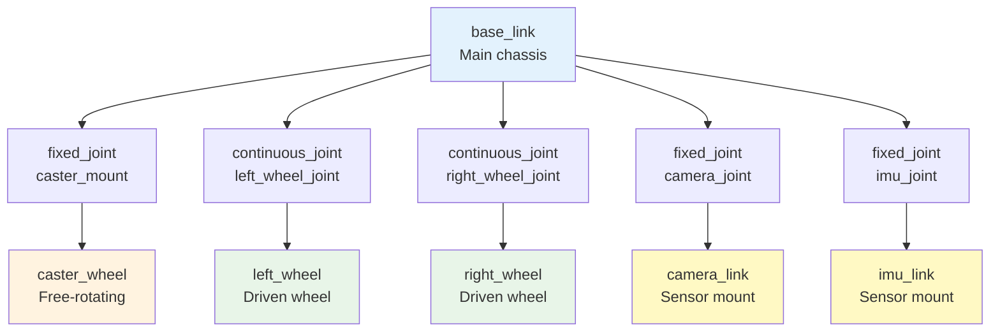

# Chapter 07 — URDF, Physics, and Unity

## Introduction: URDF Fundamentals and Importance

The Unified Robot Description Format (URDF) serves as the cornerstone of robot modeling in the ROS ecosystem. URDF is an XML-based format that describes robot models, including their physical and kinematic properties. Understanding URDF is crucial for creating accurate digital twins, as it defines the robot's structure, dynamics, and sensor placement that directly impact simulation fidelity.

### What is URDF?

URDF stands for Unified Robot Description Format, a specification for representing robot models in XML format. It describes various aspects of a robot including:

- **Kinematic structure**: The arrangement of links and joints that make up the robot
- **Physical properties**: Mass, center of gravity, and inertia tensors for each link
- **Visual properties**: How the robot appears in simulation and visualization tools
- **Collision properties**: How the robot interacts with other objects in the environment
- **Sensor placement**: Locations and orientations of various sensors on the robot
- **Actuator properties**: Specifications for joints and their control characteristics

### Why URDF Matters for Digital Twins

In the context of digital twins, URDF serves as the blueprint that connects the virtual representation to the physical reality. Accurate URDF models ensure that:

- Simulation behavior closely matches real-world physics
- Sensor data from simulation is representative of actual sensor performance
- Control algorithms developed in simulation transfer effectively to physical robots
- Kinematic calculations in simulation match those of the physical robot

### URDF Evolution and Ecosystem

URDF has evolved significantly since its introduction, with various extensions and tools developed around it:

**XACRO (XML Macros)**: A preprocessing language that extends URDF with macros, property definitions, and mathematical expressions, making complex robot descriptions more manageable.

**URDF++**: Extensions that add additional features like transmission definitions, Gazebo-specific elements, and improved joint constraints.

**Tools and Libraries**:
- `check_urdf`: Validates URDF files and displays the kinematic tree
- `urdf_parser`: Parses URDF files for use in applications
- `robot_state_publisher`: Publishes TF transforms based on joint states
- `joint_state_publisher`: Provides joint state messages for visualization

### URDF Best Practices

Creating effective URDF models requires attention to several key principles:

1. **Consistency**: Use consistent naming conventions and units throughout
2. **Accuracy**: Ensure physical properties match real robot specifications
3. **Modularity**: Structure models to allow for reuse and modification
4. **Validation**: Regularly test models in simulation to ensure proper behavior
5. **Documentation**: Comment complex sections to aid future maintenance

These foundational concepts provide the basis for creating robust and accurate robot models that serve as the core of effective digital twin implementations.

## Links, Joints, and Inertial Modeling

The fundamental building blocks of any URDF model are links and joints, which together define the robot's kinematic structure and dynamic properties.

### Links

Links represent rigid bodies in the robot structure. Each link contains:

**Visual Elements**: Define how the link appears in visualization and simulation environments
- Geometry: Shape (box, cylinder, sphere, mesh)
- Material: Color, texture, and visual properties
- Origin: Position and orientation relative to the joint

**Collision Elements**: Define how the link interacts with other objects
- Geometry: Shape for collision detection (often simplified compared to visual)
- Origin: Position and orientation relative to the joint

**Inertial Elements**: Define the physical properties for dynamics simulation
- Mass: The mass of the link in kilograms
- Inertia: The 3x3 inertia tensor describing how mass is distributed
- Origin: Position and orientation of the center of mass

#### Link Structure in URDF

A complete link definition includes all three elements:

```xml
<link name="link_name">
  <!-- Visual properties -->
  <visual>
    <origin xyz="0 0 0" rpy="0 0 0"/>
    <geometry>
      <mesh filename="package://my_robot/meshes/link_name.dae"/>
    </geometry>
    <material name="color">
      <color rgba="0.5 0.5 0.5 1.0"/>
    </material>
  </visual>

  <!-- Collision properties -->
  <collision>
    <origin xyz="0 0 0" rpy="0 0 0"/>
    <geometry>
      <mesh filename="package://my_robot/meshes/link_name_collision.stl"/>
    </geometry>
  </collision>

  <!-- Inertial properties -->
  <inertial>
    <mass value="1.0"/>
    <origin xyz="0 0 0" rpy="0 0 0"/>
    <inertia ixx="0.1" ixy="0.0" ixz="0.0"
             iyy="0.1" iyz="0.0" izz="0.1"/>
  </inertial>
</link>
```

### Joints

Joints connect links and define their relative motion. URDF supports several joint types:

**Fixed Joints**: No relative motion between connected links
- Used for connecting rigidly attached components
- Most common joint type in many robot models

**Revolute Joints**: Single degree of freedom rotation
- Define axis of rotation
- Include limits on rotation range
- Used for most robotic arm joints

**Continuous Joints**: Unlimited rotation about an axis
- Similar to revolute but without limits
- Common for wheel joints

**Prismatic Joints**: Single degree of freedom linear motion
- Define direction of linear motion
- Include limits on linear travel

**Floating Joints**: Six degrees of freedom
- Three translational and three rotational
- Rarely used in typical robot models

#### Joint Structure in URDF

A complete joint definition includes proper parent-child relationships and limits:

```xml
<joint name="joint_name" type="revolute">
  <parent link="parent_link_name"/>
  <child link="child_link_name"/>
  <origin xyz="0.1 0 0" rpy="0 0 0"/>
  <axis xyz="0 0 1"/>
  <limit lower="-1.57" upper="1.57" effort="10.0" velocity="1.0"/>
  <dynamics damping="0.1" friction="0.0"/>
</joint>
```

**Joint Parameters Explained**:
- `origin`: Position and orientation of the joint relative to the parent link
- `axis`: Axis of motion for the joint (for revolute/prismatic joints)
- `limit`: Joint limits (lower, upper), maximum effort, and maximum velocity
- `dynamics`: Damping and friction coefficients for realistic motion

### Proper Inertial Modeling

Accurate inertial properties are crucial for realistic simulation. The inertia tensor describes how mass is distributed within a link and affects how the link responds to forces and torques.

#### Mass Properties

Each link must have a positive mass value that reflects the actual physical mass of the component. The mass should be:

- **Positive**: All mass values must be greater than zero
- **Realistic**: Should match the actual weight of the physical component
- **Consistent**: Units should be in kilograms throughout the model

#### Center of Mass

The center of mass should be positioned appropriately within the link. For symmetrical objects, this is typically at the geometric center. For complex shapes:

- Use CAD software to calculate the exact center of mass
- Position the origin of the inertial element at the center of mass
- Ensure the center of mass lies within or very close to the physical boundaries of the link

#### Inertia Tensor

The 3x3 inertia tensor has the form:
```
| ixx  ixy  ixz |
| ixy  iyy  iyz |
| ixz  iyz  izz |
```

**Key Properties**:
- **Positive Diagonal Elements**: ixx, iyy, and izz must be positive
- **Symmetric**: ixy = iyx, ixz = izx, iyz = izy
- **Physical Validity**: Must satisfy the triangle inequality (e.g., ixx ≤ iyy + izz)

#### Calculating Inertial Properties

For simple geometric shapes, use standard formulas:

**Box** (width w, depth d, height h, mass m):
```
ixx = 1/12 * m * (h² + d²)
iyy = 1/12 * m * (w² + h²)
izz = 1/12 * m * (w² + d²)
```

**Cylinder** (radius r, height h, mass m):
```
ixx = iyy = 1/12 * m * (3*r² + h²)
izz = 1/2 * m * r²
```

**Sphere** (radius r, mass m):
```
ixx = iyy = izz = 2/5 * m * r²
```

#### Tools for Inertial Calculation

Several tools can help calculate accurate inertial properties:

**CAD Software**: Most CAD packages (SolidWorks, Fusion 360, FreeCAD) can calculate mass properties
**Python Libraries**: `numpy`, `scipy` for custom calculations
**ROS Tools**: `inertial_calculator` package for verification

### XACRO Extensions for Complex Models

For complex robots, XACRO (XML Macros) provides powerful features:

```xml
<?xml version="1.0"?>
<robot xmlns:xacro="http://www.ros.org/wiki/xacro" name="my_robot">

  <!-- Define properties -->
  <xacro:property name="M_PI" value="3.1415926535897931" />
  <xacro:property name="wheel_radius" value="0.1" />
  <xacro:property name="wheel_width" value="0.05" />

  <!-- Macro for wheels -->
  <xacro:macro name="wheel" params="prefix parent xyz rpy">
    <joint name="${prefix}_wheel_joint" type="continuous">
      <parent link="${parent}"/>
      <child link="${prefix}_wheel"/>
      <origin xyz="${xyz}" rpy="${rpy}"/>
      <axis xyz="0 1 0"/>
    </joint>

    <link name="${prefix}_wheel">
      <visual>
        <geometry>
          <cylinder radius="${wheel_radius}" length="${wheel_width}"/>
        </geometry>
        <material name="black">
          <color rgba="0 0 0 1"/>
        </material>
      </visual>
      <collision>
        <geometry>
          <cylinder radius="${wheel_radius}" length="${wheel_width}"/>
        </geometry>
      </collision>
      <inertial>
        <mass value="0.5"/>
        <inertia ixx="0.01" ixy="0" ixz="0"
                 iyy="0.01" iyz="0" izz="0.01"/>
      </inertial>
    </link>
  </xacro:macro>

  <!-- Use the macro -->
  <xacro:wheel prefix="front_left" parent="base_link"
               xyz="0.2 0.2 0" rpy="0 0 0"/>
  <xacro:wheel prefix="front_right" parent="base_link"
               xyz="0.2 -0.2 0" rpy="0 0 0"/>

</robot>
```

This approach makes complex robot definitions more manageable and less error-prone than pure URDF.

## Collision vs Visual Geometry

Understanding the distinction between collision and visual geometry is crucial for creating efficient and accurate robot models. This separation allows for optimal performance in both visualization and physics simulation while maintaining accuracy in the digital twin representation.

### Visual Geometry

Visual geometry defines how the robot appears in simulation environments and visualization tools. It focuses on:

- **Appearance**: Colors, textures, and detailed shapes
- **Rendering**: How the robot looks in the GUI
- **Detail**: High-resolution meshes for realistic appearance
- **Performance**: May include complex geometries that don't affect physics

#### Visual Geometry Components

**Meshes**: The most common visual geometry type, using 3D models in formats like DAE, STL, or OBJ:

```xml
<visual>
  <geometry>
    <mesh filename="package://my_robot/meshes/link_visual.dae" scale="1 1 1"/>
  </geometry>
  <material name="red">
    <color rgba="1 0 0 1"/>
  </material>
</visual>
```

**Primitive Shapes**: Basic geometric shapes for simple visual elements:
- `<box size="1 1 1"/>`
- `<cylinder radius="0.5" length="1"/>`
- `<sphere radius="0.3"/>`
- `<mesh filename="path/to/mesh.stl"/>`

#### Visual Materials and Textures

Visual elements can include material properties for realistic rendering:

```xml
<visual>
  <geometry>
    <mesh filename="package://my_robot/meshes/link_visual.dae"/>
  </geometry>
  <material name="custom_material">
    <color rgba="0.8 0.8 0.8 1.0"/>
    <texture filename="package://my_robot/materials/link_texture.png"/>
  </material>
</visual>
```

### Collision Geometry

Collision geometry defines how the robot interacts with the environment. It focuses on:

- **Physics**: How the robot collides with other objects
- **Efficiency**: Simplified shapes for faster collision detection
- **Accuracy**: Proper representation of physical boundaries
- **Performance**: Optimized for real-time physics calculations

#### Collision Geometry Types

Collision geometry can use the same primitive shapes as visual geometry, but typically with simpler representations:

```xml
<collision>
  <geometry>
    <mesh filename="package://my_robot/meshes/link_collision.stl"/>
  </geometry>
</collision>
```

**Common Collision Simplifications**:
- Complex meshes replaced with multiple simple shapes (boxes, cylinders)
- Detailed features removed (screws, small details)
- Internal structures omitted
- Convex hulls used instead of concave meshes

### Best Practices for Geometry Separation

#### Use Simplified Collision Models

Collision geometry can be much simpler than visual geometry while still accurately representing physical boundaries:

**Complex Visual, Simple Collision**:
```xml
<!-- Detailed visual model -->
<visual>
  <geometry>
    <mesh filename="package://my_robot/meshes/wheel_with_treads.dae"/>
  </geometry>
</visual>

<!-- Simplified collision model -->
<collision>
  <geometry>
    <cylinder radius="0.1" length="0.05"/>
  </geometry>
</collision>
```

#### Multiple Collision Elements

For complex shapes, use multiple simple collision elements:

```xml
<link name="complex_link">
  <!-- Detailed visual -->
  <visual>
    <geometry>
      <mesh filename="package://my_robot/meshes/complex_shape.dae"/>
    </geometry>
  </visual>

  <!-- Multiple simple collision shapes -->
  <collision>
    <geometry>
      <box size="0.2 0.2 0.1"/>
    </geometry>
  </collision>

  <collision>
    <origin xyz="0.1 0 0"/>
    <geometry>
      <cylinder radius="0.05" length="0.1"/>
    </geometry>
  </collision>
</link>
```

#### Maintain Physical Accuracy

Ensure collision geometry properly encompasses the physical robot:

- **Bounding Volumes**: Collision geometry should fully contain the visual model
- **Clearance**: Add small margins to prevent visual clipping with other objects
- **Conservative Approach**: It's better to have slightly oversized collision geometry than undersized

#### Performance Considerations

**Complexity vs. Performance**:
- Each collision primitive adds computational overhead
- Concave meshes require decomposition into convex shapes
- Multiple collision elements provide accuracy but reduce performance

**Optimization Strategies**:
- Use primitive shapes when possible
- Limit the number of collision elements per link
- Use simpler meshes for fast-moving parts
- Consider different collision models for different simulation speeds

### Alignment and Transformation

Both visual and collision elements can have independent transformations:

```xml
<link name="sensor_mount">
  <visual>
    <origin xyz="0 0 0" rpy="0 0 0"/>  <!-- Visual origin -->
    <geometry>
      <mesh filename="package://my_robot/meshes/sensor_mount.dae"/>
    </geometry>
  </visual>

  <collision>
    <origin xyz="0.01 0.01 0" rpy="0 0 0.1"/>  <!-- Collision origin -->
    <geometry>
      <mesh filename="package://my_robot/meshes/sensor_mount_collision.stl"/>
    </geometry>
  </collision>
</link>
```

### Validation Techniques

#### Visual Inspection
- Use RViz to overlay collision geometry on visual models
- Check for proper alignment and sizing
- Verify that collision geometry encompasses visual geometry

#### Simulation Testing
- Test robot in various environments to ensure proper collision detection
- Check for objects passing through the robot (too small collision geometry)
- Verify that the robot doesn't collide with itself in valid configurations

#### Tools for Validation
- **RViz**: Use "RobotModel" display with "All Links" to visualize both geometries
- **Gazebo**: Enable collision visualization to see collision boundaries
- **check_urdf**: Validate URDF structure and basic properties

### Common Mistakes to Avoid

1. **Identical Geometries**: Don't use the same complex mesh for both visual and collision
2. **Inconsistent Sizing**: Ensure visual and collision geometries represent the same physical object
3. **Missing Collision**: Every link that should collide needs collision geometry
4. **Overly Complex Collision**: Avoid detailed meshes that slow down physics simulation
5. **Poor Alignment**: Visual and collision origins should represent the same physical location

This separation of concerns between visual and collision geometry is fundamental to creating effective digital twins that are both visually appealing and computationally efficient for physics simulation.

## Physics Stability and Debugging

Creating stable physics simulations requires careful attention to model parameters and physics engine configuration. Instabilities can manifest as unrealistic behaviors that make the simulation unusable for development and testing.

### Common Stability Issues and Solutions

#### Object Sinking
**Symptoms**: Objects appear to sink into surfaces or other objects
**Root Causes**:
- Collision geometry that doesn't fully encompass the visual model
- Mass values that are too small relative to contact stiffness
- Inadequate ERP (Error Reduction Parameter) values
- Improperly configured contact surfaces

**Solutions**:
```xml
<!-- In your world file physics configuration -->
<physics type="ode">
  <ode>
    <constraints>
      <erp>0.2</erp>  <!-- Increase ERP to pull objects out of penetration -->
      <contact_surface_layer>0.001</contact_surface_layer>  <!-- Add surface layer -->
    </constraints>
  </ode>
</physics>
```

#### Explosive Behavior
**Symptoms**: Objects suddenly fly apart or exhibit unrealistic motion
**Root Causes**:
- Invalid or non-physical inertia tensors
- Joint limits that are too restrictive or zero
- Excessive force/torque applied to links
- Time step too large relative to system dynamics

**Solutions**:
```xml
<!-- Properly configured inertia tensor -->
<inertial>
  <mass value="1.0"/>
  <inertia ixx="0.1" ixy="0.0" ixz="0.0"
           iyy="0.1" iyz="0.0" izz="0.1"/>
</inertial>
```

#### Jittering and Oscillation
**Symptoms**: Small, rapid oscillations in position or velocity
**Root Causes**:
- Inappropriate solver parameters (SOR, iterations)
- Mass ratios between connected links that are too extreme
- Insufficient damping in joints

**Solutions**:
```xml
<!-- Add damping to joints -->
<joint name="joint_name" type="revolute">
  <dynamics damping="0.5" friction="0.1"/>
</joint>
```

### Physics Parameter Tuning Strategies

#### Time Step Optimization
The time step is critical for stability:
- **Too large**: Causes instability and energy drift
- **Too small**: Increases computation time unnecessarily

**Recommended starting values**:
- Real-time simulation: 0.001s (1000 Hz)
- Non-real-time: 0.0001s - 0.001s depending on system dynamics

#### Solver Parameter Tuning
For ODE physics engine:
```xml
<physics type="ode">
  <ode>
    <solver>
      <type>quick</type>
      <iters>100</iters>  <!-- Start with 100, increase if unstable -->
      <sor>1.3</sor>      <!-- Successive Over-Relaxation parameter -->
    </solver>
  </ode>
</physics>
```

**Parameter Guidelines**:
- `iters`: Higher values = more accurate but slower
- `sor`: Values 1.0-1.5 typically work well
- Start conservative and optimize for performance

#### Constraint Parameter Tuning
```xml
<physics type="ode">
  <ode>
    <constraints>
      <cfm>0.0</cfm>  <!-- Constraint Force Mixing -->
      <erp>0.2</erp>  <!-- Error Reduction Parameter -->
      <contact_max_correcting_vel>100.0</contact_max_correcting_vel>
      <contact_surface_layer>0.001</contact_surface_layer>
    </constraints>
  </ode>
</physics>
```

### URDF-Specific Stability Guidelines

#### Mass Property Validation
**Mass Validation Checklist**:
- All masses > 0
- Mass ratios between connected links reasonable (avoid 1:1000 ratios)
- Consistent units (kilograms)

**Inertia Tensor Validation**:
- Diagonal elements positive (ixx, iyy, izz > 0)
- Triangle inequality satisfied (e.g., ixx ≤ iyy + izz)
- For simple shapes, use standard formulas

#### Joint Configuration Stability
**Joint Limits and Dynamics**:
```xml
<joint name="stable_joint" type="revolute">
  <parent link="parent_link"/>
  <child link="child_link"/>
  <limit lower="-1.57" upper="1.57" effort="10.0" velocity="1.0"/>
  <dynamics damping="0.5" friction="0.1"/>  <!-- Critical for stability -->
</joint>
```

**Damping Guidelines**:
- Start with damping values of 0.1-0.5
- Increase for joints that oscillate
- Add friction for joints that should have resistance

### Debugging Tools and Techniques

#### Simulation Visualization
Enable physics debugging in Gazebo:
```bash
# Run Gazebo with verbose output
gzserver --verbose your_world.world

# Enable contact visualization in Gazebo client
gzclient --verbose
```

#### URDF Validation
Use ROS tools to validate your URDF:
```bash
# Check URDF syntax and kinematic tree
check_urdf /path/to/your/robot.urdf

# View the kinematic tree
urdf_to_graphiz /path/to/your/robot.urdf
```

#### Parameter Verification Script
Create a Python script to validate URDF parameters:

```python
#!/usr/bin/env python3
import xml.etree.ElementTree as ET
import math

def validate_urdf(urdf_file):
    """Validate URDF for common physics issues"""
    tree = ET.parse(urdf_file)
    root = tree.getroot()

    issues = []

    for link in root.findall('.//link'):
        # Check mass
        mass_elem = link.find('.//mass')
        if mass_elem is not None:
            mass = float(mass_elem.get('value'))
            if mass <= 0:
                issues.append(f"Link {link.get('name')} has invalid mass: {mass}")

        # Check inertia
        inertia_elem = link.find('.//inertia')
        if inertia_elem is not None:
            ixx = float(inertia_elem.get('ixx'))
            iyy = float(inertia_elem.get('iyy'))
            izz = float(inertia_elem.get('izz'))

            # Check diagonal elements are positive
            if ixx <= 0 or iyy <= 0 or izz <= 0:
                issues.append(f"Link {link.get('name')} has non-positive inertia: {ixx}, {iyy}, {izz}")

            # Check triangle inequality
            if not (ixx <= iyy + izz and iyy <= ixx + izz and izz <= ixx + iyy):
                issues.append(f"Link {link.get('name')} fails triangle inequality check")

    return issues

# Usage
if __name__ == "__main__":
    urdf_file = "path/to/your/robot.urdf"
    issues = validate_urdf(urdf_file)

    if issues:
        print("Validation issues found:")
        for issue in issues:
            print(f"  - {issue}")
    else:
        print("URDF validation passed!")
```

### Advanced Stability Techniques

#### Adaptive Parameter Tuning
For complex systems, consider different physics parameters for different parts:

```xml
<!-- Use different parameters for manipulator vs base -->
<gazebo reference="manipulator_link">
  <kp>1000000.0</kp>  <!-- Higher stiffness for precise control -->
  <kd>100.0</kd>
</gazebo>

<gazebo reference="base_link">
  <kp>100000.0</kp>   <!-- Lower stiffness for stability -->
  <kd>10.0</kd>
</gazebo>
```

#### Multi-Scale Simulation Considerations
When simulating systems with components of very different scales:
- Use consistent units throughout
- Consider separate simulation worlds for different scale components
- Validate that time constants are appropriate for all components

### Performance vs. Stability Trade-offs

**High Stability Configuration** (Slower but more reliable):
```xml
<physics type="ode">
  <max_step_size>0.0001</max_step_size>
  <real_time_update_rate>10000.0</real_time_update_rate>
  <ode>
    <solver>
      <iters>200</iters>
      <sor>1.0</sor>
    </solver>
  </ode>
</physics>
```

**Balanced Configuration** (Good for most applications):
```xml
<physics type="ode">
  <max_step_size>0.001</max_step_size>
  <real_time_update_rate>1000.0</real_time_update_rate>
  <ode>
    <solver>
      <iters>100</iters>
      <sor>1.3</sor>
    </solver>
  </ode>
</physics>
```

The key to stable physics simulation is systematic validation of parameters, starting with conservative values and gradually optimizing for performance while maintaining stability.

## Robot Kinematic Chain Visualization

Understanding the kinematic structure of a robot is fundamental to proper URDF modeling and digital twin implementation. The kinematic chain defines how different parts of the robot are connected and how motion propagates through the system.



This diagram illustrates a typical differential drive robot kinematic chain. The base_link serves as the root of the kinematic tree, with various joints connecting different components:

- **Fixed joints** (caster_mount, camera_joint, imu_joint): Connect components that don't move relative to the base
- **Continuous joints** (left_wheel_joint, right_wheel_joint): Allow unlimited rotation for drive wheels
- **Links**: Represent rigid bodies with their own geometry, mass, and inertial properties

### Kinematic Chain Properties

**Tree Structure**: Robot kinematics form a tree structure with no loops (except in parallel robots). Each link has exactly one parent, except for the base link which is the root.

**Joint Types Impact**:
- `fixed`: No degrees of freedom - connects two links rigidly
- `continuous`: 1 DOF rotation, unlimited range
- `revolute`: 1 DOF rotation, limited range
- `prismatic`: 1 DOF translation, limited range
- `planar`: 3 DOF motion in a plane
- `floating`: 6 DOF motion in 3D space

### Kinematic Chain Validation

To ensure proper kinematic structure:

1. **Connectivity**: Every link should be connected to the base through a series of joints
2. **No Loops**: The structure should form a tree, not a graph with cycles
3. **Consistent Frames**: Coordinate frames should be consistently defined
4. **Physical Plausibility**: Joint limits and types should match physical robot

## Sensor Simulation Pipeline

Simulated sensors in Gazebo provide the critical link between the virtual environment and the robotic control system. Understanding how these sensors work and how to configure them properly is essential for creating realistic and useful simulations.

### Sensor Types and Configuration

Gazebo supports a wide variety of sensor types, each with specific configuration parameters:

**Camera Sensors**: Simulate RGB cameras, depth cameras, and stereo cameras with parameters for resolution, field of view, and noise models.

**LiDAR Sensors**: Simulate laser range finders with configurable scan patterns, range limits, and resolution.

**IMU Sensors**: Simulate inertial measurement units with parameters for noise characteristics and update rates.

**GPS Sensors**: Simulate global positioning systems with configurable accuracy and update rates.

### Sensor Placement and Configuration Diagram

```mermaid
graph LR
    subgraph "Robot Platform"
        A[base_link<br/>Main chassis]
        B[camera_link<br/>Front-facing camera]
        C[lidar_link<br/>360° LiDAR scanner]
        D[imu_link<br/>Inertial measurement]
        E[gps_link<br/>Global positioning]
    end

    subgraph "Simulation Environment"
        F[Gazebo Server<br/>Physics & Rendering]
        G[Sensor Plugins<br/>Camera, LiDAR, IMU]
        H[Noise Models<br/>Realistic sensor errors]
    end

    subgraph "ROS 2 Interface"
        I[ROS 2 Nodes<br/>Control & Perception]
        J[Sensor Topics<br/>sensor_msgs/...]
        K[TF Transform<br/>sensor positions]
    end

    subgraph "External Systems"
        L[RViz Visualization<br/>Sensor data display]
        M[Perception Nodes<br/>SLAM, object detection]
        N[Navigation Nodes<br/>Path planning]
    end

    A --"Fixed joint"--> B
    A --"Fixed joint"--> C
    A --"Fixed joint"--> D
    A --"Fixed joint"--> E

    B --"Camera plugin"--> G
    C --"LiDAR plugin"--> G
    D --"IMU plugin"--> G
    E --"GPS plugin"--> G

    G --"Physics simulation"--> F
    G --"Noise addition"--> H

    G --"Sensor data"--> J
    J --"ROS 2 topics"--> I
    A --"Transforms"--> K
    K --"Coordinate frames"--> I

    J --"Camera data"--> L
    J --"LiDAR data"--> M
    J --"IMU data"--> N

    style A fill:#e3f2fd
    style B fill:#fff9c4
    style C fill:#fff9c4
    style D fill:#fff9c4
    style E fill:#fff9c4
    style G fill:#e8f5e8
    style I fill:#f3e5f5
</mermaid>

This diagram shows how sensors are placed on the robot and integrated into the simulation pipeline. Key aspects include:

- **Sensor Mounting**: Different sensor types mounted on appropriate links with fixed joints
- **Plugin Integration**: Each sensor has a corresponding Gazebo plugin for simulation
- **Data Flow**: Sensor data flows from simulation through ROS 2 topics to processing nodes
- **Transform Management**: TF system maintains coordinate relationships between sensors
- **External Integration**: Sensor data connects to perception, navigation, and visualization systems

### Sensor Placement Best Practices

**Camera Placement**:
- Position for maximum field of view without robot body obstruction
- Consider mounting height for optimal scene coverage
- Account for tilt angles needed for ground/object detection

**LiDAR Placement**:
- Mount high enough to avoid robot body interference in scan
- Position for 360° coverage if using rotating LiDAR
- Consider multiple LiDAR units for complex coverage patterns

**IMU Placement**:
- Mount near robot's center of mass for accurate measurements
- Secure mounting to minimize vibration effects
- Consider multiple IMUs for redundancy

**GPS Placement**:
- Top-mounted for clear sky visibility
- Away from metallic structures that might block signals
- Consider RTK-GPS for higher accuracy applications

### Sensor Simulation Best Practices

Creating realistic sensor simulations requires attention to several key factors:

**Noise Modeling**: Real sensors have inherent noise and inaccuracies. Configure noise parameters to match real sensor specifications.

**Update Rates**: Set update rates that match real sensor capabilities to ensure realistic processing loads.

**Coordinate Frames**: Maintain consistent coordinate frame definitions between simulation and real robot.

**Validation**: Compare simulated sensor data with real sensor data to validate realism.

## Applied Lab: Configure Sensors on Robot Model and Validate Outputs

In this applied lab, you will configure multiple sensors on a robot model in Gazebo, validate their outputs, and ensure proper integration with ROS 2. This hands-on exercise will demonstrate practical sensor configuration techniques and validation methodologies essential for creating effective digital twins.

### Lab Objectives

By completing this lab, you will:
- Configure multiple sensor types (camera, LiDAR, IMU, GPS) on a robot model
- Validate sensor outputs in simulation
- Understand noise modeling and sensor parameter tuning
- Integrate sensors with ROS 2 topics and message types
- Test sensor data quality and consistency

### Prerequisites

Before starting this lab, ensure you have:
- ROS 2 Humble Hawksbill installed
- Gazebo Classic or Garden installed
- Basic understanding of URDF and SDF formats
- Experience with ROS 2 topics and message types
- Access to the complete robot model files from previous sections

### Lab Environment Setup

First, create a dedicated workspace for this lab:

```bash
mkdir -p ~/ros2_ws/src/sensor_lab
cd ~/ros2_ws/src/sensor_lab
```

### Step 1: Review the Base Robot Model

Start by examining the complete robot model with physics properties that we created earlier:

```xml
<?xml version="1.0"?>
<robot name="complete_robot_with_physics">
  <!-- Base Link -->
  <link name="base_link">
    <visual>
      <origin xyz="0 0 0" rpy="0 0 0"/>
      <geometry>
        <box size="0.6 0.4 0.2"/>
      </geometry>
      <material name="light_grey">
        <color rgba="0.7 0.7 0.7 1.0"/>
      </material>
    </visual>
    <collision>
      <origin xyz="0 0 0" rpy="0 0 0"/>
      <geometry>
        <box size="0.6 0.4 0.2"/>
      </geometry>
    </collision>
    <inertial>
      <mass value="5.0"/>
      <origin xyz="0 0 0" rpy="0 0 0"/>
      <inertia ixx="0.2" ixy="0.0" ixz="0.0"
               iyy="0.3" iyz="0.0" izz="0.4"/>
    </inertial>
  </link>
  <!-- Additional links and joints omitted for brevity - see complete_robot_with_physics.urdf -->
</robot>
```

### Step 2: Configure Camera Sensor

Create a camera sensor configuration in your robot's URDF file. Add this to your robot model:

```xml
<!-- Camera Link -->
<link name="camera_link">
  <visual>
    <origin xyz="0 0 0" rpy="0 0 0"/>
    <geometry>
      <box size="0.05 0.05 0.03"/>
    </geometry>
    <material name="red">
      <color rgba="0.8 0.2 0.2 1.0"/>
    </material>
  </visual>
  <collision>
    <origin xyz="0 0 0" rpy="0 0 0"/>
    <geometry>
      <box size="0.05 0.05 0.03"/>
    </geometry>
  </collision>
  <inertial>
    <mass value="0.05"/>
    <origin xyz="0 0 0" rpy="0 0 0"/>
    <inertia ixx="0.00001" ixy="0.0" ixz="0.0"
             iyy="0.00001" iyz="0.0" izz="0.00001"/>
  </inertial>
</link>

<!-- Camera Joint -->
<joint name="camera_joint" type="fixed">
  <parent link="base_link"/>
  <child link="camera_link"/>
  <origin xyz="0.25 0 0.15" rpy="0 0 0"/>
</joint>

<!-- Camera Sensor Plugin -->
<gazebo reference="camera_link">
  <sensor type="camera" name="camera_sensor">
    <update_rate>30</update_rate>
    <camera name="head">
      <horizontal_fov>1.3962634</horizontal_fov>
      <image>
        <width>800</width>
        <height>600</height>
        <format>R8G8B8</format>
      </image>
      <clip>
        <near>0.1</near>
        <far>100</far>
      </clip>
    </camera>
    <plugin name="camera_controller" filename="libgazebo_ros_camera.so">
      <ros>
        <namespace>complete_robot</namespace>
        <remapping>image_raw:=camera/image_raw</remapping>
        <remapping>camera_info:=camera/camera_info</remapping>
      </ros>
      <camera_name>camera</camera_name>
      <image_topic_name>image_raw</image_topic_name>
      <camera_info_topic_name>camera_info</camera_info_topic_name>
      <frame_name>camera_link</frame_name>
      <hack_baseline>0.07</hack_baseline>
      <distortion_k1>0.0</distortion_k1>
      <distortion_k2>0.0</distortion_k2>
      <distortion_k3>0.0</distortion_k3>
      <distortion_t1>0.0</distortion_t1>
      <distortion_t2>0.0</distortion_t2>
    </plugin>
  </sensor>
</gazebo>
```

### Step 3: Configure LiDAR Sensor

Add a LiDAR sensor configuration to your robot model:

```xml
<!-- LiDAR Link -->
<link name="lidar_link">
  <inertial>
    <mass value="0.2"/>
    <inertia ixx="0.001" ixy="0.0" ixz="0.0"
             iyy="0.001" iyz="0.0" izz="0.001"/>
  </inertial>
  <visual>
    <geometry>
      <cylinder radius="0.05" length="0.05"/>
    </geometry>
    <material name="blue">
      <color rgba="0.2 0.2 0.8 1"/>
    </material>
  </visual>
  <collision>
    <geometry>
      <cylinder radius="0.05" length="0.05"/>
    </geometry>
  </collision>
</link>

<!-- LiDAR Joint -->
<joint name="lidar_joint" type="fixed">
  <parent link="base_link"/>
  <child link="lidar_link"/>
  <origin xyz="0.2 0 0.1" rpy="0 0 0"/>
</joint>

<!-- LiDAR Sensor Plugin -->
<gazebo reference="lidar_link">
  <sensor type="ray" name="lidar_sensor">
    <always_on>true</always_on>
    <update_rate>10</update_rate>
    <ray>
      <scan>
        <horizontal>
          <samples>720</samples>
          <resolution>1</resolution>
          <min_angle>-1.570796</min_angle>  <!-- -90 degrees -->
          <max_angle>1.570796</max_angle>   <!-- 90 degrees -->
        </horizontal>
      </scan>
      <range>
        <min>0.1</min>
        <max>30.0</max>
        <resolution>0.01</resolution>
      </range>
    </ray>
    <plugin name="lidar_controller" filename="libgazebo_ros_ray_sensor.so">
      <ros>
        <namespace>complete_robot</namespace>
        <remapping>scan:=lidar_scan</remapping>
      </ros>
      <output_type>sensor_msgs/LaserScan</output_type>
      <frame_name>lidar_link</frame_name>
    </plugin>
  </sensor>
</gazebo>
```

### Step 4: Configure IMU Sensor

Add an IMU sensor configuration to your robot model:

```xml
<!-- IMU Link -->
<link name="imu_link">
  <inertial>
    <mass value="0.01"/>
    <inertia ixx="0.000001" ixy="0.0" ixz="0.0"
             iyy="0.000001" iyz="0.0" izz="0.000001"/>
  </inertial>
</link>

<!-- IMU Joint -->
<joint name="imu_joint" type="fixed">
  <parent link="base_link"/>
  <child link="imu_link"/>
  <origin xyz="0 0 0.1" rpy="0 0 0"/>
</joint>

<!-- IMU Sensor Plugin -->
<gazebo reference="imu_link">
  <sensor type="imu" name="imu_sensor">
    <always_on>true</always_on>
    <update_rate>100</update_rate>
    <imu>
      <angular_velocity>
        <x>
          <noise type="gaussian">
            <mean>0.0</mean>
            <stddev>2e-4</stddev>
          </noise>
        </x>
        <y>
          <noise type="gaussian">
            <mean>0.0</mean>
            <stddev>2e-4</stddev>
          </noise>
        </y>
        <z>
          <noise type="gaussian">
            <mean>0.0</mean>
            <stddev>2e-4</stddev>
          </noise>
        </z>
      </angular_velocity>
      <linear_acceleration>
        <x>
          <noise type="gaussian">
            <mean>0.0</mean>
            <stddev>1.7e-2</stddev>
          </noise>
        </x>
        <y>
          <noise type="gaussian">
            <mean>0.0</mean>
            <stddev>1.7e-2</stddev>
          </noise>
        </y>
        <z>
          <noise type="gaussian">
            <mean>0.0</mean>
            <stddev>1.7e-2</stddev>
          </noise>
        </z>
      </linear_acceleration>
    </imu>
    <plugin name="imu_controller" filename="libgazebo_ros_imu_sensor.so">
      <ros>
        <namespace>complete_robot</namespace>
        <remapping>imu:=imu/data</remapping>
      </ros>
      <frame_name>imu_link</frame_name>
      <body_name>imu_link</body_name>
    </plugin>
  </sensor>
</gazebo>
```

### Step 5: Create Sensor Validation Script

Create a Python script to validate sensor outputs:

```python
#!/usr/bin/env python3
import rclpy
from rclpy.node import Node
from sensor_msgs.msg import Image, LaserScan, Imu
from sensor_msgs.msg import NavSatFix
from std_msgs.msg import Header
import numpy as np
from cv_bridge import CvBridge
import cv2

class SensorValidator(Node):
    def __init__(self):
        super().__init__('sensor_validator')

        # Initialize CV Bridge for camera processing
        self.bridge = CvBridge()

        # Subscribe to sensor topics
        self.camera_sub = self.create_subscription(
            Image,
            '/complete_robot/camera/image_raw',
            self.camera_callback,
            10
        )

        self.lidar_sub = self.create_subscription(
            LaserScan,
            '/complete_robot/lidar_scan',
            self.lidar_callback,
            10
        )

        self.imu_sub = self.create_subscription(
            Imu,
            '/complete_robot/imu/data',
            self.imu_callback,
            10
        )

        # Validation statistics
        self.camera_count = 0
        self.lidar_count = 0
        self.imu_count = 0

        self.get_logger().info('Sensor Validator Node Started')

    def camera_callback(self, msg):
        """Validate camera sensor output"""
        self.camera_count += 1

        try:
            # Convert ROS Image to OpenCV
            cv_image = self.bridge.imgmsg_to_cv2(msg, "bgr8")

            # Validate image properties
            height, width, channels = cv_image.shape
            expected_width = 800
            expected_height = 600

            if width != expected_width or height != expected_height:
                self.get_logger().warn(f'Camera resolution mismatch: {width}x{height}, expected {expected_width}x{expected_height}')

            # Check for valid image data
            if cv_image is None or cv_image.size == 0:
                self.get_logger().error('Received empty camera image')
            else:
                self.get_logger().info(f'Valid camera image received: {width}x{height}, channels: {channels}')

        except Exception as e:
            self.get_logger().error(f'Camera validation error: {str(e)}')

    def lidar_callback(self, msg):
        """Validate LiDAR sensor output"""
        self.lidar_count += 1

        # Validate LiDAR data
        if len(msg.ranges) == 0:
            self.get_logger().error('Received empty LiDAR scan')
            return

        # Check for valid range values
        valid_ranges = [r for r in msg.ranges if msg.range_min <= r <= msg.range_max and not np.isnan(r)]
        invalid_count = len(msg.ranges) - len(valid_ranges)

        if invalid_count > 0:
            self.get_logger().warn(f'LiDAR scan contains {invalid_count} invalid ranges out of {len(msg.ranges)}')

        # Check for expected scan properties
        expected_samples = 720  # Based on our configuration
        if len(msg.ranges) != expected_samples:
            self.get_logger().warn(f'LiDAR samples mismatch: {len(msg.ranges)}, expected {expected_samples}')

        self.get_logger().info(f'Valid LiDAR scan received: {len(msg.ranges)} samples, valid: {len(valid_ranges)}')

    def imu_callback(self, msg):
        """Validate IMU sensor output"""
        self.imu_count += 1

        # Validate IMU data
        angular_vel = msg.angular_velocity
        linear_acc = msg.linear_acceleration
        orientation = msg.orientation

        # Check for valid values (not NaN)
        if (np.isnan(angular_vel.x) or np.isnan(angular_vel.y) or np.isnan(angular_vel.z) or
            np.isnan(linear_acc.x) or np.isnan(linear_acc.y) or np.isnan(linear_acc.z)):
            self.get_logger().error('IMU contains NaN values')

        # Check for reasonable values (Earth gravity is ~9.8 m/s²)
        gravity_check = abs(linear_acc.z - 9.8) < 2.0  # Allow for movement
        if not gravity_check:
            self.get_logger().warn(f'IMU Z-acceleration seems unusual: {linear_acc.z}')

        self.get_logger().info(f'Valid IMU data received: angular_vel=({angular_vel.x:.3f}, {angular_vel.y:.3f}, {angular_vel.z:.3f})')

    def print_summary(self):
        """Print validation summary"""
        self.get_logger().info(f'Sensor Validation Summary:')
        self.get_logger().info(f'  Camera messages: {self.camera_count}')
        self.get_logger().info(f'  LiDAR messages: {self.lidar_count}')
        self.get_logger().info(f'  IMU messages: {self.imu_count}')

def main(args=None):
    rclpy.init(args=args)

    validator = SensorValidator()

    # Run for 30 seconds then print summary
    timer = validator.create_timer(30.0, lambda: [validator.print_summary(), rclpy.shutdown()])

    try:
        rclpy.spin(validator)
    except KeyboardInterrupt:
        validator.print_summary()
    finally:
        validator.destroy_node()

if __name__ == '__main__':
    main()
```

### Step 6: Create Launch File for Sensor Validation

Create a launch file to start the robot with sensors and validation:

```python
from launch import LaunchDescription
from launch.actions import DeclareLaunchArgument, IncludeLaunchDescription
from launch.launch_description_sources import PythonLaunchDescriptionSource
from launch.substitutions import PathJoinSubstitution, LaunchConfiguration
from launch_ros.actions import Node
from launch_ros.substitutions import FindPackageShare

def generate_launch_description():
    # Launch configuration variables
    use_sim_time = LaunchConfiguration('use_sim_time', default='true')

    # Robot description from URDF file
    robot_description_path = PathJoinSubstitution([
        FindPackageShare('sensor_lab'),
        'urdf',
        'complete_robot_with_sensors.urdf'
    ])

    # Robot state publisher node
    robot_state_publisher = Node(
        package='robot_state_publisher',
        executable='robot_state_publisher',
        name='robot_state_publisher',
        output='screen',
        parameters=[{
            'use_sim_time': use_sim_time,
            'robot_description': open(robot_description_path.get_path()).read()
        }]
    )

    # Joint state publisher (for fixed joints)
    joint_state_publisher = Node(
        package='joint_state_publisher',
        executable='joint_state_publisher',
        name='joint_state_publisher',
        parameters=[{
            'use_sim_time': use_sim_time
        }]
    )

    # Gazebo launch
    gazebo = IncludeLaunchDescription(
        PythonLaunchDescriptionSource([
            PathJoinSubstitution([
                FindPackageShare('gazebo_ros'),
                'launch',
                'gazebo.launch.py'
            ])
        ]),
        launch_arguments={
            'world': PathJoinSubstitution([
                FindPackageShare('sensor_lab'),
                'worlds',
                'basic_room.world'
            ])
        }.items()
    )

    # Spawn robot in Gazebo
    spawn_robot = Node(
        package='gazebo_ros',
        executable='spawn_entity.py',
        arguments=[
            '-topic', 'robot_description',
            '-entity', 'complete_robot',
            '-x', '0.0',
            '-y', '0.0',
            '-z', '0.1'
        ],
        output='screen'
    )

    # Sensor validation node
    sensor_validator = Node(
        package='sensor_lab',
        executable='sensor_validator',
        name='sensor_validator',
        output='screen'
    )

    return LaunchDescription([
        DeclareLaunchArgument(
            'use_sim_time',
            default_value='true',
            description='Use simulation (Gazebo) clock if true'
        ),
        robot_state_publisher,
        joint_state_publisher,
        gazebo,
        spawn_robot,
        sensor_validator
    ])
```

### Step 7: Validate Sensor Configuration

1. **Check URDF Syntax**:
   ```bash
   check_urdf /path/to/complete_robot_with_sensors.urdf
   ```

2. **Visualize Robot Model**:
   ```bash
   # Create a simple launch file to visualize the robot
   ros2 launch sensor_lab view_robot.launch.py
   ```

3. **Launch Gazebo with Sensors**:
   ```bash
   ros2 launch sensor_lab sensor_validation.launch.py
   ```

4. **Monitor Sensor Topics**:
   ```bash
   # Check available topics
   ros2 topic list | grep complete_robot

   # Monitor specific sensor data
   ros2 topic echo /complete_robot/camera/image_raw
   ros2 topic echo /complete_robot/lidar_scan
   ros2 topic echo /complete_robot/imu/data
   ```

### Step 8: Sensor Data Analysis

Create a simple analysis script to verify sensor data quality:

```bash
#!/bin/bash
# sensor_analysis.sh - Analyze sensor data quality

echo "Analyzing Camera Data..."
ros2 topic echo /complete_robot/camera/image_raw --field header.stamp -c | head -10

echo "Analyzing LiDAR Data..."
ros2 topic echo /complete_robot/lidar_scan --field ranges -c | head -5

echo "Analyzing IMU Data..."
ros2 topic echo /complete_robot/imu/data --field linear_acceleration -c | head -5

echo "Checking TF Tree..."
ros2 run tf2_tools view_frames
```

### Step 9: Troubleshooting Common Issues

**Issue 1: No sensor data published**
- Check that the Gazebo plugins are properly loaded
- Verify ROS namespace and topic remappings
- Ensure the sensor links are properly connected to the robot

**Issue 2: Invalid sensor readings**
- Check sensor noise parameters in the SDF/URDF
- Verify sensor placement and orientation
- Validate physics properties and collision geometry

**Issue 3: Performance issues**
- Reduce sensor update rates if too high
- Simplify sensor models if needed
- Check CPU usage and adjust simulation parameters

### Step 10: Advanced Sensor Validation

For more comprehensive validation, create a test that moves the robot and validates sensor responses:

```python
#!/usr/bin/env python3
import rclpy
from rclpy.node import Node
from geometry_msgs.msg import Twist
from sensor_msgs.msg import LaserScan
import time

class SensorMovementValidator(Node):
    def __init__(self):
        super().__init__('sensor_movement_validator')

        # Publisher for robot movement
        self.cmd_vel_pub = self.create_publisher(Twist, '/complete_robot/cmd_vel', 10)

        # Subscriber for LiDAR data
        self.lidar_sub = self.create_subscription(
            LaserScan,
            '/complete_robot/lidar_scan',
            self.lidar_callback,
            10
        )

        # Timer for movement commands
        self.timer = self.create_timer(0.1, self.move_robot)
        self.move_count = 0

        self.get_logger().info('Sensor Movement Validator Started')

    def move_robot(self):
        """Send movement commands to test sensor responses"""
        if self.move_count < 50:  # Move forward for 5 seconds
            twist = Twist()
            twist.linear.x = 0.5  # Move forward at 0.5 m/s
            self.cmd_vel_pub.publish(twist)
        elif self.move_count < 100:  # Stop for 5 seconds
            twist = Twist()
            self.cmd_vel_pub.publish(twist)
        elif self.move_count < 150:  # Rotate for 5 seconds
            twist = Twist()
            twist.angular.z = 0.5  # Rotate at 0.5 rad/s
            self.cmd_vel_pub.publish(twist)
        else:
            # Stop and cancel timer
            twist = Twist()
            self.cmd_vel_pub.publish(twist)
            self.timer.cancel()

        self.move_count += 1

    def lidar_callback(self, msg):
        """Validate LiDAR response during movement"""
        if self.move_count > 0 and self.move_count % 50 == 0:
            # Log LiDAR data every 5 seconds
            valid_ranges = [r for r in msg.ranges if not r > msg.range_max and r < msg.range_min]
            avg_range = sum(valid_ranges) / len(valid_ranges) if valid_ranges else 0
            self.get_logger().info(f'LiDAR validation - Average range: {avg_range:.2f}m, samples: {len(valid_ranges)}')

def main(args=None):
    rclpy.init(args=args)
    validator = SensorMovementValidator()

    try:
        rclpy.spin(validator)
    except KeyboardInterrupt:
        pass
    finally:
        validator.destroy_node()
        rclpy.shutdown()

if __name__ == '__main__':
    main()
```

### Validation Checklist

Complete this checklist to ensure proper sensor configuration:

- [ ] All sensor links are properly connected to the robot with fixed joints
- [ ] Sensor plugins are correctly configured with appropriate ROS namespaces
- [ ] Sensor topics are published at expected rates
- [ ] Sensor data is valid (no NaN values, reasonable ranges)
- [ ] Coordinate frames are properly defined and TF tree is complete
- [ ] Sensor noise parameters match real-world expectations
- [ ] Sensor data quality is verified through validation scripts
- [ ] Performance is acceptable (no excessive CPU usage)

### Conclusion

This applied lab has demonstrated the complete process of configuring sensors on a robot model in Gazebo, validating their outputs, and ensuring proper integration with ROS 2. Proper sensor configuration is crucial for creating realistic digital twins that can effectively bridge the gap between simulation and real-world robotics applications.

The validation techniques learned in this lab will help ensure that your digital twin's sensor data is accurate, reliable, and representative of real-world conditions, making it suitable for development, testing, and validation of robotic systems.

## Unity as a High-Fidelity Digital Twin Platform

Unity has emerged as a powerful platform for creating high-fidelity digital twins, particularly for applications requiring advanced visualization, human-robot interaction, and immersive experiences. While Gazebo excels at physics simulation, Unity provides superior rendering capabilities and user interaction features.

### Unity's Role in Digital Twin Architecture

Unity complements Gazebo by providing:

- **Advanced Rendering**: High-quality graphics with realistic lighting, shadows, and materials
- **Human Interaction**: Sophisticated user interfaces and interaction mechanisms
- **Immersive Environments**: VR/AR support for immersive digital twin experiences
- **Real-time Visualization**: Smooth, high-frame-rate rendering for real-time applications

### Unity Robotics Simulation Package

The Unity Robotics Simulation package provides essential tools for robotics applications:

**ROS-TCP-Connector**: Enables communication between Unity and ROS/ROS 2 systems
- TCP/IP-based communication protocol
- Support for standard ROS message types
- Real-time data exchange capabilities

**URDF Importer**: Converts URDF robot models for use in Unity
- Automatic conversion of kinematic structure
- Preservation of visual and collision geometries
- Joint constraint setup

**Robotics Library**: Provides robotics-specific components and utilities
- Physics integration with Unity's physics engine
- Sensor simulation capabilities
- Navigation and pathfinding tools

## ROS-TCP-Connector Integration for Unity ↔ ROS 2 Communication

The ROS-TCP-Connector serves as the bridge between Unity and ROS 2, enabling real-time communication and data exchange. This integration is crucial for maintaining synchronization between the high-fidelity Unity visualization and the ROS 2 control system.

### Architecture Overview

The ROS-TCP-Connector architecture includes:

**Unity Side**: Components that handle ROS communication within the Unity environment
- Message serialization/deserialization
- Connection management
- Topic and service interfaces

**ROS 2 Side**: Nodes that manage the TCP connection and bridge to ROS 2 topics
- Connection establishment and maintenance
- Message routing between TCP and ROS 2
- Service call handling

### Communication Patterns

**Publish/Subscribe**: Unity can publish messages to ROS 2 topics and subscribe to receive messages from ROS 2

**Services**: Unity can call ROS 2 services and provide service servers

**Actions**: Support for long-running operations with feedback and goal management

### Implementation Considerations

**Network Latency**: TCP communication introduces latency that must be managed for real-time applications

**Message Synchronization**: Coordinate timing between Unity's rendering loop and ROS 2 message processing

**Data Consistency**: Ensure that the Unity visualization accurately reflects the state of the ROS 2 system

## Guide for Importing URDF Models into Unity

Importing URDF models into Unity requires careful preparation and conversion to ensure that the robot model maintains its kinematic structure and visual appearance while functioning properly in Unity's environment.

### Preparing URDF Models for Unity

Before importing, ensure your URDF model is properly structured:

**Valid URDF Syntax**: Verify that the URDF file follows proper XML syntax and URDF specifications

**Complete Kinematic Chain**: Ensure all links and joints form a proper kinematic structure

**Proper Mass Properties**: Include valid mass, center of mass, and inertia properties

**Mesh File Paths**: Ensure all referenced mesh files are accessible and properly formatted (preferably in FBX or OBJ format)

### Import Process

1. **Install URDF Importer**: Add the Unity URDF Importer package to your Unity project

2. **Prepare Mesh Files**: Convert any mesh files to Unity-compatible formats (FBX, OBJ) if needed

3. **Import URDF**: Use the URDF Importer to load the robot model into Unity

4. **Configure Joints**: Verify that joint constraints are properly set up in Unity

5. **Adjust Materials**: Apply appropriate materials and shaders to match the visual appearance

### Post-Import Considerations

**Physics Configuration**: Set up Unity's physics properties to match the real robot's behavior

**Control Integration**: Connect Unity's joint controls to the ROS-TCP-Connector

**Coordinate System Alignment**: Ensure Unity's coordinate system aligns with ROS 2 conventions

## Human-Robot Interaction in Virtual Worlds

One of Unity's key advantages for digital twin applications is its superior support for human-robot interaction. This capability enables new possibilities for robot development, training, and testing.

### Interaction Paradigms

**Direct Manipulation**: Users can directly interact with robot components using mouse, keyboard, or VR controllers

**Teleoperation**: Remote control of robots through intuitive interfaces

**Supervisory Control**: High-level command interfaces that allow users to guide robot behavior

**Training and Simulation**: Safe environments for human operators to learn robot control

### Implementation Approaches

**UI/UX Design**: Create intuitive interfaces that allow natural interaction with robot systems

**VR/AR Integration**: Leverage virtual and augmented reality for immersive interaction experiences

**Multi-Modal Interfaces**: Combine visual, auditory, and haptic feedback for rich interaction

**Safety Systems**: Implement safety measures to prevent dangerous interactions in simulation

## Unity Visualization Best Practices for Digital Twins

Creating effective visualizations in Unity requires attention to both technical implementation and user experience considerations.

### Visual Quality

**Realistic Materials**: Use physically-based rendering (PBR) materials for realistic appearance

**Proper Lighting**: Implement lighting that matches the intended operational environment

**Environmental Effects**: Include atmospheric effects, shadows, and reflections for realism

### Performance Optimization

**Level of Detail (LOD)**: Implement LOD systems to maintain performance with complex models

**Occlusion Culling**: Hide objects not visible to the camera to improve rendering performance

**Texture Optimization**: Use appropriate texture sizes and compression for optimal performance

### Consistency with Reality

**Scale Accuracy**: Maintain proper scale relationships between all objects in the environment

**Motion Realism**: Ensure robot movements match the kinematic and dynamic properties of the real robot

**Sensor Simulation**: Provide visual feedback that corresponds to simulated sensor data

## Applied Lab: Import URDF Robot into Unity and Simulate Interaction

In this lab, we'll import a URDF robot model into Unity, set up ROS-TCP-Connector communication, and create a basic human-robot interaction scenario. This hands-on exercise will demonstrate the integration of Gazebo simulation with Unity visualization.

### Lab Objectives

By completing this lab, you will:
- Import a URDF robot model into Unity
- Set up ROS-TCP-Connector communication
- Create a basic Unity scene with the robot model
- Implement simple interaction controls
- Test the integration between Unity and ROS 2

### Prerequisites

Before starting this lab, ensure you have:
- Unity 2022.3 LTS or later installed
- Unity Robotics Simulation package installed
- ROS 2 Humble Hawksbill with appropriate packages
- A working URDF robot model
- Basic understanding of Unity development

### Lab Steps

1. **Prepare Unity Project**: Set up a new Unity project with robotics packages
2. **Import URDF Model**: Use the URDF Importer to bring your robot into Unity
3. **Configure ROS Connection**: Set up ROS-TCP-Connector for communication
4. **Create Interaction Interface**: Design controls for human-robot interaction
5. **Test Integration**: Verify communication and interaction functionality

[Continue with detailed implementation of the lab...]
