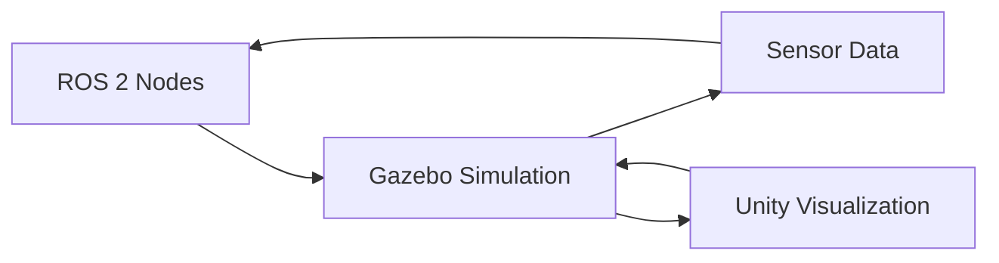
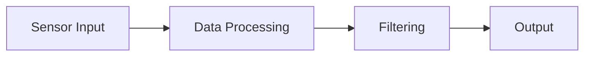
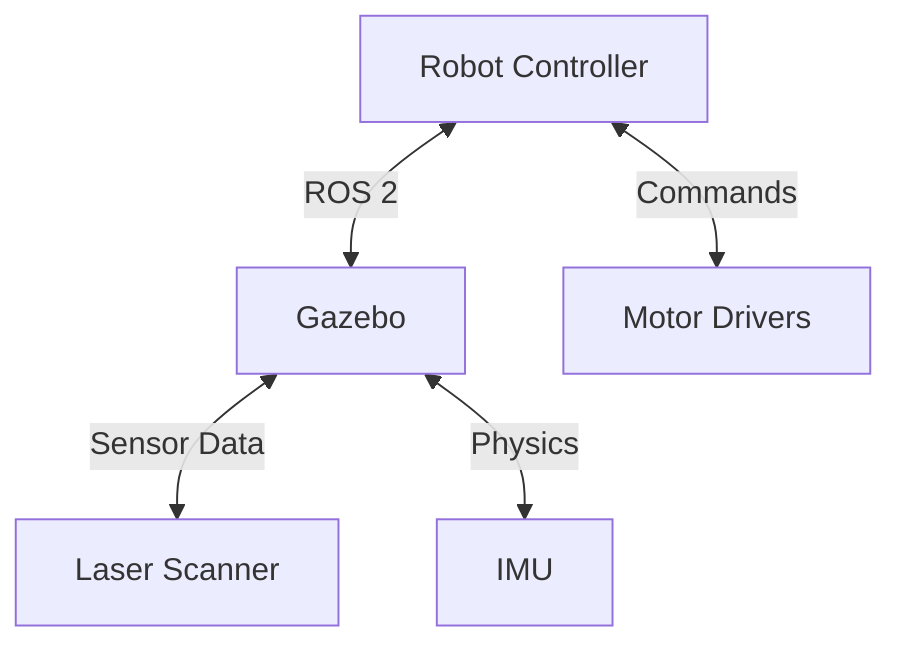
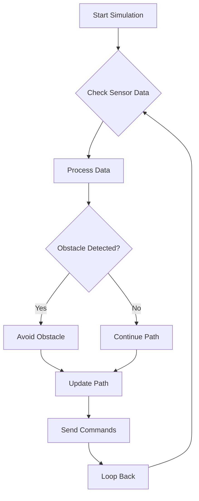
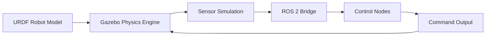
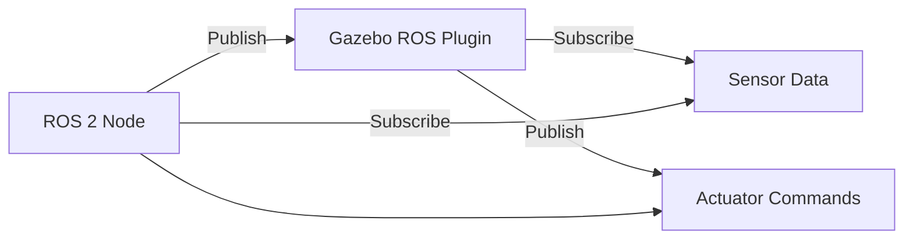
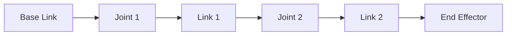
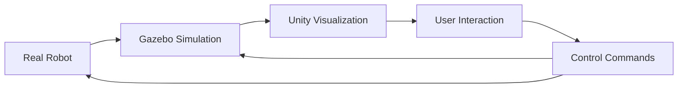

# Standard Diagram Layout for Simulation Architecture Visuals

This guide provides consistent layout standards for all diagrams used in the Digital Twin simulation module.

## Diagram Types and Standards

### 1. System Architecture Diagrams

**Purpose**: Show the relationship between different system components
**Layout**: Left-to-right or top-to-bottom flow
**Style**: Boxes with clear labels, directional arrows

**Standards**:
- Use rectangular boxes for system components
- Use directional arrows to show data flow
- Label arrows with the type of data exchanged
- Group related components with similar colors
- Maintain consistent spacing between elements

### 2. Data Flow Diagrams

**Purpose**: Illustrate how data moves through the system
**Layout**: Sequential flow from input to output
**Style**: Process boxes with input/output arrows

**Standards**:
- Use rounded rectangles for processes
- Use circles for data stores
- Use arrows to show data flow direction
- Include data types on arrows
- Show parallel processes when applicable

### 3. Component Relationship Diagrams

**Purpose**: Show how different software/hardware components interact
**Layout**: Network-style connections
**Style**: Circular or rectangular nodes with connecting lines

**Standards**:
- Use consistent node shapes for similar component types
- Use dashed lines for optional connections
- Use solid lines for required connections
- Include interface protocols when relevant
- Show both input and output connections

### 4. Process Flow Diagrams

**Purpose**: Illustrate step-by-step processes or algorithms
**Layout**: Sequential steps in logical order
**Style**: Standard flowchart symbols

**Standards**:
- Use ovals for start/end points
- Use rectangles for processes
- Use diamonds for decision points
- Use arrows to show flow direction
- Include labels for different decision outcomes

## Visual Standards

### Color Palette
- **Primary Components**: Blue (#2196F3) - Core system components
- **ROS 2 Elements**: Green (#4CAF50) - ROS 2 related components
- **Gazebo Elements**: Orange (#FF9800) - Gazebo simulation components
- **Unity Elements**: Purple (#9C27B0) - Unity visualization components
- **Data Flows**: Gray (#757575) - Data connections and flows
- **User Interface**: Red (#F44336) - User interaction elements

### Typography
- **Component Labels**: Bold, 14pt font
- **Connection Labels**: Regular, 12pt font
- **Annotations**: Italic, 10pt font
- **Code Elements**: Monospace font

### Spacing and Layout
- **Horizontal spacing**: 100px minimum between elements
- **Vertical spacing**: 80px minimum between rows
- **Arrow length**: Minimum 50px for clarity
- **Connection angles**: Prefer 90° angles for clean appearance

## Diagram Creation Guidelines

### Naming Convention
- Use descriptive names: `[DiagramType]_[Purpose]_[Version]`
- Examples: `arch_unity_ros_connection_v1`, `flow_sensor_processing_v2`

### File Formats
- **Mermaid diagrams**: Include as embedded code in markdown
- **Complex diagrams**: Use SVG format with embedded text
- **Simple diagrams**: Use ASCII art when appropriate

### Accessibility
- Include alt text for all diagrams
- Use high contrast colors
- Provide textual descriptions of relationships
- Consider colorblind-friendly palettes

## Specific Diagram Templates

### Gazebo Simulation Pipeline

### ROS 2 ↔ Gazebo Communication Flow

### Robot Kinematic Chain

### Gazebo ↔ Unity Digital Twin Flow

## Quality Assurance Checklist

Before finalizing any diagram, verify:
- [ ] All components are clearly labeled
- [ ] Data flows are properly indicated with arrows
- [ ] Colors follow the standard palette
- [ ] Spacing is consistent and readable
- [ ] Alternative text is provided for accessibility
- [ ] Diagram serves its intended educational purpose
- [ ] Connections accurately represent real system relationships
- [ ] Text is legible at standard viewing size

## Tool Recommendations

### For Mermaid Diagrams
- Use the official Mermaid syntax for consistency
- Test diagrams in the target documentation system
- Keep diagrams simple and readable

### For Complex Diagrams
- Consider using tools like Draw.io or Lucidchart
- Export as SVG for scalability
- Maintain editable source files

### For Integration Diagrams
- Focus on showing relationships rather than implementation details
- Use standard architectural symbols
- Include protocol/communication method labels

These standards ensure consistency across all simulation architecture visuals in the Digital Twin module, providing clear and professional diagrams that enhance understanding of complex system interactions.
