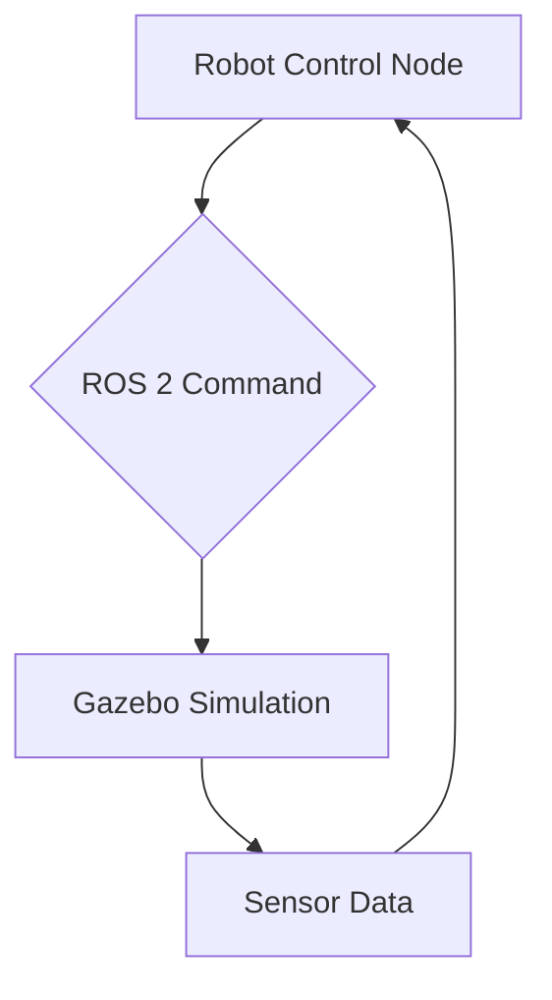

# Style Guide: Simulation Content

This style guide provides consistent formatting and writing standards for all simulation-related content in the Digital Twin module.

## Writing Style

### Tone and Voice
- Use clear, technical language appropriate for robotics professionals and students
- Write in active voice whenever possible
- Avoid jargon without proper explanation
- Maintain consistency in terminology throughout all content

### Technical Accuracy
- Verify all code examples before publication
- Use precise technical terminology
- Include appropriate units for all measurements
- Reference standard ROS 2 and Gazebo conventions

## Document Structure

### Headings Hierarchy
```
# Chapter Title (H1) - One per document
## Section Title (H2) - Major content sections
### Subsection Title (H3) - Detailed topics
#### Minor Section (H4) - Specific concepts
```

### Content Organization
- Begin each section with a brief overview
- Follow with detailed explanations
- Include practical examples when applicable
- End with summary or key takeaways

## Code Formatting

### Syntax Highlighting
Use appropriate language identifiers for syntax highlighting:

```xml
<!-- URDF/XML examples -->
<robot name="my_robot">
  <link name="base_link">
    <visual>
      <geometry>
        <box size="1 1 1"/>
      </geometry>
    </visual>
  </link>
</robot>
```

```python
# Python/ROS 2 examples
import rclpy
from geometry_msgs.msg import Twist

def move_robot():
    msg = Twist()
    msg.linear.x = 1.0
    publisher.publish(msg)
```

```cpp
// C++ examples
#include <rclcpp/rclcpp.hpp>
#include <sensor_msgs/msg/laser_scan.hpp>

class ScanProcessor : public rclcpp::Node
{
public:
  ScanProcessor() : Node("scan_processor") {}
};
```

```bash
# Command line examples
ros2 run gazebo_ros gazebo
ros2 launch my_robot_bringup robot.launch.py
```

```xml
<!-- SDF/XML examples -->
<sdf version="1.6">
  <world name="my_world">
    <physics type="ode">
      <max_step_size>0.001</max_step_size>
    </physics>
  </world>
</sdf>
```

## Code Example Standards

### File Structure
Each code example should include:
1. Brief description of purpose
2. Complete, runnable code
3. Inline comments for complex sections
4. Expected output or behavior

### Naming Conventions
- Use snake_case for ROS 2 package names
- Use CamelCase for class names
- Use lowercase with underscores for topic names
- Use descriptive variable names that indicate purpose

### Best Practices
- Include error handling where appropriate
- Add comments explaining non-obvious code
- Follow ROS 2 and Gazebo best practices
- Ensure examples are self-contained when possible

## Diagram Standards

### Diagram Types
- Use Mermaid for flowcharts and process diagrams
- Use SVG for detailed technical illustrations
- Use simple ASCII art for basic structure diagrams when needed

### Mermaid Examples


### Diagram Content
- Include clear labels and legends
- Use consistent color schemes
- Provide alternative text descriptions
- Ensure diagrams are scalable and clear

## Technical Terminology

### Consistent Usage
- **Gazebo Classic**: Use instead of just "Gazebo" when referring to the traditional version
- **ROS 2**: Always use "ROS 2" not "ROS2" or "ros2"
- **URDF**: Always capitalize as "URDF", not "urdf"
- **Digital Twin**: Capitalize as "Digital Twin" when referring to the concept

### Acronyms and Abbreviations
- Define acronyms on first use in each document
- Use standard robotics abbreviations consistently
- Spell out terms in headings for clarity

## Mathematical Notation

### Formulas
Use proper mathematical notation:
- Use LaTeX-style formatting for complex equations
- Define all variables clearly
- Use standard robotics notation conventions

### Units and Measurements
- Always include units for physical quantities
- Use SI units consistently
- Convert between systems clearly when necessary

## References and Citations

### External Links
- Use descriptive link text, not URLs
- Verify all links are current and accessible
- Include official documentation links when available

### Code References
- Reference specific ROS 2 packages with full names
- Include version information when relevant
- Link to official documentation when possible

## Accessibility

### Alternative Text
- Provide alt text for all diagrams and images
- Include descriptions of visual content in text
- Use semantic markup appropriately

### Inclusive Language
- Use gender-neutral language
- Avoid idioms that may not translate well
- Consider international audience needs

## Review Checklist

Before publishing, verify:
- [ ] All code examples are tested and functional
- [ ] Technical terms are used consistently
- [ ] Diagrams have appropriate alternative text
- [ ] Mathematical notation is clear and correct
- [ ] External links are valid and accessible
- [ ] Content follows established hierarchy and formatting
- [ ] All acronyms are defined on first use
- [ ] Writing is clear and accessible to target audience
