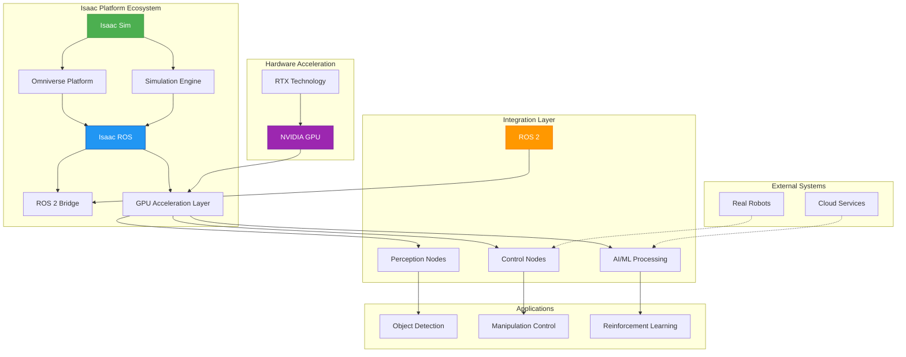

# NVIDIA Isaac Platform: Core Infrastructure for Robotics AI

## Overview

The NVIDIA Isaac platform represents a comprehensive ecosystem for developing, simulating, and deploying AI-powered robotic systems. Built on NVIDIA's extensive expertise in GPU computing and artificial intelligence, Isaac provides a complete solution that bridges the gap between simulation and real-world deployment. This chapter delves into the core components of the Isaac platform, including Isaac Sim for simulation, Isaac ROS for perception and control, and their seamless integration with ROS 2.

The platform's architecture is designed to leverage GPU acceleration for computationally intensive tasks such as perception, planning, and control. This enables robotics engineers to develop sophisticated AI behaviors that can be efficiently executed on both simulated and real robotic platforms.

## Isaac Platform Architecture

The NVIDIA Isaac platform consists of three primary components that work in harmony:

### Isaac Sim: Advanced Robotics Simulation

Isaac Sim is a high-fidelity simulation environment built on NVIDIA's Omniverse platform. It provides realistic physics simulation, advanced rendering capabilities, and seamless integration with robotics frameworks. Key features include:

- **Physics Simulation**: Accurate simulation of rigid body dynamics, collisions, and contact physics
- **Rendering**: Photo-realistic rendering with physically-based materials and lighting
- **Sensor Simulation**: Comprehensive simulation of various sensor types including RGB-D cameras, LiDAR, IMU, and force/torque sensors
- **Robot Models**: Extensive library of pre-built robot models with accurate kinematics and dynamics
- **Environment Assets**: Rich collection of environments, objects, and scenarios for testing

### Isaac ROS: GPU-Accelerated Perception and Control

Isaac ROS delivers a collection of GPU-accelerated perception and control nodes that seamlessly integrate with the Robot Operating System (ROS 2). Key capabilities include:

- **Perception Pipelines**: GPU-accelerated computer vision algorithms for object detection, segmentation, and pose estimation
- **Sensor Processing**: High-performance processing of RGB-D, LiDAR, and other sensor data
- **AI/ML Integration**: Direct integration with NVIDIA's AI frameworks for deep learning inference
- **ROS 2 Compatibility**: Full compliance with ROS 2 standards and message types
- **Real-time Performance**: Optimized for real-time applications with deterministic behavior

### ROS 2 Integration Layer

The integration layer ensures seamless communication between Isaac components and the broader ROS 2 ecosystem. This includes:

- **Message Transport**: Efficient transport of sensor data and control commands
- **TF System**: Integration with ROS 2's transform system for coordinate frame management
- **Parameter Management**: Configuration and parameter management following ROS 2 conventions
- **Service Interfaces**: Standardized service interfaces for common robotics operations

## Technical Architecture

The Isaac platform's architecture can be visualized as a multi-layered system:



This architecture demonstrates how the Isaac platform leverages NVIDIA's GPU acceleration and Omniverse technology to provide a comprehensive robotics development environment. The platform's design ensures that algorithms developed in simulation can be efficiently deployed to real hardware with minimal changes.

## Setting Up Isaac Sim

### Prerequisites

Before setting up Isaac Sim, ensure your system meets the following requirements:

- **GPU**: NVIDIA GPU with compute capability 6.0 or higher (recommended: RTX series)
- **CUDA**: CUDA 11.8 or later
- **OS**: Ubuntu 20.04 LTS or 22.04 LTS
- **Memory**: 16GB RAM minimum, 32GB recommended
- **Storage**: 100GB free space for Isaac Sim installation

### Installation Process

1. **Download Isaac Sim**: Obtain the latest version from the NVIDIA Developer website
2. **Extract the Package**: Extract the downloaded archive to your desired installation directory
3. **Set Environment Variables**: Configure the necessary environment variables for Isaac Sim
4. **Verify Installation**: Run a basic test to ensure Isaac Sim is properly installed

### Basic Scene Configuration

Once Isaac Sim is installed, you can begin creating simulation scenes. The following code example demonstrates how to create a basic scene with a robot:

```python
# Example: Basic Isaac Sim Scene Configuration
import omni
from omni.isaac.core import World
from omni.isaac.core.utils.stage import add_reference_to_stage
from omni.isaac.core.utils.nucleus import get_assets_root_path
from omni.isaac.core.robots import Robot
from omni.isaac.core.utils.viewports import set_camera_view
from omni.isaac.core.scenes.scene import Scene

# Create world instance
world = World(stage_units_in_meters=1.0)

# Set up the physics scene
world.scene = Scene(usd_path="/World", name="World")

# Add default ground plane
world.scene.add_default_ground_plane()

# Get assets root path
assets_root_path = get_assets_root_path()

if assets_root_path is not None:
    # Add Franka robot to the scene
    franka_asset_path = assets_root_path + "/Isaac/Robots/Franka/franka_alt_fingers.usd"
    add_reference_to_stage(usd_path=franka_asset_path, prim_path="/World/Franka")

    # Add the robot to the world
    robot = world.scene.add(
        Robot(
            prim_path="/World/Franka",
            name="franka_robot",
            position=[0.0, 0.0, 0.0],
            orientation=[0.0, 0.0, 0.0, 1.0]
        )
    )

# Set camera view
set_camera_view(eye=[2.0, 2.0, 2.0], target=[0.0, 0.0, 0.0])

# Reset the world
world.reset()

# Run simulation for a few steps
for i in range(100):
    world.step(render=True)

# Clean up
world.clear()
```

## Isaac ROS Perception Nodes

### Overview of GPU-Accelerated Perception

Isaac ROS provides a comprehensive set of GPU-accelerated perception nodes that significantly outperform CPU-based alternatives. These nodes leverage NVIDIA's CUDA and TensorRT frameworks to deliver real-time performance for computationally intensive tasks.

### Key Perception Capabilities

#### Object Detection and Pose Estimation

Isaac ROS includes GPU-accelerated object detection nodes that can identify and estimate the 6-DOF pose of objects in the environment. These nodes typically process RGB-D input to provide accurate object localization.

#### Semantic Segmentation

Semantic segmentation nodes provide pixel-level classification of objects in the scene, enabling detailed understanding of the environment. These nodes are optimized for real-time performance using NVIDIA's Deep Learning Acceleration (DLA) units.

#### Point Cloud Processing

For 3D perception tasks, Isaac ROS provides GPU-accelerated point cloud processing nodes that can perform operations such as:
- Point cloud filtering and downsampling
- Surface normal estimation
- Plane fitting and segmentation
- Feature extraction and matching

### Implementation Example: Isaac ROS Perception Node

Here's an example of implementing a GPU-accelerated perception node using Isaac ROS:

```python
#!/usr/bin/env python3

"""
Isaac ROS Perception Node

This node demonstrates GPU-accelerated perception using Isaac ROS.
It processes RGB-D data to perform object detection and pose estimation.
"""

import rclpy
from rclpy.node import Node
from rclpy.qos import QoSProfile, ReliabilityPolicy, HistoryPolicy

from sensor_msgs.msg import Image, CameraInfo
from geometry_msgs.msg import Point, Pose, PoseArray
from std_msgs.msg import Header
from visualization_msgs.msg import Marker, MarkerArray
from builtin_interfaces.msg import Time

import numpy as np
import cv2
from cv_bridge import CvBridge
import message_filters
from tf2_ros import Buffer, TransformListener
import tf2_ros
import tf2_geometry_msgs

# Import common utilities
from isaac_examples.common.isaac_ros_utils import (
    image_msg_to_cv2,
    cv2_to_image_msg,
    create_pose,
    create_point,
    get_transform
)


class IsaacPerceptionNode(Node):
    """
    Isaac ROS Perception Node for processing sensor data with GPU acceleration
    """

    def __init__(self):
        super().__init__('isaac_perception_node')

        # Declare parameters
        self.declare_parameter('camera_namespace', '/camera')
        self.declare_parameter('enable_visualization', True)
        self.declare_parameter('detection_confidence_threshold', 0.5)
        self.declare_parameter('object_classes', ['person', 'bottle', 'cup', 'chair'])

        # Get parameters
        self.camera_namespace = self.get_parameter('camera_namespace').value
        self.enable_visualization = self.get_parameter('enable_visualization').value
        self.confidence_threshold = self.get_parameter('detection_confidence_threshold').value
        self.object_classes = self.get_parameter('object_classes').value

        # Initialize CvBridge
        self.bridge = CvBridge()

        # TF buffer and listener
        self.tf_buffer = Buffer()
        self.tf_listener = TransformListener(self.tf_buffer, self)

        # Publishers
        self.detection_pub = self.create_publisher(PoseArray, 'object_detections', 10)
        self.visualization_pub = self.create_publisher(MarkerArray, 'detection_markers', 10) if self.enable_visualization else None

        # Create QoS profile for sensor data
        qos_profile = QoSProfile(
            reliability=ReliabilityPolicy.BEST_EFFORT,
            history=HistoryPolicy.KEEP_LAST,
            depth=1
        )

        # Subscribers for RGB and Depth images
        self.rgb_sub = message_filters.Subscriber(
            self,
            Image,
            f'{self.camera_namespace}/rgb/image_raw',
            qos_profile=qos_profile
        )
        self.depth_sub = message_filters.Subscriber(
            self,
            Image,
            f'{self.camera_namespace}/depth/image_raw',
            qos_profile=qos_profile
        )

        # Approximate time synchronizer for RGB and Depth
        self.sync = message_filters.ApproximateTimeSynchronizer(
            [self.rgb_sub, self.depth_sub],
            queue_size=10,
            slop=0.1
        )
        self.sync.registerCallback(self.sync_callback)

        # Store camera info (in a real implementation, this would come from a camera_info topic)
        self.camera_info = None

        # Object detection simulation (in a real implementation, this would use Isaac ROS perception packages)
        self.get_logger().info('Isaac Perception Node initialized')
        self.get_logger().info(f'Listening to camera namespace: {self.camera_namespace}')

    def sync_callback(self, rgb_msg, depth_msg):
        """
        Callback for synchronized RGB and Depth images
        """
        try:
            # Convert ROS images to OpenCV
            rgb_image = image_msg_to_cv2(rgb_msg)
            depth_image = image_msg_to_cv2(depth_msg, desired_encoding='32FC1')

            if rgb_image is None or depth_image is None:
                self.get_logger().warn('Failed to convert images')
                return

            # Perform object detection (simulated)
            detections = self.simulate_object_detection(rgb_image)

            # Estimate 3D poses from 2D detections and depth
            object_poses = self.estimate_poses_from_detections(detections, depth_image, rgb_msg.header)

            # Publish detections
            self.publish_detections(object_poses, rgb_msg.header)

            # Publish visualization markers
            if self.enable_visualization and self.visualization_pub:
                self.publish_visualization_markers(object_poses, rgb_msg.header)

        except Exception as e:
            self.get_logger().error(f'Error in sync_callback: {e}')

    def simulate_object_detection(self, image):
        """
        Simulate object detection (in a real implementation, this would use Isaac ROS detection nodes)

        Args:
            image: Input RGB image

        Returns:
            List of detections with format [x, y, width, height, confidence, class_name]
        """
        # This is a simulation - in a real implementation, this would use Isaac ROS detection nodes
        # For demonstration, we'll simulate detecting some objects

        height, width = image.shape[:2]
        detections = []

        # Simulate detecting a few objects at known positions
        # Format: [x, y, width, height, confidence, class_name]
        simulated_objects = [
            [int(0.3 * width), int(0.4 * height), int(0.1 * width), int(0.1 * height), 0.85, 'bottle'],
            [int(0.6 * width), int(0.5 * height), int(0.08 * width), int(0.08 * height), 0.78, 'cup'],
            [int(0.2 * width), int(0.6 * height), int(0.12 * width), int(0.15 * height), 0.92, 'person']
        ]

        # Filter based on confidence threshold and class list
        for det in simulated_objects:
            x, y, w, h, conf, class_name = det
            if conf >= self.confidence_threshold and class_name in self.object_classes:
                detections.append(det)

        return detections

    def estimate_poses_from_detections(self, detections, depth_image, header):
        """
        Estimate 3D poses from 2D detections and depth information

        Args:
            detections: List of 2D detections
            depth_image: Depth image
            header: ROS header for the pose array

        Returns:
            PoseArray with estimated 3D poses
        """
        poses = PoseArray()
        poses.header = header

        height, width = depth_image.shape

        for det in detections:
            x, y, w, h, conf, class_name = det

            # Calculate center of bounding box
            center_x = x + w // 2
            center_y = y + h // 2

            # Get depth at center of bounding box (with some averaging)
            depth_region = depth_image[max(0, center_y-5):min(height, center_y+5),
                                      max(0, center_x-5):min(width, center_x+5)]

            # Calculate average depth (ignore invalid values)
            valid_depths = depth_region[depth_region > 0]
            if len(valid_depths) > 0:
                avg_depth = np.mean(valid_depths)
            else:
                avg_depth = 1.0  # Default depth if no valid readings

            # Convert pixel coordinates to 3D world coordinates (simplified)
            # In a real implementation, you would use camera intrinsics
            # For now, we'll use a simple approximation
            world_x = (center_x - width/2) * avg_depth * 0.001  # Scale factor
            world_y = (center_y - height/2) * avg_depth * 0.001  # Scale factor
            world_z = avg_depth

            # Create pose
            pose = create_pose(world_x, world_y, world_z)
            poses.poses.append(pose)

            self.get_logger().info(f'Detected {class_name} at 3D position: ({world_x:.2f}, {world_y:.2f}, {world_z:.2f})')

        return poses

    def publish_detections(self, poses, header):
        """
        Publish object detection results

        Args:
            poses: PoseArray with object poses
            header: Header to use for the published message
        """
        poses.header = header
        self.detection_pub.publish(poses)

    def publish_visualization_markers(self, poses, header):
        """
        Publish visualization markers for detected objects

        Args:
            poses: PoseArray with object poses
            header: Header to use for the published message
        """
        marker_array = MarkerArray()

        for i, pose in enumerate(poses.poses):
            # Create a marker for each detected object
            marker = Marker()
            marker.header = header
            marker.ns = "detections"
            marker.id = i
            marker.type = Marker.SPHERE
            marker.action = Marker.ADD

            # Position and orientation
            marker.pose = pose
            marker.pose.position.z += 0.1  # Slightly above the object

            # Scale (size of the marker)
            marker.scale.x = 0.1
            marker.scale.y = 0.1
            marker.scale.z = 0.1

            # Color (blue for detected objects)
            marker.color.r = 0.0
            marker.color.g = 0.0
            marker.color.b = 1.0
            marker.color.a = 0.8  # Alpha

            marker_array.markers.append(marker)

        self.visualization_pub.publish(marker_array)

    def set_camera_info(self, camera_info_msg):
        """
        Set camera information for 3D reconstruction

        Args:
            camera_info_msg: CameraInfo message with intrinsic parameters
        """
        self.camera_info = camera_info_msg


def main(args=None):
    """
    Main function to run the Isaac Perception Node
    """
    rclpy.init(args=args)

    perception_node = IsaacPerceptionNode()

    try:
        rclpy.spin(perception_node)
    except KeyboardInterrupt:
        pass
    finally:
        perception_node.destroy_node()
        rclpy.shutdown()


if __name__ == '__main__':
    main()
```

## Synthetic Data Generation

### Overview

Synthetic data generation is a critical capability of the Isaac platform that enables the creation of large, diverse datasets for training AI models. By leveraging the high-fidelity simulation environment, developers can generate realistic training data with perfect ground truth annotations, significantly reducing the time and cost associated with data collection in the real world.

### Domain Randomization

Domain randomization is a key technique used in synthetic data generation. It involves systematically varying environmental parameters such as lighting conditions, textures, colors, and object positions to create diverse training scenarios. This approach helps improve the robustness of AI models when deployed to real-world environments.

### Implementation Example

The following example demonstrates synthetic data generation with domain randomization:

```python
# Example: Synthetic Data Generation with Domain Randomization
import omni
from omni.isaac.core import World
from omni.isaac.core.utils.stage import add_reference_to_stage
from omni.isaac.core.utils.nucleus import get_assets_root_path
from omni.isaac.core.utils.prims import get_prim_at_path
from omni.isaac.core.objects import DynamicCuboid
from omni.isaac.core.utils.carb import set_carb_setting
import carb
import numpy as np
import random

class SyntheticDataGenerator:
    """
    A class to generate synthetic data with domain randomization
    """

    def __init__(self, world: World):
        self.world = world
        self.objects = []

    def setup_scene_for_data_generation(self):
        """
        Setup a scene with randomized elements for synthetic data generation
        """
        # Add random lighting
        self.add_random_lighting()

        # Add random background objects
        self.add_random_background_objects()

        # Randomize material properties
        self.randomize_materials()

        # Add target objects with random poses
        self.add_target_objects()

    def add_random_lighting(self):
        """
        Add randomized lighting to the scene
        """
        # Randomize lighting conditions
        light_intensity = random.uniform(500, 2000)
        light_color = [random.uniform(0.8, 1.2), random.uniform(0.8, 1.2), random.uniform(0.8, 1.2)]

        # In a real implementation, we would add light prims to the scene
        print(f"Added randomized lighting: intensity={light_intensity}, color={light_color}")

    def add_random_background_objects(self):
        """
        Add randomized background objects to the scene
        """
        num_background_objects = random.randint(5, 15)

        for i in range(num_background_objects):
            # Random position in the background
            x = random.uniform(-3.0, 3.0)
            y = random.uniform(-3.0, 3.0)
            z = random.uniform(0.1, 1.0)

            # Random size
            size = random.uniform(0.1, 0.5)

            # Add object to scene
            obj = self.world.scene.add(
                DynamicCuboid(
                    prim_path=f"/World/BackgroundObj{i}",
                    name=f"background_obj_{i}",
                    position=[x, y, z],
                    size=size,
                    mass=random.uniform(0.1, 1.0)
                )
            )
            self.objects.append(obj)

    def randomize_materials(self):
        """
        Randomize material properties in the scene
        """
        # In a real implementation, we would randomize material properties
        # such as color, texture, reflectance, etc.
        print("Randomized material properties")

    def add_target_objects(self):
        """
        Add target objects with randomized poses
        """
        # Add target object for detection
        target_obj = self.world.scene.add(
            DynamicCuboid(
                prim_path="/World/TargetObject",
                name="target_object",
                position=[0.0, 0.0, 0.5],
                size=0.2,
                mass=0.5
            )
        )
        self.objects.append(target_obj)

    def generate_data_sample(self, sample_id: int):
        """
        Generate a single data sample with annotations

        Args:
            sample_id: ID of the sample being generated
        """
        # Simulate camera capture
        # In a real implementation, we would capture RGB-D images
        # and generate corresponding annotations

        # For this example, we'll just print what would happen
        print(f"Generated data sample {sample_id}")
        print(f"  - RGB image captured")
        print(f"  - Depth image captured")
        print(f"  - Object poses: {[obj.get_world_pose() for obj in self.objects]}")
        print(f"  - Segmentation mask generated")
        print(f"  - Bounding boxes computed")

        # In a real implementation, we would save the data to disk
        # with corresponding annotations

    def generate_dataset(self, num_samples: int):
        """
        Generate a complete dataset with multiple samples

        Args:
            num_samples: Number of samples to generate
        """
        for i in range(num_samples):
            # Randomize the scene
            self.setup_scene_for_data_generation()

            # Generate a data sample
            self.generate_data_sample(i)

            # Reset the world for the next sample
            self.world.reset()

        print(f"Dataset generation complete: {num_samples} samples generated")

# Example usage
def main():
    """
    Main function to demonstrate synthetic data generation
    """
    # Create world instance
    world = World(stage_units_in_meters=1.0)

    # Set up scene
    world.scene = Scene(usd_path="/World", name="World")
    world.scene.add_default_ground_plane()

    # Create data generator
    data_generator = SyntheticDataGenerator(world)

    # Generate a small dataset for demonstration
    data_generator.generate_dataset(10)  # Generate 10 samples

    # Clean up
    world.clear()

if __name__ == "__main__":
    main()
```

## Integration with ROS 2

### Message Types and Communication Patterns

Isaac ROS follows ROS 2 conventions for message types and communication patterns. This ensures seamless integration with the broader ROS 2 ecosystem and allows developers to leverage existing tools and infrastructure.

Common message types used in Isaac ROS include:
- `sensor_msgs/Image`: For RGB and depth images
- `sensor_msgs/PointCloud2`: For 3D point cloud data
- `geometry_msgs/PoseArray`: For object poses and trajectories
- `visualization_msgs/MarkerArray`: For visualization purposes
- `std_msgs/Header`: For timestamp and frame information

### Launch Files and System Configuration

Isaac ROS nodes are typically configured and launched using ROS 2 launch files. These files define the node parameters, remappings, and dependencies required for proper operation.

Example launch file for the perception node:

```xml
<!-- Example launch file: isaac_perception.launch.py -->
from launch import LaunchDescription
from launch_ros.actions import Node
from launch.actions import DeclareLaunchArgument
from launch.substitutions import LaunchConfiguration

def generate_launch_description():
    return LaunchDescription([
        # Declare launch arguments
        DeclareLaunchArgument(
            'camera_namespace',
            default_value='/camera',
            description='Camera namespace for RGB and depth topics'
        ),
        DeclareLaunchArgument(
            'enable_visualization',
            default_value='true',
            description='Enable visualization markers'
        ),

        # Isaac Perception Node
        Node(
            package='isaac_examples',
            executable='perception_node',
            name='isaac_perception_node',
            parameters=[
                {
                    'camera_namespace': LaunchConfiguration('camera_namespace'),
                    'enable_visualization': LaunchConfiguration('enable_visualization'),
                    'detection_confidence_threshold': 0.5,
                    'object_classes': ['person', 'bottle', 'cup', 'chair']
                }
            ],
            remappings=[
                ('/object_detections', '/isaac/object_detections'),
                ('/detection_markers', '/isaac/detection_markers')
            ],
            output='screen'
        )
    ])
```

## Performance Considerations

### GPU Utilization

To maximize the benefits of Isaac ROS, proper GPU utilization is critical. This involves:

- **Memory Management**: Efficient allocation and deallocation of GPU memory
- **Kernel Optimization**: Using optimized CUDA kernels for specific operations
- **Batch Processing**: Processing multiple data samples in parallel when possible
- **Memory Bandwidth**: Minimizing data transfers between CPU and GPU

### Real-time Performance

For real-time applications, consider the following optimizations:

- **Pipeline Parallelism**: Overlapping computation and data transfer
- **Multi-threading**: Using multiple threads for different processing stages
- **Asynchronous Processing**: Non-blocking operations where appropriate
- **Efficient Algorithms**: Using algorithms optimized for GPU execution

## Testing and Validation

### Simulation-to-Reality Transfer

One of the key challenges in robotics is ensuring that algorithms developed in simulation perform well in the real world. Isaac Sim addresses this through:

- **High-fidelity Physics**: Accurate simulation of physical interactions
- **Realistic Sensor Models**: Simulation of sensor noise and limitations
- **Domain Randomization**: Training models on diverse simulated environments
- **Validation Frameworks**: Tools for comparing simulation and real-world performance

### Quality Assurance

Quality assurance for Isaac-based systems involves:

- **Unit Testing**: Testing individual components in isolation
- **Integration Testing**: Testing component interactions
- **Regression Testing**: Ensuring changes don't break existing functionality
- **Performance Testing**: Verifying real-time performance requirements

## Best Practices

### Development Workflow

1. **Start Simple**: Begin with basic scenes and gradually add complexity
2. **Modular Design**: Create reusable components for different scenarios
3. **Version Control**: Track changes to scenes, configurations, and code
4. **Documentation**: Maintain clear documentation for all components
5. **Testing**: Implement comprehensive testing at all levels

### Performance Optimization

1. **Profile Early**: Identify performance bottlenecks early in development
2. **GPU Utilization**: Maximize GPU usage for computationally intensive tasks
3. **Memory Management**: Efficiently manage both CPU and GPU memory
4. **Parallel Processing**: Leverage parallel processing capabilities
5. **Algorithm Selection**: Choose algorithms appropriate for GPU execution

## Summary

The NVIDIA Isaac platform provides a comprehensive solution for developing AI-powered robotic systems. By combining Isaac Sim for high-fidelity simulation with Isaac ROS for GPU-accelerated perception and control, developers can create sophisticated robotic applications that bridge the gap between simulation and reality.

The platform's architecture is designed to leverage NVIDIA's GPU acceleration capabilities, enabling real-time performance for computationally intensive tasks. Through synthetic data generation and domain randomization, developers can train robust AI models that perform well in real-world environments.

The integration with ROS 2 ensures compatibility with the broader robotics ecosystem, allowing developers to leverage existing tools and infrastructure. As robotics continues to advance, the Isaac platform provides the foundation for developing the next generation of intelligent robotic systems.

## Next Steps

In the following chapters, we will explore how to build upon this foundation to implement perception and manipulation systems, and how to train reinforcement learning policies that can be safely transferred from simulation to real robots.
