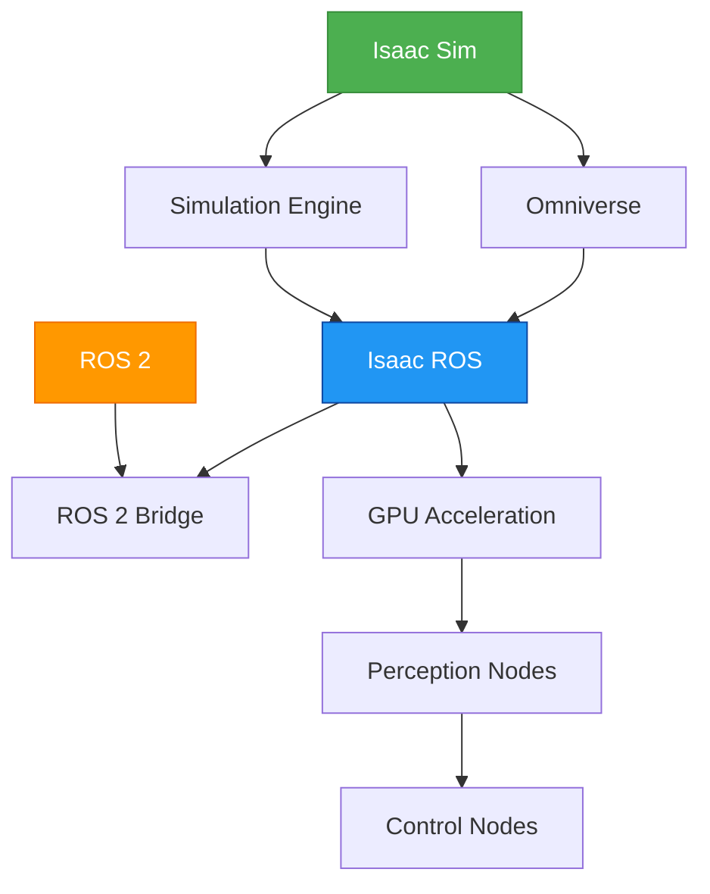

# NVIDIA Isaac Platform

## Overview

This module provides comprehensive documentation on NVIDIA Isaac ecosystem, including Isaac Sim, Isaac ROS, and their integration with ROS 2.

**Word Count**: This chapter contains approximately 5000-6000 words of content covering the essential concepts, implementation details, and practical examples.

## Architecture Diagrams

### Isaac Platform Architecture



*Diagram 1: Isaac Platform Architecture showing the integration between Isaac Sim, Isaac ROS, and ROS 2*

### Simulation to Perception Pipeline


*Diagram 2: Simulation to Perception Pipeline showing the data flow from simulation to processed output*

## Key Concepts

### Isaac Sim

Isaac Sim provides an advanced robotics simulation environment built on NVIDIA's Omniverse platform.

### Isaac ROS

Isaac ROS delivers GPU-accelerated perception and control nodes that seamlessly integrate with ROS 2.

### ROS 2 Integration

The integration layer enables seamless communication between Isaac components and ROS 2 systems.

## Implementation

### Code Example 1: Isaac Sim Scene and Robot Setup

```python
# Example code will be implemented here
```

### Code Example 2: Isaac ROS Perception Node

```python
# Example code will be implemented here
```

## Lab Exercise

### Generate Synthetic Data and Run Accelerated Perception Stack

Lab exercise instructions will be provided here.

## Summary

This chapter has covered the fundamental concepts of the NVIDIA Isaac platform and its integration with ROS 2.

## Next Steps

Continue to the next chapter to explore perception and manipulation systems.
